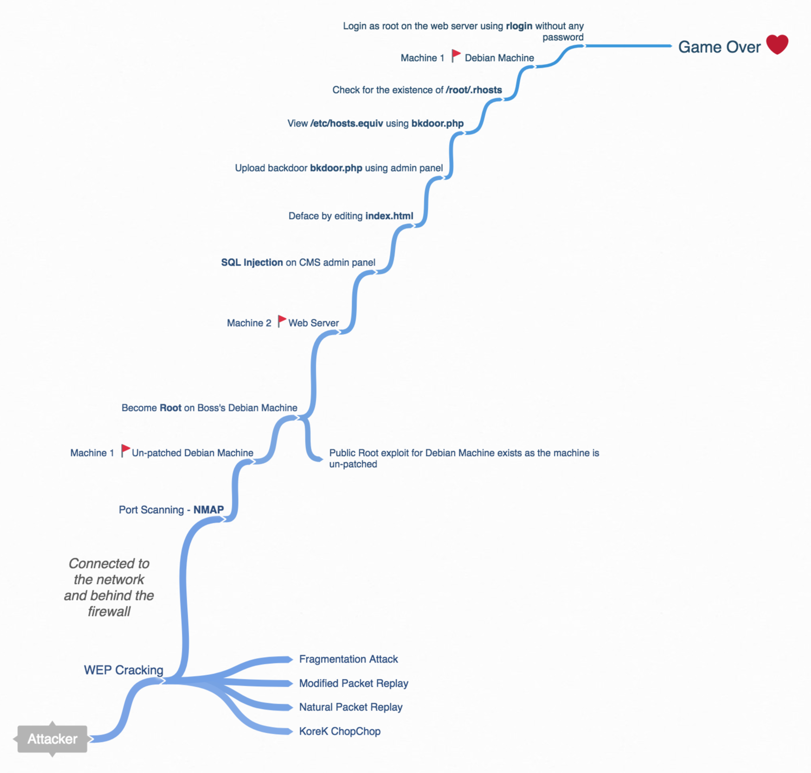

#### Homework 3

The following questions pertain to general linux systems. When in doubt, refer to Debian or Ubuntu implementations.

###### 1.) [10 points] What is the purpose of:

- the ```/etc/passwd``` file
	- Text File
	- Stores user account information
	- It contains a list of the system’s accounts
	- Useful information like user ID, group ID, home directory, shell, etc.
	- Read permission for all but write for only superuser/root account
- the ```/etc/shadow``` file
	- Text file 
	- Stores hashed password 
	- Stores secure user account information 
	- Fields are separated by a colon (:) symbol 
	- Contains one entry per line for each user listed in /etc/passwd file 
- the ```setuid``` bit
	- SUID (Set owner User ID up on execution) is a special type of file permissions given to a file. 
	- Normally in Linux/Unix when a program runs, it inherit’s access permissions from the logged in user. 
	- SUID is defined as giving temporary permissions to a user to run a program/file with the permissions of the file owner rather that the user who runs it. 
	- Users will get file owner’s permissions as well as owner UID and GID when executing a file/program/command.
- ```chroot```
	- The root directory ```\``` is stored within each process's entry in the process table.
	- All the ```chroot()``` system call does is to change the location of the root directory for that process.
		- Is seen as an OS-level virtualization mechanism.
		- The result is called a ```chroot jail```
			- Can be easily broken
			- Nothing prevents a program from chrooting out of the jail typically...

###### 2) [10 points] Explain the differences between the commands “ls -l” and “lsattr”.

- ```ls -l``` 
	- List directory contents using a long listing format

```sh
l32@l32-VirtualBox:~$ touch out
l32@l32-VirtualBox:~$ ls -l out
-rw-rw-r-- 1 l32 l32 0 Aug 14 09:56 out
l32@l32-VirtualBox:~$
```

- ```lsattr```
	- List file attributes on a Linux second extended file system

```sh
l32@l32-VirtualBox:~$ lsattr out
-------------e-- out
l32@l32-VirtualBox:~$ sudo chattr +i out
l32@l32-VirtualBox:~$ lsattr out
----i--------e-- out
l32@l32-VirtualBox:~$
```

###### 3) [5 points] Android is a linux based operating system. The android app store features many apps that when installed request access to all sorts of information, sometimes information that seems completely irrelevant to the program. Explain the general problem with android apps through the least privilege principle.

- Least privilege principle means giving a user account only those privileges which are essential to perform its intended function. For example, a user account for the sole purpose of creating backups does not need to install software: hence, it has rights only to run backup and backup-related applications. Any other privileges, such as installing new software, are blocked. 
- So even if android apps are provided with the least privileges it prompts the user to provide more privileges at the time of installing. This means the decision making of the permissions of the app is shifted from the Android OS to the user (may or may not be aware/knowledgable)

###### 4) [5 points] Compare access control lists to the standard unix permissions model.

- Unix Permissions Model
	- Permission groups
		- owner
		- group
		- all users
	- Permission Types
		- read
		- write
		- execute
	- ```_rwxrwxrwx 1 owner:group```
	- View permissions
	
		```sh
		l32@l32-VirtualBox:~$ ls -l mat
		-rw-rw-r-- 1 l32 l32 0 Aug 14 10:51 mat
		l32@l32-VirtualBox:~$
		```
	- Advanced Permissions 
		
		Symbol | Explanation
		-------|---------------------		
		_ | no special permissions
		d | directory
		l | symbolic link
		s | setuid/setgid
		t | sticky bit 

- Access Control Lists

	- Usually are disabled by default
	- Extendeds the owner/group/other access model to allow much finer control
		- Can specify permissions for each individual user and group defined in the system
		- ACL is a mount option that can be turned on for specific permissions in the /etc/fstab file
		
		```
		 UUID=65a4eb31-feac-4a62-8f14-245ddd76604d /               ext4    errors=remount-ro,acl 0       1
		```
		
###### 5) [10 points] [Compare ruid and euid. Explain an example how they may not be equal.](https://unix.stackexchange.com/questions/191940/difference-between-owner-root-and-ruid-euid)

- RUID 
	- Real User ID
	- It never (almost) changes. 
	- If user2 logs in to the system, the shell is then launched with its real ID set to user2. 
	- All processes he starts from the shell will inherit the real ID user2 as their real ID.

- EUID
	- Effective User ID 
	- It changes for processes (not for the user) that the user executes that have set the setuid bit.

###### 6) [10 points] List two entirely different ways that an attacker might clean his/her tracks when attacking a unix based system. State the required level of access for each approach. Explain your answers.

- Clearing Event Logs

```
/var/log/messages
/var/log/syslog
```

- Shredding the History File

```sh
l32@l32-VirtualBox:~$ more ~/.bash_history
ls
./runasroot.sh
sudo ./runasroot.sh
sudo su
mount
umount /dev/sr0
sudo apt-get install openssh-server
ifconfig
eicil &
eiciel &
terminator
terminator &
exit
gnome-system-log
terminator &
l32@l32-VirtualBox:~$
l32@l32-VirtualBox:~$ shred -zu ~/.bash_history
l32@l32-VirtualBox:~$ more ~/.bash_history
more: stat of /home/l32/.bash_history failed: No such file or directory
l32@l32-VirtualBox:~$
```

Both the above operations require normal user privileges.

###### 8) [25 points] Here’s a scenario, which is going to take some googling / research: 

>You’ve been hired to do incident response/investigation at a local small coffee shop, and the believe that their webserver has been hacked when the boss was out of town, as the website has been defaced with various rantings and graffiti from disapproving coffee-”fascists”.  

>They also believe that the attacker used their own wifi (WEP encryption) at the coffee shop to do it, so it occurred within their network firewall.  They also believe that the attacker used SQL injection (we’ll cover this later) to hack into the admin console for their custom content management system (a undergraduate student designed it for them), for the purpose of uploading a webshell.  They found the webshell (which was called bkdoor.php), and also found some interesting entries in the logs for the URL’s that were served to the attacker using the bkdoor.php: 

- www.coffeshop.com/include/bkdoor.php?cmd=cat ../../../../../../etc/passwd
- www.coffeshop.com/include/bkdoor.php?cmd=cat ../../../../../../etc/shadow
- www.coffeshop.com/include/bkdoor.php?cmd=cat ../../../../../../etc/hosts.equiv
- www.coffeshop.com/include/bkdoor.php?cmd=cat ../../../../../../root/.rhosts

>The employees explain that the webserver’s apache http daemon (tomcat6) was implemented using the least permissions principle, with tomcat6 under its own user account  and does not have access to the shadow file (which is pretty impressive for a bunch of art students).  But they do not understand how the attacker managed to get root, as the password hashes were not in the /etc/passwd file, and not accessible to the user account running the apache daemon (tomcat6).  Also they don’t understand the request for /root/.rhosts as the attacker couldn’t have viewed it under the tomcat6 account (which did not have root access).  

>The logs show no sign of the attacker trying to brute force the root password on the webserver.  Lastly the boss’s Debian computer (which upon inspection has not been patched in forever) seems to have been hacked as well, and the attacker seems to have got root access on it as well.

>The employees provide you with the /etc/passwd, /etc/hosts.equiv, and /root/.rhosts file on the webserver (but not the /etc/shadow file)

>The contents of the /etc/hosts.equiv file and the /root/.rhosts file contain only the IP address for the boss’s computer.
>
The contents of the /etc/passwd file are:

```sh
root:x:0:0:root:/root:/bin/bash
daemon:x:1:1:daemon:/usr/sbin:/bin/sh
bin:x:2:2:bin:/bin:/bin/sh
sys:x:3:3:sys:/dev:/bin/sh
sync:x:4:65534:sync:/bin:/bin/sync
games:x:5:60:games:/usr/games:/bin/sh
man:x:6:12:man:/var/cache/man:/bin/sh
lp:x:7:7:lp:/var/spool/lpd:/bin/sh
mail:x:8:8:mail:/var/mail:/bin/sh
news:x:9:9:news:/var/spool/news:/bin/sh
uucp:x:10:10:uucp:/var/spool/uucp:/bin/sh
proxy:x:13:13:proxy:/bin:/bin/sh
www-data:x:33:33:www-data:/var/www:/bin/sh
backup:x:34:34:backup:/var/backups:/bin/sh
list:x:38:38:Mailing List Manager:/var/list:/bin/sh
irc:x:39:39:ircd:/var/run/ircd:/bin/sh
gnats:x:41:41:Gnats Bug-Reporting System (admin):/var/lib/gnats:/bin/sh
nobody:x:65534:65534:nobody:/nonexistent:/bin/sh
libuuid:x:100:101::/var/lib/libuuid:/bin/sh
syslog:x:101:102::/home/syslog:/bin/false
klog:x:102:103::/home/klog:/bin/false
mysql:x:103:105:MySQL Server,,,:/var/lib/mysql:/bin/false
landscape:x:104:122::/var/lib/landscape:/bin/false
sshd:x:105:65534::/var/run/sshd:/usr/sbin/nologin
postgres:x:106:109:PostgreSQL administrator,,,:/var/lib/postgresql:/bin/bash
messagebus:x:107:114::/var/run/dbus:/bin/false
tomcat6:x:108:115::/usr/share/tomcat6:/bin/false
user:x:1000:1000:user,,,:/home/user:/bin/bash
polkituser:x:109:118:PolicyKit,,,:/var/run/PolicyKit:/bin/false
haldaemon:x:110:119:Hardware abstraction layer,,,:/var/run/hald:/bin/false
pulse:x:111:120:PulseAudio daemon,,,:/var/run/pulse:/bin/false
postfix:x:112:123::/var/spool/postfix:/bin/false
```

- [15 points] Explain a possible attack scenario for this situation. Start with (or even before!) the wifi hacking. Explain in a manner that non-computer-science students might understand.

	The attacker first entered the coffee shop and cracked the WEP enabled Wi-Fi using any of the below mentioned attacks

	- Modified Packet Replay
	- Natural Packet Replay    
	- KoreK ChopChop
	- Fragmentation Attack

	Later the attacker connects to the WEP enabled Wi-Fi. Now he is a part of the internal network which means he is a behind the firewall.
	
	The attacker performed a list scan using a network scanner like ```nmap```. This lead to the identification of an unpatched Debian system which happened to be the boss's system.
	
	The attacker uses a remote exploit to get a shell on the system as it is unpatched and several public exploits exist. Later he tries to pivot to other machines on the network. When he scanned the internal network he might have found a web server running the coffee shops website.
	
	The attacker used SQL injection to bypass the autentication scheme (``` ' or 1=1-- ```) to access the admin interface. All the attacker had to do is edit the ```index.html	``` page to deface the website.
	
	He then uploaded a web shell ```bkdoor.php``` using the CMS admin interface. He later views the ```/etc/hosts.equiv``` file and realizes that the unpatched Debian system can login as ```root``` on this machine as he finds the IP of the Debian machine in the ```/etc/hosts.equiv```. He suspects the existence of ```/root/.rhosts```. When he checks for the file he gets a ```Permission denied``` error.
	
	Now he goes back to the Debian system (boss's system) and logs in as root on the webserver using [```rlogin``` without any password](https://vegdave.wordpress.com/2007/05/17/how-to-rloginrcprsh-to-a-machine-without-enter-a-password/). As the attacker is root he can access the ```/etc/shadow``` file.

-  [5 points] Draw or provide a diagram for the attack chain for your answer in part A. Provide as many technical details as you like here.



-  [5 points] Provide the coffee shop some advice to prevent this in the future.

	- Wifi Security
		- WEP is vulnerable so switch to WPA/WPA2
	- Patch all the systems in the network not just the mission critical machines.
	- Do not use custom CMS as they are not updated and patched frequently. Use CMS which are frequently patched, updated and used by a majority of people.
	- Do not configure remote login services such as ```rsh, rlogin, rexec``` to login without password.