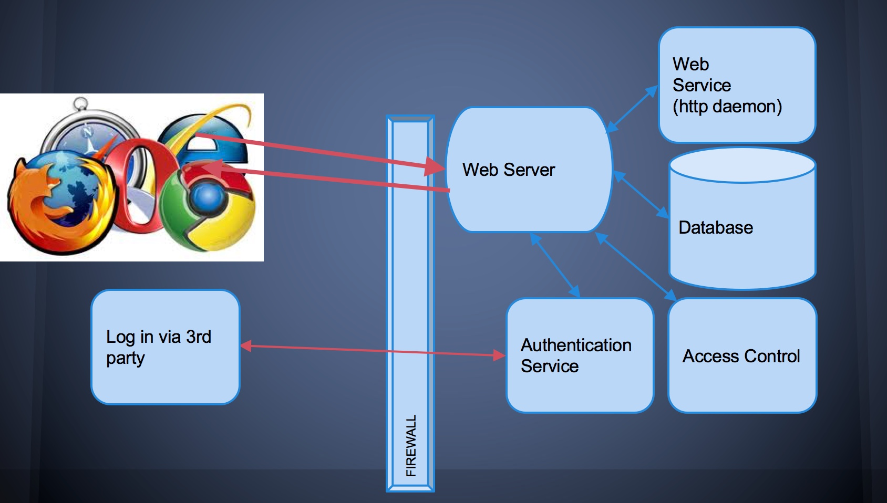
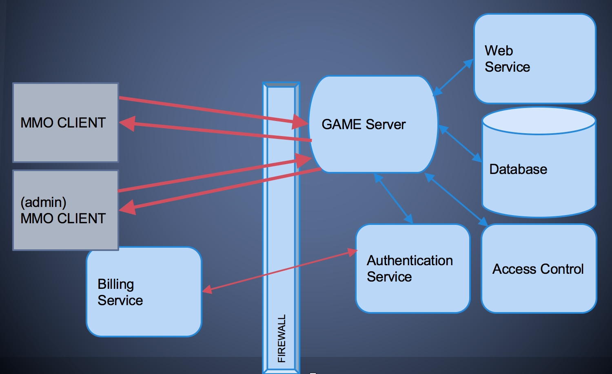

#### Lecture 4: Code Auditing

###### Software Security Resources

- ```CVE``` [Common Vulnerablities and Exposures](http://cve.mitre.org/)
- ```CWE``` [Common Weakness Enumeration](http://cwe.mitre.org/)
- [Seven kingdoms of weaknesses Taxonomy](http://cwe.mitre.org/documents/sources/SevenPerniciousKingdomsTaxonomyGraphic.pdf)
- ```CCE``` [Common Configuration Enumeration](http://cce.mitre.org/)
- ```NVD``` [National Vulnerability Database](https://nvd.nist.gov/home)
	- [ CVE-2012-0861 Detail](https://nvd.nist.gov/vuln/detail/CVE-2012-0861)

###### CVEs (Common Vulnerabilities and Exposures)

-  List of information security vulnerabilities that aims to provide common names for publicly known problems
- Goal is to make it easier to spread/share data
	- in house, between divisions, companies, researchers, etc.
	- across vulnerability databases
- Run by ```MITRE```
- Intended to be a comprehensive list of publicly known vulnerabilities & exposures
- Vulnerability
	- It is a mistake in software that can be directly used by a hacker to gain access to a system or network
- Exposure
	- It is a mistake in software that allows access to information or capabilities that can be used be a hacker as a stepping-stone into a system or network

###### CCE (Common Configuration Enumeration)

- Assigns unique identifiers to configuration guidance statements
	- The required permissions for accessing the directory ```%System Root%\System32\Setup``` should be ```Administrator Account``` only
	- The ```account lockout threshold``` for failed password attempts should be 3
	- For Linux, passwords should be stored in either ```SHA256``` or ```SHA512```, or the default ```DES``` formats and in the ```/etc/shadow``` file not the ```/etc/passwd``` file

###### CWE (Common Weakness Enumeration)

- A software weakness is an error that may lead to a software vulnerability, such as those enumerated by the CVE list
- Examples software weaknesses include: 
	- buffer overflows, format strings, etc.
	- structure and validity problems; common special element manipulations
	- channel and path errors
	- handler errors
	- user interface errors
	- pathname traversal and equivalence errors
	- authentication errors
	- resource management errors
	- insufficient verification of data
	- code evaluation and injection
	- randomness and predictability
	
```Weaknesses are a subset of bugs```


###### Discovering Vulnerabilities

```3 methods```

- ```Source Code Auditing```
	- Requires source code
- ```Reverse Engineering```
	- Can be done without source code.
	- Requires binary applications (i.e. not interpreted languages)
	- very time consuming and requires high technical skill
- ```Fuzzing```
	- Lots of tools / frameworks exist
	- Easy to make custom ones
	- Binary or source code availability is unimportant

###### Source Code Auditing

- Tedious and time consuming
- Hard to estimate time cost
- Requires high knowledge/skill with given language
- Techniques and Tools
	- Author’s source code comments
	- Editors / Reading tools
		- vi/vim
		- emacs
		- [source-navigator](http://sourcenav.sourceforge.net/)
		- notepad++
		- eclipse
		- visual studio
		- [Understand](https://scitools.com/features/)
		- [source insight](https://www.sourceinsight.com/)
	- Pattern matching tools
	- Static analyzers
		- prone to missing vulnerabilities
		- prone to false positives (can waste time)
	- pen & paper
		- not obsolete yet
- Approach
	- Find the most bugs?
	- Find the easiest to find bugs?
	- Find the weaknesses that are most reliable to exploit?
	- It is important to limit the approach
	- won't ever have enough time to find all the bugs
- General Methodology
	- Understand the Application
		- features
		- architecture
		- programming language
	- Understand the Attack Surface
		- inputs
			- various formats / protocols
		- code paths
	- Target your efforts 
		- depends on your style
- Understand the Application 
	- Read specs / documentation 
	- Understanding the programming language
		- Interpreted vs compiled
	- Features
		- What features are really complex?
			- meld of two technologies or media encodings?
	- Components
		- Database?
			- try to hit the Database for SQLi?
		- File share?
			- try to upload a file?
	- Understand the architecture

	
	
	

	
	
- Understand the Attack Surface

	- sabotage
		- defacing
		- attacker deleting records
		- altering them
		- destroying user trust
		
	- gaining access
		- to server/service
			- exploit free service?
		- of clients machines
			- attack / harass other users?
			- botnet?
			- identity theft?
			
	- piracy / theft

	- Understand inputs / outputs of architecture
		- dictates targets
	- Understand inputs of application(s)
		- dictates attack vectors for exploitation
	- Prioritize inputs of application that are remotely accessible
		- update()
		- sync()
	- Prioritize authentication mechanisms
		- weak cookies?
		- passwords sent in cleartext?
			- plain encoding?

	- Remotely accessible code path:
		- means functions / features that can be executed as a result (or following) network interaction / input 
	- Remotely accessible code paths vs non:
		- if code path is NOT remotely accessible, not likely to be remotely exploitable
			- ```read_config_file()```
			- ```load_startup_scripts()```
			- ```initialize()```

###### How to think like an attacker

- Traditional strategies:
	- input sources related to code paths
		- most effective
	- target important components
		- Security Mechanisms
			- Authentication
			- http/https
	- Data managment / Database
	- Interpreters (php)
- Complex parsing, protocols, or functions
- ``Meta Targeting`` strategies
	- Start by looking at source code comments
		- grep/search for:
 			- ```FIX THIS```, ```TODO!```, ```XXXX```, ```*******```
			- Swearing / typos
			- old code
				- old libraries!
			- code checked in at 4AM
				- (its said that SSL was a largely a 4AM decision)
			- code checked in at same time as other buggy code
				- or patterns from other buggy code
				- or code from bad developers


