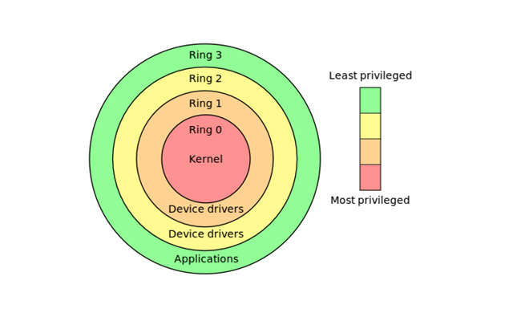
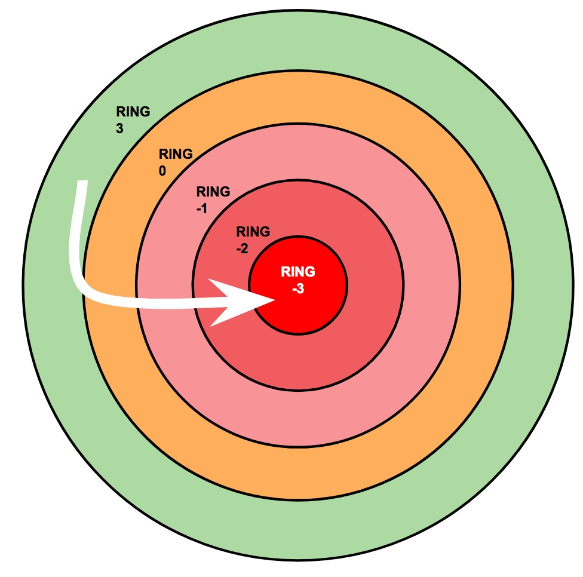
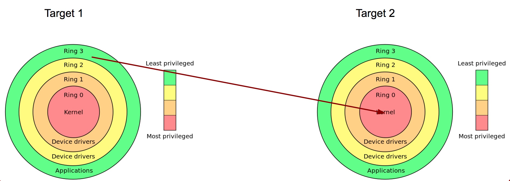
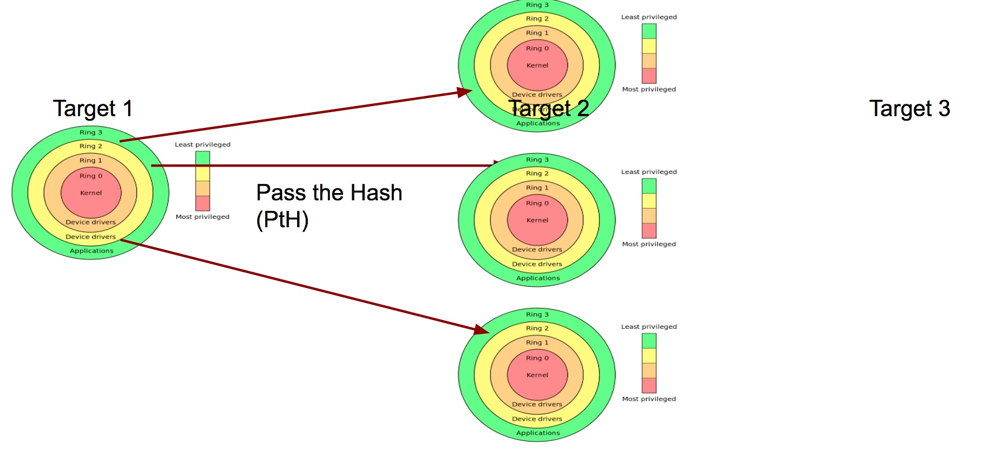
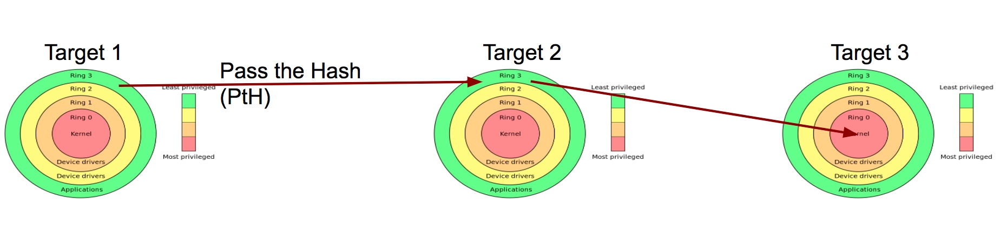
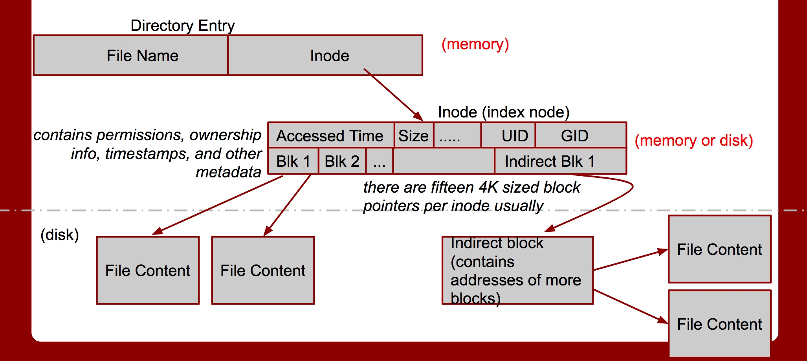
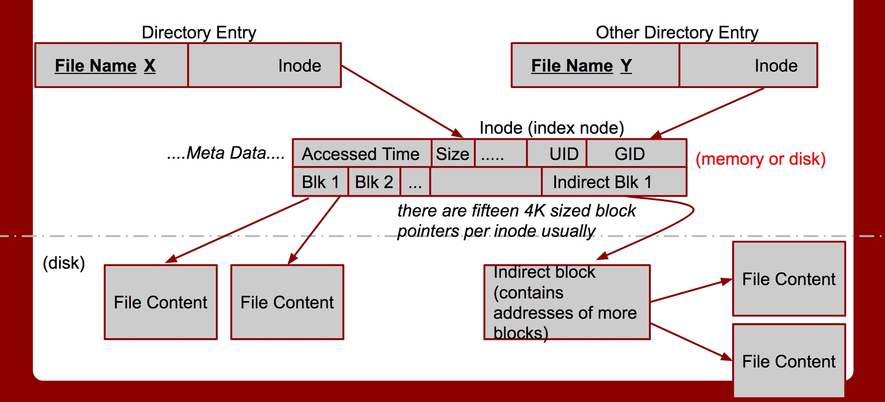
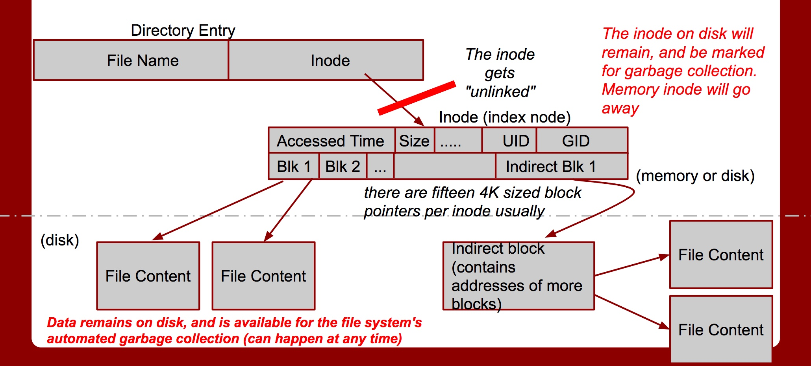
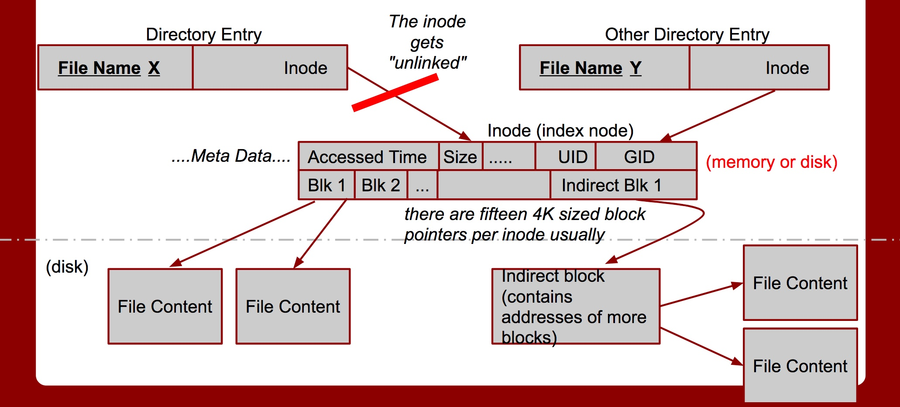

#### Lecture 5: The Permissions Spectrum

###### [```BIOS```](https://www.computerhope.com/jargon/b/bios.htm)

- _Basic Input/Output System_
- _ROM_ Chip
- Allows you to access and set up your computer system at the most basic level
- 4 function
	- ```POST``` 
		- _Power On Self Test_
		- Test the computer hardware and make sure no errors exist before loading the operating system
	- ```Bootstrap Loader```
		- Locate the operating system. If a capable operating system is located, the BIOS will pass control to it.
	- ```BIOS drivers```
		- Low level drivers that give the computer basic operational control over your computer's hardware.
	- ```BIOS``` or ```CMOS``` Setup
		- Configuration program that allows you to configure hardware settings including system settings such as computer passwords, time, and date.

###### [```CMOS```](https://www.computerhope.com/jargon/c/cmos.htm)

- _Complementary Metal-Oxide Semiconductor_
- On-board, battery powered semiconductor chip inside computers that stores information
- Stores system time and date to system hardware settings for your computer.

###### General Boot Process

- BIOS
- POST
	- CMOS
	- Hardware initialization (CPU, Video Card, …)
- Bootloader
- OS

###### [```Linux Boot Process```](http://www.thegeekstuff.com/2011/02/linux-boot-process/)


- ```BIOS```
- ```MBR```
	- ```512 bytes``` in size
	- 3 components
		- ```Primary boot loader info``` in 1st ```446 bytes```
		- ```Partition table info``` in next ```64 bytes```
		- ```MBR validation check``` in last ```2 bytes```
	- MBR loads and executes the GRUB boot loader
- ```GRUB```
	- Loads and executes ```Kernel``` and ```initrd``` images.
	- calls ```start_kernel()``` on the selected option
	- ```start_kernel()``` performs most of the system setup
		- interrupt handling, memory manager, device initialization, drivers
	- ```start_kernel()``` spawns the ```idle``` process, process scheduler, and the init process (which is in ```userspace```)

- ```Kernel```
	- Mounts the root file system
	- Kernel executes the ```/sbin/init``` program
	- ```init``` is the 1st program to be executed by Linux Kernel so it has the ```PID``` of 1

		```sh
		l32@l32-VirtualBox:~$ ps -ef | grep init
		root         1     0  0 16:13 ?        00:00:01 /sbin/init splash
		l32       4883  2139  0 16:31 pts/1    00:00:00 grep --color=auto init
		l32@l32-VirtualBox:~$
		```
	
	- ```initrd``` stands for Initial RAM Disk
	- ```initrd``` is used by kernel as temporary root file system until kernel is booted and the real root file system is mounted. It also contains necessary drivers compiled inside, which helps it to access the hard drive partitions, and other hardware.
	- Handles all operating system processes
		- Memory management
		- Task scheduling (context switching)
		- I/O (and CPU interrupts, per packet, keystroke, etc...)
		- Interprocess communication
		- Overall system control
	- Kernel is typically loaded as an image file, compressed into either ```zImage``` or ```bzImage``` formats (using zlib).
	- Linux has a ```monolithic``` kernel

- ```Init```
	- Looks at the ```/etc/inittab``` file to decide the Linux run level
	
		Number | Run Level
		-------|----------
		0 		| halt
		1 		| Single user mode
		2 		| Multiuser, without NFS
		3 		| Full multiuser mode
		4 		| unused
		5 		| X11
		6 		| reboot
		
		```sh
		l32@l32-VirtualBox:~$ who -r
         run-level 5  2017-08-12 16:14
		l32@l32-VirtualBox:~$
		```
- ```Runlevel```
	- When the Linux system is booting up, you might see various services getting started. For example, it might say ```starting sendmail …. OK```. Those are the runlevel programs, executed from the run level directory as defined by your run level.
	- Depending on your default init level setting, the system will execute the programs from one of the following directories.
	
		Run Level | Directory
		----------|----------
		Run level 0 | /etc/rc.d/rc0.d/
		Run level 1 | /etc/rc.d/rc1.d/
		Run level 2 | /etc/rc.d/rc2.d/
		Run level 3 | /etc/rc.d/rc3.d/
		Run level 4 | /etc/rc.d/rc4.d/
		Run level 5 | /etc/rc.d/rc5.d/
		Run level 6 | /etc/rc.d/rc6.d/
		
		```sh
		l32@l32-VirtualBox:/etc$ tree rc*
		rc0.d
		├── K01alsa-utils -> ../init.d/alsa-utils
		├── K01bluetooth -> ../init.d/bluetooth
		├── K01irqbalance -> ../init.d/irqbalance
		├── K01lightdm -> ../init.d/lightdm
		├── K01plymouth -> ../init.d/plymouth
		├── K01resolvconf -> ../init.d/resolvconf
		├── K01thermald -> ../init.d/thermald
		├── K01urandom -> ../init.d/urandom
		├── K01uuidd -> ../init.d/uuidd
		├── K02sendsigs -> ../init.d/sendsigs
		├── K03rsyslog -> ../init.d/rsyslog
		├── K04hwclock.sh -> ../init.d/hwclock.sh
		├── K04umountnfs.sh -> ../init.d/umountnfs.sh
		├── K05networking -> ../init.d/networking
		├── K06umountfs -> ../init.d/umountfs
		├── K07umountroot -> ../init.d/umountroot
		├── K08halt -> ../init.d/halt
		└── README
		rc1.d
		├── K01alsa-utils -> ../init.d/alsa-utils
		├── K01bluetooth -> ../init.d/bluetooth
		├── K01irqbalance -> ../init.d/irqbalance
		├── K01lightdm -> ../init.d/lightdm
		├── K01ntp -> ../init.d/ntp
		├── K01thermald -> ../init.d/thermald
		├── K01ufw -> ../init.d/ufw
		├── K01uuidd -> ../init.d/uuidd
		├── K01whoopsie -> ../init.d/whoopsie
		├── K03rsyslog -> ../init.d/rsyslog
		├── README
		├── S01killprocs -> ../init.d/killprocs
		└── S02single -> ../init.d/single
		rc2.d
		├── README
		├── S01apport -> ../init.d/apport
		├── S01rsyslog -> ../init.d/rsyslog
		├── S01uuidd -> ../init.d/uuidd
		├── S02anacron -> ../init.d/anacron
		├── S02cron -> ../init.d/cron
		├── S02dbus -> ../init.d/dbus
		├── S02irqbalance -> ../init.d/irqbalance
		├── S02ntp -> ../init.d/ntp
		├── S02rsync -> ../init.d/rsync
		├── S02ssh -> ../init.d/ssh
		├── S02thermald -> ../init.d/thermald
		├── S02whoopsie -> ../init.d/whoopsie
		├── S03bluetooth -> ../init.d/bluetooth
		├── S03lightdm -> ../init.d/lightdm
		├── S04grub-common -> ../init.d/grub-common
		├── S04ondemand -> ../init.d/ondemand
		├── S04plymouth -> ../init.d/plymouth
		└── S04rc.local -> ../init.d/rc.local
		rc3.d
		├── README
		├── S01apport -> ../init.d/apport
		├── S01rsyslog -> ../init.d/rsyslog
		├── S01uuidd -> ../init.d/uuidd
		├── S02anacron -> ../init.d/anacron
		├── S02cron -> ../init.d/cron
		├── S02dbus -> ../init.d/dbus
		├── S02irqbalance -> ../init.d/irqbalance
		├── S02ntp -> ../init.d/ntp
		├── S02rsync -> ../init.d/rsync
		├── S02ssh -> ../init.d/ssh
		├── S02thermald -> ../init.d/thermald
		├── S02whoopsie -> ../init.d/whoopsie
		├── S03bluetooth -> ../init.d/bluetooth
		├── S03lightdm -> ../init.d/lightdm
		├── S04grub-common -> ../init.d/grub-common
		├── S04ondemand -> ../init.d/ondemand
		├── S04plymouth -> ../init.d/plymouth
		└── S04rc.local -> ../init.d/rc.local
		rc4.d
		├── README
		├── S01apport -> ../init.d/apport
		├── S01rsyslog -> ../init.d/rsyslog
		├── S01uuidd -> ../init.d/uuidd
		├── S02anacron -> ../init.d/anacron
		├── S02cron -> ../init.d/cron
		├── S02dbus -> ../init.d/dbus
		├── S02irqbalance -> ../init.d/irqbalance
		├── S02ntp -> ../init.d/ntp
		├── S02rsync -> ../init.d/rsync
		├── S02ssh -> ../init.d/ssh
		├── S02thermald -> ../init.d/thermald
		├── S02whoopsie -> ../init.d/whoopsie
		├── S03bluetooth -> ../init.d/bluetooth
		├── S03lightdm -> ../init.d/lightdm
		├── S04grub-common -> ../init.d/grub-common
		├── S04ondemand -> ../init.d/ondemand
		├── S04plymouth -> ../init.d/plymouth
		└── S04rc.local -> ../init.d/rc.local
		rc5.d
		├── README
		├── S01apport -> ../init.d/apport
		├── S01rsyslog -> ../init.d/rsyslog
		├── S01uuidd -> ../init.d/uuidd
		├── S02anacron -> ../init.d/anacron
		├── S02cron -> ../init.d/cron
		├── S02dbus -> ../init.d/dbus
		├── S02irqbalance -> ../init.d/irqbalance
		├── S02ntp -> ../init.d/ntp
		├── S02rsync -> ../init.d/rsync
		├── S02ssh -> ../init.d/ssh
		├── S02thermald -> ../init.d/thermald
		├── S02whoopsie -> ../init.d/whoopsie
		├── S03bluetooth -> ../init.d/bluetooth
		├── S03lightdm -> ../init.d/lightdm
		├── S04grub-common -> ../init.d/grub-common
		├── S04ondemand -> ../init.d/ondemand
		├── S04plymouth -> ../init.d/plymouth
		└── S04rc.local -> ../init.d/rc.local
		rc6.d
		├── K01alsa-utils -> ../init.d/alsa-utils
		├── K01bluetooth -> ../init.d/bluetooth
		├── K01irqbalance -> ../init.d/irqbalance
		├── K01lightdm -> ../init.d/lightdm
		├── K01plymouth -> ../init.d/plymouth
		├── K01resolvconf -> ../init.d/resolvconf
		├── K01thermald -> ../init.d/thermald
		├── K01urandom -> ../init.d/urandom
		├── K01uuidd -> ../init.d/uuidd
		├── K02sendsigs -> ../init.d/sendsigs
		├── K03rsyslog -> ../init.d/rsyslog
		├── K04hwclock.sh -> ../init.d/hwclock.sh
		├── K04umountnfs.sh -> ../init.d/umountnfs.sh
		├── K05networking -> ../init.d/networking
		├── K06umountfs -> ../init.d/umountfs
		├── K07umountroot -> ../init.d/umountroot
		├── K08reboot -> ../init.d/reboot
		└── README
		rc.local [error opening dir]
		rcS.d
		├── README
		├── S01console-setup -> ../init.d/console-setup
		├── S02alsa-utils -> ../init.d/alsa-utils
		├── S02apparmor -> ../init.d/apparmor
		├── S02hostname.sh -> ../init.d/hostname.sh
		├── S02mountkernfs.sh -> ../init.d/mountkernfs.sh
		├── S02plymouth-log -> ../init.d/plymouth-log
		├── S02pppd-dns -> ../init.d/pppd-dns
		├── S02resolvconf -> ../init.d/resolvconf
		├── S02ufw -> ../init.d/ufw
		├── S02x11-common -> ../init.d/x11-common
		├── S03udev -> ../init.d/udev
		├── S04keyboard-setup -> ../init.d/keyboard-setup
		├── S05mountdevsubfs.sh -> ../init.d/mountdevsubfs.sh
		├── S05procps -> ../init.d/procps
		├── S06hwclock.sh -> ../init.d/hwclock.sh
		├── S07checkroot.sh -> ../init.d/checkroot.sh
		├── S08checkfs.sh -> ../init.d/checkfs.sh
		├── S09checkroot-bootclean.sh -> ../init.d/checkroot-bootclean.sh
		├── S09kmod -> ../init.d/kmod
		├── S09urandom -> ../init.d/urandom
		├── S10mountall.sh -> ../init.d/mountall.sh
		├── S10networking -> ../init.d/networking
		├── S11mountall-bootclean.sh -> ../init.d/mountall-bootclean.sh
		├── S11mountnfs.sh -> ../init.d/mountnfs.sh
		├── S12mountnfs-bootclean.sh -> ../init.d/mountnfs-bootclean.sh
		└── S13bootmisc.sh -> ../init.d/bootmisc.sh
		
		0 directories, 152 files
		l32@l32-VirtualBox:/etc$
		```
		
		- Programs starts with ```S``` are used during startup. ```S for startup```
		- Programs starts with ```K``` are used during shutdown. ```K for kill```
		- There are numbers right next to S and K in the program names. 
		- Those are the sequence number in which the programs should be started or killed.

###### Academic Ring Model

- For fault tolerance, and security
- Provide different levels of access 

Ring | | Application
-----|------|-------
3 | Normal non-root | user applications
2 | Device drivers | keyboard, mice
1 | Device drivers | video card
0 | Kernel



- Things operate higher than ring 0

Operating Mode |Full Form | Ring
-----|----|---------
IPMI | Intelligent Platform Management Interface | -3
SMM | System Management Mode | -2
BIOS | Basic Input/Output System | -1

- The original ```Multics``` had ```8``` rings!
	- had special register for ring #

###### Practical Rings model

- For fault tolerance, and security
- Provide different levels of access 

Rings | Apps
----------|--------------
4 | Sandboxed non-root user applications
3 | Normal non-root user applications
0 | Kernel / root user
-1 | BIOS
-2 | SMM
-3 | IPMI (Servers)
   | Physical Access

###### Vulnerability Research

- Privilege Escalation:
	- Type of attack resulting in higher (or more) permissions for user/attacker.
	- Goes beyond to -1, -2, -3 rings
	- Sometimes going from 3 to -3 is harder than 3 to 0
	
	
- Pivoting: Priv Esc to remote system



- Pivoting: Lateral Movement





###### Kernel Space

- Drivers run in ```Ring 1``` and ```Ring 2```
- Modern micro-kernel are pushing drivers into userspace
- Random number generation is very difficult

###### Kernel modification

- Modifying the kernel requires recompiling it, and rebooting from the new kernel
- Difficult to use this in attack chain
- On the Fly kernel modification

	Utility | Use
	--------|--------
	  kexec | system call that enables you to load and boot into another kernel from the currently running kernel
	  ksplice | applying patches without the need to reboot

###### init process (user space, ring 3)

- Init is the father of all processes
- It establishes and operates the entire user space
- It takes a parameter: runlevel (from 1 to 6)
	- Run level determines which subsystems are run
- Executes:
	- Scripts to set up all non-operating system services and structures for the user environment
	- Checks and mounts the file system
- Spawns the gui (if configured to)
- Then presents the user with the login screen
- Init scripts are located usually in directories such as

	```sh
	l32@l32-VirtualBox:~$ ls /etc/rc
	rc0.d/    rc1.d/    rc2.d/    rc3.d/    rc4.d/    rc5.d/    rc6.d/    rc.local  rcS.d/
	l32@l32-VirtualBox:~$
	```
- The toplevel configuration file for init is at ```/etc/inittab```
- Init checks for the runlevel parameter in ```/etc/inittab``` as well
- Init goes dormant after all of the specified processes have been spawned
- Waits for 3 things to happen:
	- A process init has started is ending / dying
	- A power failure signal
	- A request to ```/sbin/telnit``` to change the run level
- There are other init alternative binaries (depending on the system), such as ```systemd``` or ```upstart```

###### User Space

- More security layers here
- ```root``` is king
- Common to have a single user account per service (apache's httpd, mysqld)
	- Can be set to no login
	- The least privilege principle...

###### File system, deleting files

- Data gets left on the disk, and the ```inode``` is just unlinked 
- So sectors usually have old data from other files in them unless securely deleted

###### File system basics ( ext2/ext3.. ufs, ffs, and others derived from the original fast file system (ffs)





General delete behavior (can differ per file system!!!)





###### Generic directory layout for linux distros


- ```< / >```

	- This is the root directory.
	- This is where the Linux FS begins.
	- Every other directory is under it.
	- Do not confuse it with the root account, or the root account's home directory.

- ```< /usr/bin >```

	- It contains other applications for the users

	
- ```< /usr/sbin >```

	- Most system administration programs are here

- ```< /usr >```

	- Most user applications, their source code, pictures, docs, and other config files.  
	- ```/usr``` is the largest directory on a linux system.

- ```< /boot >```

	- Boot info is stored here.  
	- The linux kernel is also kept here.  
	- The file ```vmlinuz``` is the kernel.

- ```< /root >``` 

	- The superuser's (root) home directory

- ```< /var >```

	- Contains frequently changed variable data when the system is running.  
	- Also contains logs ```/var/log```, mail ```/var/mail```, and print info ```/var/spool```

- ```< /dev >```

	- Contains all device info for the linux system. 
	- Devices are treated like files in linux, and you can read/write to them just like files

- ```< /proc >```

	- This is a special, and interesting directory.
	- ```/proc``` is actually a virtual directory
	- It contains info on:
		- the kernel
		- all processes info
		- Contains special files that permit access to the current configuration of the system.

###### Users and groups

- [Linux File permissions](https://www.linux.com/learn/understanding-linux-file-permissions) ```_rwxrwxrwx 1 owner:group```
- [WHAT IS A STICKY BIT AND HOW TO SET IT IN LINUX?](http://www.linuxnix.com/sticky-bit-set-linux/)
- [WHAT IS SUID AND HOW TO SET SUID IN LINUX/UNIX?](http://www.linuxnix.com/suid-set-suid-linuxunix/)

```sh
l32@l32-VirtualBox:~$ touch sample
```

```sh
l32@l32-VirtualBox:~$ ls -l sample
-rw-rw-r-- 1 l32 l32 0 Aug 13 12:11 sample
l32@l32-VirtualBox:~$
```

```sh
l32@l32-VirtualBox:~$ chmod a+rwx sample
```

```sh
l32@l32-VirtualBox:~$ ls -l sample
-rwxrwxrwx 1 l32 l32 0 Aug 13 12:11 sample
l32@l32-VirtualBox:~$
```

```sh
l32@l32-VirtualBox:~$ chmod a-x sample
```

```sh
l32@l32-VirtualBox:~$ ls -l sample
-rw-rw-rw- 1 l32 l32 0 Aug 13 12:11 sample
l32@l32-VirtualBox:~$
```

```sh
l32@l32-VirtualBox:~$ mkdir sample_dir
```

```sh
l32@l32-VirtualBox:~$ ls -l
total 36
drwxr-xr-x 2 l32 l32 4096 Aug 12 14:59 Desktop
drwxr-xr-x 2 l32 l32 4096 Aug 12 14:54 Documents
drwxr-xr-x 2 l32 l32 4096 Aug 12 14:54 Downloads
drwxr-xr-x 2 l32 l32 4096 Aug 12 14:54 Music
drwxr-xr-x 2 l32 l32 4096 Aug 12 14:54 Pictures
drwxr-xr-x 2 l32 l32 4096 Aug 12 14:54 Public
-rw-rw-rw- 1 l32 l32    0 Aug 13 12:11 sample
drwxrwxr-x 2 l32 l32 4096 Aug 13 12:12 sample_dir
drwxr-xr-x 2 l32 l32 4096 Aug 12 14:54 Templates
drwxr-xr-x 2 l32 l32 4096 Aug 12 14:54 Videos
l32@l32-VirtualBox:~$
```

- Symbolic Link

```sh
l32@l32-VirtualBox:~$ ln -s sample sym_link_sample
```

```sh
l32@l32-VirtualBox:~$ ls -l sym_link_sample
lrwxrwxrwx 1 l32 l32 6 Aug 13 12:13 sym_link_sample -> sample
l32@l32-VirtualBox:~$
```

- SUID

```sh
l32@l32-VirtualBox:~$ touch suid_binary
```

```sh
l32@l32-VirtualBox:~$ ls -l suid_binary
-rw-rw-r-- 1 l32 l32 0 Aug 13 12:17 suid_binary
l32@l32-VirtualBox:~$
```

```sh
l32@l32-VirtualBox:~$ chmod u+s suid_binary
```

```sh
l32@l32-VirtualBox:~$ ls -l suid_binary
-rwSrw-r-- 1 l32 l32 0 Aug 13 12:17 suid_binary
l32@l32-VirtualBox:~$
```

- Sticky bit permissions

```sh
l32@l32-VirtualBox:/tmp$ mkdir sticky_dir
```

```sh
l32@l32-VirtualBox:/tmp$ ls -l
total 4
drwxrwxr-x 2 l32 l32 4096 Aug 13 12:27 sticky_dir
l32@l32-VirtualBox:/tmp$
```

```sh
l32@l32-VirtualBox:/tmp$ chmod +t sticky_dir/
```

```sh
l32@l32-VirtualBox:/tmp$ ls -l
total 4
drwxrwxr-t 2 l32 l32 4096 Aug 13 12:27 sticky_dir
l32@l32-VirtualBox:/tmp$
```

```sh
l32@l32-VirtualBox:/tmp$ cd sticky_dir/
l32@l32-VirtualBox:/tmp/sticky_dir$ ls -l
total 0
l32@l32-VirtualBox:/tmp/sticky_dir$ touch 1 2 3 4 5 6 7 8 9 0
l32@l32-VirtualBox:/tmp/sticky_dir$ ls -l
total 0
-rw-rw-r-- 1 l32 l32 0 Aug 13 12:27 0
-rw-rw-r-- 1 l32 l32 0 Aug 13 12:27 1
-rw-rw-r-- 1 l32 l32 0 Aug 13 12:27 2
-rw-rw-r-- 1 l32 l32 0 Aug 13 12:27 3
-rw-rw-r-- 1 l32 l32 0 Aug 13 12:27 4
-rw-rw-r-- 1 l32 l32 0 Aug 13 12:27 5
-rw-rw-r-- 1 l32 l32 0 Aug 13 12:27 6
-rw-rw-r-- 1 l32 l32 0 Aug 13 12:27 7
-rw-rw-r-- 1 l32 l32 0 Aug 13 12:27 8
-rw-rw-r-- 1 l32 l32 0 Aug 13 12:27 9
l32@l32-VirtualBox:/tmp/sticky_dir$
```

```sh
l32@l32-VirtualBox:/tmp/sticky_dir$ sudo useradd -m tim
[sudo] password for l32:
l32@l32-VirtualBox:/tmp/sticky_dir$
l32@l32-VirtualBox:/tmp/sticky_dir$ sudo passwd tim
Enter new UNIX password:
Retype new UNIX password:
passwd: password updated successfully
l32@l32-VirtualBox:/tmp/sticky_dir$
```

```sh
l32@l32-VirtualBox:/tmp/sticky_dir$ su - tim
Password:
tim@l32-VirtualBox:~$
tim@l32-VirtualBox:~$ cd /tmp/
tim@l32-VirtualBox:/tmp$ cd sticky_dir/
tim@l32-VirtualBox:/tmp/sticky_dir$ ls -l
total 0
-rw-rw-r-- 1 l32 l32 0 Aug 13 12:27 0
-rw-rw-r-- 1 l32 l32 0 Aug 13 12:27 1
-rw-rw-r-- 1 l32 l32 0 Aug 13 12:27 2
-rw-rw-r-- 1 l32 l32 0 Aug 13 12:27 3
-rw-rw-r-- 1 l32 l32 0 Aug 13 12:27 4
-rw-rw-r-- 1 l32 l32 0 Aug 13 12:27 5
-rw-rw-r-- 1 l32 l32 0 Aug 13 12:27 6
-rw-rw-r-- 1 l32 l32 0 Aug 13 12:27 7
-rw-rw-r-- 1 l32 l32 0 Aug 13 12:27 8
-rw-rw-r-- 1 l32 l32 0 Aug 13 12:27 9
tim@l32-VirtualBox:/tmp/sticky_dir$ rm 6
rm: remove write-protected regular empty file '6'? y
rm: cannot remove '6': Permission denied
tim@l32-VirtualBox:/tmp/sticky_dir$
```

```sh
tim@l32-VirtualBox:/tmp/sticky_dir$ su - l32
Password:
l32@l32-VirtualBox:~$ cd /tmp/sticky_dir/
l32@l32-VirtualBox:/tmp/sticky_dir$ ls -l
total 0
-rw-rw-r-- 1 l32 l32 0 Aug 13 12:27 0
-rw-rw-r-- 1 l32 l32 0 Aug 13 12:27 1
-rw-rw-r-- 1 l32 l32 0 Aug 13 12:27 2
-rw-rw-r-- 1 l32 l32 0 Aug 13 12:27 3
-rw-rw-r-- 1 l32 l32 0 Aug 13 12:27 4
-rw-rw-r-- 1 l32 l32 0 Aug 13 12:27 5
-rw-rw-r-- 1 l32 l32 0 Aug 13 12:27 6
-rw-rw-r-- 1 l32 l32 0 Aug 13 12:27 7
-rw-rw-r-- 1 l32 l32 0 Aug 13 12:27 8
-rw-rw-r-- 1 l32 l32 0 Aug 13 12:27 9
l32@l32-VirtualBox:/tmp/sticky_dir$ rm 6
l32@l32-VirtualBox:/tmp/sticky_dir$ ls -l
total 0
-rw-rw-r-- 1 l32 l32 0 Aug 13 12:27 0
-rw-rw-r-- 1 l32 l32 0 Aug 13 12:27 1
-rw-rw-r-- 1 l32 l32 0 Aug 13 12:27 2
-rw-rw-r-- 1 l32 l32 0 Aug 13 12:27 3
-rw-rw-r-- 1 l32 l32 0 Aug 13 12:27 4
-rw-rw-r-- 1 l32 l32 0 Aug 13 12:27 5
-rw-rw-r-- 1 l32 l32 0 Aug 13 12:27 7
-rw-rw-r-- 1 l32 l32 0 Aug 13 12:27 8
-rw-rw-r-- 1 l32 l32 0 Aug 13 12:27 9
l32@l32-VirtualBox:/tmp/sticky_dir$
```

- chattr / lsattr

	- chattr - change file attributes on a Linux file system
	- lsattr - list file attributes on a Linux second extended file system

	Option | Attribute
-------|-------------------------
a | append only
A | no atime updates
c | compressed
C | no copy on write
d | no dump
D | synchronous directory updates
e | extent format
i | immutable
j | data journalling
s | secure deletion
S | synchronous update
t | no tail-merging
T | top of directory hierarchy
u | undeletable

```sh
l32@l32-VirtualBox:~$ touch file.txt
l32@l32-VirtualBox:~$ ls -l file.txt
-rw-rw-r-- 1 l32 l32 0 Aug 13 12:38 file.txt
l32@l32-VirtualBox:~$ chmod 777 file.txt
l32@l32-VirtualBox:~$ ls -l file.txt
-rwxrwxrwx 1 l32 l32 0 Aug 13 12:38 file.txt
l32@l32-VirtualBox:~$ sudo chattr +i file.txt
l32@l32-VirtualBox:~$ lsattr file.txt
----i--------e-- file.txt
l32@l32-VirtualBox:~$ rm -rf file.txt
rm: cannot remove 'file.txt': Operation not permitted
l32@l32-VirtualBox:~$
```

- chown

	- change file owner and groups

```sh
```

```sh
```


