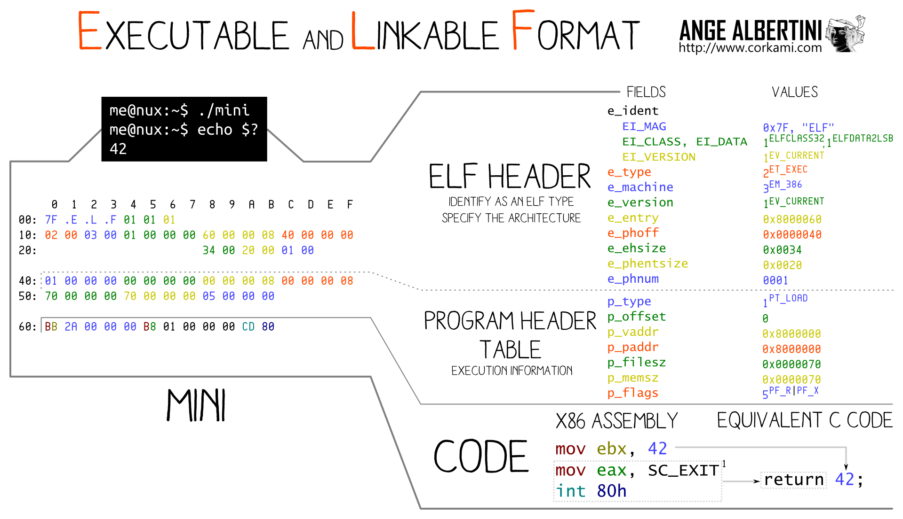
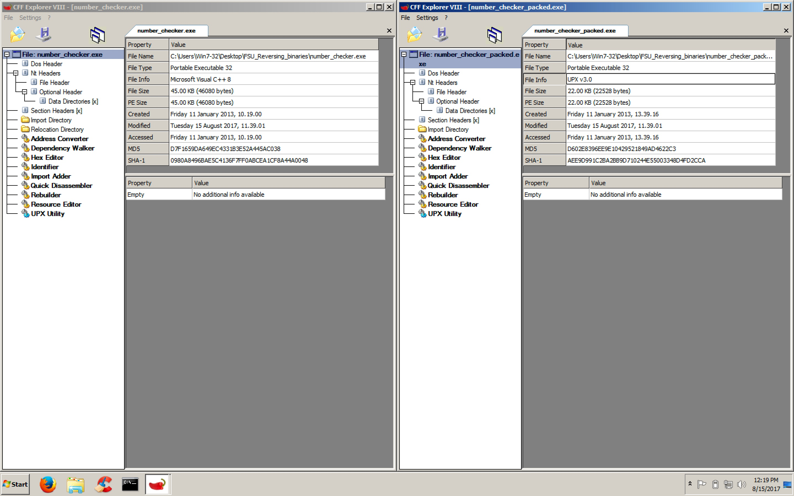

#### Lecture 6: Reverse Engineering Workshop 1

###### Static

- Looking at the code, figure things out
- A safer approach
- Not running the code!
- Tools
	- Disassemblers
		- IDA Pro
		- objdump
- Features of good disassembler
	- Commenting
	- Renaming variables
	- Changing function prototypes
	- Coloring, grouping and renaming nodes (IDA)

###### Dynamic

- Examine the process during execution
- Can see the values in real time
- Registers, memory contents, etc.
- Allows manipulation of the process
- Should run in a VM!
- Tools
	- Debuggers
		- Windows
			- WinDBG
			- Immunity
			- OllyDBG
			- IDA Pro
		- Linux
			- GDB
- Features of good debugger
	- Set breakpoints
	- Step into / over
	- Show loaded modules, SEH chain, etc.
	- Memory searching

###### PE

- Portable Executable
- File format for executables, object code and DLLs, used in 32-bit and 64-bit versions of Windows operating systems


###### ELF

- Executable and Linkable Format
- A common standard file format for executables, object code, shared libraries, and core dumps
- Linux, Unix, Apple OS



###### PE and ELF

- PE and ELF are a big collection of ```fields``` and ```sections```
- Fields will have a particular meaning and hold a particular value
	- Date created, last modified, number of sections, image base, etc.
- A section is, generally, a logical collection of code or data
	- Has permissions (read/write/execute)
	- Has a name (.text, .bss, etc.)
- Conclusions drawn form ```fields``` and ```sections```
	- Can look at what libraries the binary is loading
	- Can look at what functions are used in a library
		- Find vulns
	- Can parse data sections for strings
		- Very helpful on CTFs
	- Can help determine if a binary is packed
		- Weird section names or sizes, lack of strings, lack of imports
- Analyze
	- PE
		- CFF Explorer
		- IDA Pro
		- pefile (python library)
	- ELF
		- readelf
		- objdump
		- file

###### CFF Explorer

- Not packed exe


- Packed exe


###### readelf

- Read sections of an elf

```sh
l32@l32-VirtualBox:~$ readelf -S /bin/ping
There are 28 section headers, starting at offset 0x93b4:

Section Headers:
  [Nr] Name              Type            Addr     Off    Size   ES Flg Lk Inf Al
  [ 0]                   NULL            00000000 000000 000000 00      0   0  0
  [ 1] .interp           PROGBITS        08048154 000154 000013 00   A  0   0  1
  [ 2] .note.ABI-tag     NOTE            08048168 000168 000020 00   A  0   0  4
  [ 3] .note.gnu.build-i NOTE            08048188 000188 000024 00   A  0   0  4
  [ 4] .gnu.hash         GNU_HASH        080481ac 0001ac 00004c 04   A  5   0  4
  [ 5] .dynsym           DYNSYM          080481f8 0001f8 000540 10   A  6   1  4
  [ 6] .dynstr           STRTAB          08048738 000738 00037e 00   A  0   0  1
  [ 7] .gnu.version      VERSYM          08048ab6 000ab6 0000a8 02   A  5   0  2
  [ 8] .gnu.version_r    VERNEED         08048b60 000b60 000060 00   A  6   1  4
  [ 9] .rel.dyn          REL             08048bc0 000bc0 000028 08   A  5   0  4
  [10] .rel.plt          REL             08048be8 000be8 000230 08  AI  5  12  4
  [11] .init             PROGBITS        08048e18 000e18 000023 00  AX  0   0  4
  [12] .plt              PROGBITS        08048e40 000e40 000470 04  AX  0   0 16
  [13] .text             PROGBITS        080492b0 0012b0 005882 00  AX  0   0 16
  [14] .fini             PROGBITS        0804eb34 006b34 000014 00  AX  0   0  4
  [15] .rodata           PROGBITS        0804eb48 006b48 00141c 00   A  0   0  8
  [16] .eh_frame_hdr     PROGBITS        0804ff64 007f64 000114 00   A  0   0  4
  [17] .eh_frame         PROGBITS        08050078 008078 000698 00   A  0   0  4
  [18] .init_array       INIT_ARRAY      08051f00 008f00 000004 00  WA  0   0  4
  [19] .fini_array       FINI_ARRAY      08051f04 008f04 000004 00  WA  0   0  4
  [20] .jcr              PROGBITS        08051f08 008f08 000004 00  WA  0   0  4
  [21] .dynamic          DYNAMIC         08051f0c 008f0c 0000f0 08  WA  6   0  4
  [22] .got              PROGBITS        08051ffc 008ffc 000004 04  WA  0   0  4
  [23] .got.plt          PROGBITS        08052000 009000 000124 04  WA  0   0  4
  [24] .data             PROGBITS        08052140 009140 00016a 00  WA  0   0 32
  [25] .bss              NOBITS          080522c0 0092aa 0132b4 00  WA  0   0 32
  [26] .gnu_debuglink    PROGBITS        00000000 0092aa 00000c 00      0   0  1
  [27] .shstrtab         STRTAB          00000000 0092b6 0000fc 00      0   0  1
Key to Flags:
  W (write), A (alloc), X (execute), M (merge), S (strings)
  I (info), L (link order), G (group), T (TLS), E (exclude), x (unknown)
  O (extra OS processing required) o (OS specific), p (processor specific)
l32@l32-VirtualBox:~$
```

###### IDA Pro

- Imports
	- Filtered using the regular expression ```*str.*```


- Strings


###### Exercise

```number_checker.exe``` vs ```number_checker_packed.exe```

- CFF Explorer




- IDA Pro

	- Strings

	

	- Imports

	

	- Sections
	
	
	
###### Assembly

- ATT

```
instruction source, dest
```

```
mov %eax, %edx
```

Move eax into edx


- Intel

```
instruction dest, source
```

```
mov edx, eax
```

Move eax into edx

--

- Example 1

```
mov eax, ecx
```

Move into eax, the contents of ecx

- Example 2

```
mov eax, [ecx]
```

Move into eax, the contents of what ecx points to

The brackets, ```[…]```, mean dereference the value between them

In C, this is like a pointer dereference

```
eax = *ecx
```

- Example 3

```
mov eax, 5
```

Move into eax, the value 5

- Example 4

```
mov edx, [0x12345678]
```

Move into edx, what 0x12345678 points to

- Example 5

```
call 0x12345678
```

Call the function at 0x12345678

- Example 6

```
cmp eax, 8
```

Compare eax to 8

Compare left to right

- Example 7

```
jmp 0x12345678
```

Unconditional jump to 0x12345678

- Example 8

```
jle 0x12345678
```

Jump to 0x12345678 if eax is less than or equal to 8

- Example 9

```
jg 0x12345678
```

Jump to 0x112345678 if eax is greater than 8

- Example 10

	

	- 2 memory addresses, relative to the pointer contained in ebp, have values. One has 4, one has 10.
	- There is a comparison
	- If operand 1 >= operand 2, take the jump
	- If not, continue execution
	- EAX gets assigned the value of 1
	- The function returns

```
sub esp, 0x10
	There is room for 16 (0x10) bytes of locals, or 4 ints
[ebp-0x4] = 0x4
[ebp-0x8] = 0xa
eax = [ebp-0x4]
cmp eax, [ebp-0x8]
	eax == [ebp-0x8]
	4 == 10
jge 0x80483d7
	If 4 was >= 10, jmp
	Else, continue execution
mov eax, 0x1
	Return value, eax, is either 1 or 0 depending on the comparison
jmp over the mov eax, 0
leave and return
```

```
mov DWORD PTR [ebp-0x4], 0x4
```

DWORD PTR

DWORD = the size

PTR = dereference the value, accompanied by the brackets

The address pointed to by the dereferenced value of ```[ebp-4]``` is getting 4 bytes moved into it, with the value of 4.

```[ebp-4]``` is an int


###### Process Memory Layout

- Windows


- Linux


###### Virtual Memory


###### Registers


###### Stack


###### Source to ASM discrepancy for ```if``` statements


###### Exercise

Produce the source code for the following function


- How many local variables, how many arguments, what types?
- Hint:
 
```
lea eax, [edx+eax*1] 
```

is the same thing as

```
eax = edx+eax
```

- Solution

Number of local variables : ```0```

Number of arguments : ```2```

```ebp+0xc```

```ebp+0x8```

Types : ```int```: DWORD - 4 bytes


###### Functions

- Calling Conventions

	- ```CDECL```
		- Originates from C
		- Args pushed on the stack, right to left (reverse)
		- Calling function cleans up
	- ```STDCall```
		- Orignates from Microsoft
		- Args pushed on the stack, right to left (reverse)
		- Called function cleans up
			- Must know how many bytes ahead of time

- ```GCC``` vs ```Visual Studio```

GCC tends to use : ```move [esp+x], arg```

Visual studio tents to use : ```push arg```


###### Stack Frame

- Functions reference local variables and arguments via their stack frame pointers, ```esp``` and ```ebp```
- So, every function has it’s own ```prolog``` and ```epilog``` to adjust ```esp``` and ```ebp``` to contain the correct values
- Prolog

```
push ebp		// Save ebp on the stack
mov ebp, esp		// Move ebp to the top of the stack
sub esp, x		// Make room for locals
```

- Epilog

``` 
add esp, x		// move esp back to ebp
pop ebp			// pop the top of the stack into ebp
ret			// return to the address on top of the stack
```
