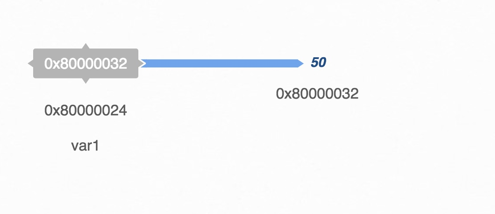
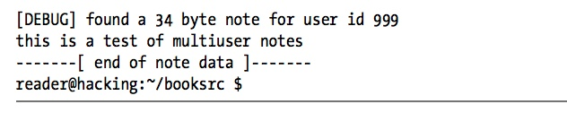

#### 0x200 Programming

```Assembly language``` ----Assembler----&rightarrow; ```Machine language```

```High-level language``` ----Compiler----&rightarrow; ```Machine language```

###### Pseudo-code

- English like 
- Arranged with a general structure 
- Similar to a high-level language

###### Control Structures

- If-Then-Else

```
If (condition) then 
{
	Set of instructions to execute if the condition is met;
} 
Else 
{
	Set of instruction to execute if the condition is not met;
}
```

- While/Until Loops

```
While (you are hungry) 
{
	Find some food;
	Eat the food; 
}
```

```
Until (you are not hungry) 
{
	Find some food;
	Eat the food; 
}
```

- For Loops

```
for (i=0; i<5; i++)
{
	Drive straight for 1 mile;
}
```

###### More Fundamental Programming Concepts

- Variables
	- Variables
	- Constants

```
int a, b; 
float k; 
char z;
```

```
int a = 13, b; 
float k;
char z = 'A';

k = 3.14; 
z = 'w';
b = a + 5;
```

- Arithmetic Operators

Operation | Symbol | Example
----------|--------|---------
Addition 	| + | b = a + 5
Subtraction | - | b = a - 5
Multiplication | * | b = a * 5
Division | / | b = a / 5
Modulo reduction | % | b = a % 5

Full Expression | Shorthand | Explanation
----------------|-----------|-----------------
i = i + 1 | i++ or ++i | Add 1 to the variable
i = i - 1 | i-- or --i | Subtract 1 from the variable

Full Expression | Shorthand | Explanation
----------------|-----------|-----------------
i = i + 12 | i+=12 | Add some value to the variable.
i = i - 12 | i-=12 | Subtract some value from the variable.
i = i * 12 | i*=12 | Multiply some value by the variable.
i = i / 12 | i/=12 | Divide some value from the variable.

- Comparison Operators

Condition | Symbol | Example
----------|--------|-------------
Less than | < | (a<b)
Greater than | > | (a>b)
Less than or equal to | <= | (a<=b)
Greater than or equal to | >= | (a>=b)
Equal to | == | (a==b)
Not equal to | != | (a!=b)

Logic | Symbol | Example
------|--------|-------------
OR | ```||``` | ((a < b) || (a < c))
AND | ```&&``` | ((a < b) && !(a < c))

- Functions

```
int factorial(int x) 
{
	int i;
	for(i=1; i < x; i++)
    	x *= i;
  	return x;
}
```

```
int a = 5, b;
b = factorial(a);
```

```
int factorial(int);
```

###### Getting your hands dirty

- Location of header files

```/usr/include```

- ```GCC``` Version

```sh
root@kali:~/hacking/booksrc# gcc --version
gcc (Debian 6.3.0-12) 6.3.0 20170406
Copyright (C) 2016 Free Software Foundation, Inc.
This is free software; see the source for copying conditions.  There is NO
warranty; not even for MERCHANTABILITY or FITNESS FOR A PARTICULAR PURPOSE.

root@kali:~/hacking/booksrc#
```

- Write and Compile ```C``` programs

```c
root@kali:~/hacking/booksrc# cat firstprog.c
#include <stdio.h>

int main()
{
  int i;
  for(i=0; i < 10; i++)
  {
    printf("Hello World!\n");
  }
}
root@kali:~/hacking/booksrc#
```

```sh
root@kali:~/hacking/booksrc# gcc firstprog.c -o firstprog
```

```sh
root@kali:~/hacking/booksrc# file firstprog
firstprog: ELF 32-bit LSB shared object, Intel 80386, version 1 (SYSV), dynamically linked, interpreter /lib/ld-linux.so.2, for GNU/Linux 2.6.32, BuildID[sha1]=84d59dc5f956badc162523dcaa2dc18e0fe5be5a, not stripped
root@kali:~/hacking/booksrc#
```

```sh
root@kali:~/hacking/booksrc# ./firstprog
Hello World!
Hello World!
Hello World!
Hello World!
Hello World!
Hello World!
Hello World!
Hello World!
Hello World!
Hello World!
root@kali:~/hacking/booksrc#
```

- Machine code of the ```main()``` function

	- AT&T

	```sh
	root@kali:~/hacking/booksrc# objdump -D firstprog | grep -A 36 main.:
	00000590 <main>:
	 590:	8d 4c 24 04          	lea    0x4(%esp),%ecx
	 594:	83 e4 f0             	and    $0xfffffff0,%esp
	 597:	ff 71 fc             	pushl  -0x4(%ecx)
	 59a:	55                   	push   %ebp
	 59b:	89 e5                	mov    %esp,%ebp
	 59d:	53                   	push   %ebx
	 59e:	51                   	push   %ecx
	 59f:	83 ec 10             	sub    $0x10,%esp
	 5a2:	e8 b9 fe ff ff       	call   460 <__x86.get_pc_thunk.bx>
	 5a7:	81 c3 59 1a 00 00    	add    $0x1a59,%ebx
	 5ad:	c7 45 f4 00 00 00 00 	movl   $0x0,-0xc(%ebp)
	 5b4:	eb 16                	jmp    5cc <main+0x3c>
	 5b6:	83 ec 0c             	sub    $0xc,%esp
	 5b9:	8d 83 70 e6 ff ff    	lea    -0x1990(%ebx),%eax
	 5bf:	50                   	push   %eax
	 5c0:	e8 2b fe ff ff       	call   3f0 <puts@plt>
	 5c5:	83 c4 10             	add    $0x10,%esp
	 5c8:	83 45 f4 01          	addl   $0x1,-0xc(%ebp)
	 5cc:	83 7d f4 09          	cmpl   $0x9,-0xc(%ebp)
	 5d0:	7e e4                	jle    5b6 <main+0x26>
	 5d2:	b8 00 00 00 00       	mov    $0x0,%eax
	 5d7:	8d 65 f8             	lea    -0x8(%ebp),%esp
	 5da:	59                   	pop    %ecx
	 5db:	5b                   	pop    %ebx
	 5dc:	5d                   	pop    %ebp
	 5dd:	8d 61 fc             	lea    -0x4(%ecx),%esp
	 5e0:	c3                   	ret
	 5e1:	66 90                	xchg   %ax,%ax
	 5e3:	66 90                	xchg   %ax,%ax
	 5e5:	66 90                	xchg   %ax,%ax
	 5e7:	66 90                	xchg   %ax,%ax
	 5e9:	66 90                	xchg   %ax,%ax
	 5eb:	66 90                	xchg   %ax,%ax
	 5ed:	66 90                	xchg   %ax,%ax
	 5ef:	90                   	nop
	
	root@kali:~/hacking/booksrc#
	```

	- Intel

	```sh
	root@kali:~/hacking/booksrc# objdump -D firstprog -M intel | grep -A 36 main.:
	00000590 <main>:
	 590:	8d 4c 24 04          	lea    ecx,[esp+0x4]
	 594:	83 e4 f0             	and    esp,0xfffffff0
	 597:	ff 71 fc             	push   DWORD PTR [ecx-0x4]
	 59a:	55                   	push   ebp
	 59b:	89 e5                	mov    ebp,esp
	 59d:	53                   	push   ebx
	 59e:	51                   	push   ecx
	 59f:	83 ec 10             	sub    esp,0x10
	 5a2:	e8 b9 fe ff ff       	call   460 <__x86.get_pc_thunk.bx>
	 5a7:	81 c3 59 1a 00 00    	add    ebx,0x1a59
	 5ad:	c7 45 f4 00 00 00 00 	mov    DWORD PTR [ebp-0xc],0x0
	 5b4:	eb 16                	jmp    5cc <main+0x3c>
	 5b6:	83 ec 0c             	sub    esp,0xc
	 5b9:	8d 83 70 e6 ff ff    	lea    eax,[ebx-0x1990]
	 5bf:	50                   	push   eax
	 5c0:	e8 2b fe ff ff       	call   3f0 <puts@plt>
	 5c5:	83 c4 10             	add    esp,0x10
	 5c8:	83 45 f4 01          	add    DWORD PTR [ebp-0xc],0x1
	 5cc:	83 7d f4 09          	cmp    DWORD PTR [ebp-0xc],0x9
	 5d0:	7e e4                	jle    5b6 <main+0x26>
	 5d2:	b8 00 00 00 00       	mov    eax,0x0
	 5d7:	8d 65 f8             	lea    esp,[ebp-0x8]
	 5da:	59                   	pop    ecx
	 5db:	5b                   	pop    ebx
	 5dc:	5d                   	pop    ebp
	 5dd:	8d 61 fc             	lea    esp,[ecx-0x4]
	 5e0:	c3                   	ret
	 5e1:	66 90                	xchg   ax,ax
	 5e3:	66 90                	xchg   ax,ax
	 5e5:	66 90                	xchg   ax,ax
	 5e7:	66 90                	xchg   ax,ax
	 5e9:	66 90                	xchg   ax,ax
	 5eb:	66 90                	xchg   ax,ax
	 5ed:	66 90                	xchg   ax,ax
	 5ef:	90                   	nop
	
	root@kali:~/hacking/booksrc#
	```
	
###### The x86 Processor

- Registers
	- Internal Variables

General Purpose Register | Use
-------------------------|--------
EAX | Accumulator
EBX | Base
ECX | Counter
EDX | Data

Pointers & Indexes | Use
-------------------|------
ESP | Stack Pointer
EBP | Base Pointer
ESI | Source Index
EDI | Destination Index

```EIP```
	- Instruction Pointer
	- Points to the current instruction the processor is reading

[```EFLAGS```](http://www.c-jump.com/CIS77/ASM/Instructions/I77_0070_eflags_bits.htm)
	- Bit flags that are used for comparisons and memory segmentation


- Debugger
	- Step through the compiled program
	- Examine program memory
	- View processor registers

- GDB

```sh
root@kali:~/hacking/booksrc# gdb ./firstprog -q
Reading symbols from ./firstprog...(no debugging symbols found)...done.
(gdb) break main
Breakpoint 1 at 0x59f
(gdb) run
Starting program: /root/hacking/booksrc/firstprog

Breakpoint 1, 0x8000059f in main ()
(gdb) info registers
eax            0xb7fb2dbc	-1208275524
ecx            0xbffff680	-1073744256
edx            0xbffff6a4	-1073744220
ebx            0x0	0
esp            0xbffff660	0xbffff660
ebp            0xbffff668	0xbffff668
esi            0x1	1
edi            0xb7fb1000	-1208283136
eip            0x8000059f	0x8000059f <main+15>
eflags         0x282	[ SF IF ]
cs             0x73	115
ss             0x7b	123
ds             0x7b	123
es             0x7b	123
fs             0x0	0
gs             0x33	51
(gdb) quit
A debugging session is active.

	Inferior 1 [process 1605] will be killed.

Quit anyway? (y or n) y
root@kali:~/hacking/booksrc#
```

###### Assembly Language

- ```GDB``` init file to use ```Intel``` syntax

```sh
root@kali:~/hacking/booksrc# gdb -q
(gdb) set disassembly-flavor intel
(gdb) quit
root@kali:~/hacking/booksrc#
```

```sh
root@kali:~/hacking/booksrc# echo "set disassembly-flavor intel" > ~/.gdbinit
root@kali:~/hacking/booksrc# cat ~/.gdbinit
set disassembly-flavor intel
root@kali:~/hacking/booksrc#
```

- Intel Syntax

```
operation <destination>, <source>
```

```DWORD``` - 4 bytes

- Compile with debug information

```sh
root@kali:~/hacking/booksrc# gcc firstprog.c -o firstprog_debug -g
```

```sh
root@kali:~/hacking/booksrc# file firstprog_debug
firstprog_debug: ELF 32-bit LSB shared object, Intel 80386, version 1 (SYSV), dynamically linked, interpreter /lib/ld-linux.so.2, for GNU/Linux 2.6.32, BuildID[sha1]=f9594a9b7afa7598a838fee6af6531982c357267, not stripped
root@kali:~/hacking/booksrc#
```

```sh
root@kali:~/hacking/booksrc# gdb ./firstprog_debug -q
Reading symbols from ./firstprog_debug...done.
(gdb) list
1	#include <stdio.h>
2
3	int main()
4	{
5	  int i;
6	  for(i=0; i < 10; i++)
7	  {
8	    printf("Hello World!\n");
9	  }
10	}
(gdb) disassemble main
Dump of assembler code for function main:
   0x00000590 <+0>:		lea    ecx,[esp+0x4]
   0x00000594 <+4>:		and    esp,0xfffffff0
   0x00000597 <+7>:		push   DWORD PTR [ecx-0x4]
   0x0000059a <+10>:	push   ebp
   0x0000059b <+11>:	mov    ebp,esp
   0x0000059d <+13>:	push   ebx
   0x0000059e <+14>:	push   ecx
   0x0000059f <+15>:	sub    esp,0x10
   0x000005a2 <+18>:	call   0x460 <__x86.get_pc_thunk.bx>
   0x000005a7 <+23>:	add    ebx,0x1a59
   0x000005ad <+29>:	mov    DWORD PTR [ebp-0xc],0x0
   0x000005b4 <+36>:	jmp    0x5cc <main+60>
   0x000005b6 <+38>:	sub    esp,0xc
   0x000005b9 <+41>:	lea    eax,[ebx-0x1990]
   0x000005bf <+47>:	push   eax
   0x000005c0 <+48>:	call   0x3f0 <puts@plt>
   0x000005c5 <+53>:	add    esp,0x10
   0x000005c8 <+56>:	add    DWORD PTR [ebp-0xc],0x1
   0x000005cc <+60>:	cmp    DWORD PTR [ebp-0xc],0x9
   0x000005d0 <+64>:	jle    0x5b6 <main+38>
   0x000005d2 <+66>:	mov    eax,0x0
   0x000005d7 <+71>:	lea    esp,[ebp-0x8]
   0x000005da <+74>:	pop    ecx
   0x000005db <+75>:	pop    ebx
   0x000005dc <+76>:	pop    ebp
   0x000005dd <+77>:	lea    esp,[ecx-0x4]
   0x000005e0 <+80>:	ret
End of assembler dump.
(gdb) break main
Breakpoint 1 at 0x5ad: file firstprog.c, line 6.
(gdb) run
Starting program: /root/hacking/booksrc/firstprog_debug

Breakpoint 1, main () at firstprog.c:6
6	  for(i=0; i < 10; i++)
(gdb) info registers eip
eip            0x800005ad	0x800005ad <main+29>
(gdb)
```

EIP

```sh
   0x000005ad <+29>:	mov    DWORD PTR [ebp-0xc],0x0
```

Function Prolog

```sh
   0x00000590 <+0>:		lea    ecx,[esp+0x4]
   0x00000594 <+4>:		and    esp,0xfffffff0
   0x00000597 <+7>:		push   DWORD PTR [ecx-0x4]
   0x0000059a <+10>:	push   ebp
   0x0000059b <+11>:	mov    ebp,esp
   0x0000059d <+13>:	push   ebx
   0x0000059e <+14>:	push   ecx
   0x0000059f <+15>:	sub    esp,0x10
   0x000005a2 <+18>:	call   0x460 <__x86.get_pc_thunk.bx>
   0x000005a7 <+23>:	add    ebx,0x1a59
```

- Examine - ```x```
	- 2 arguments
		- Location of memory to examine
		- How to display the memory
			- display is preceded by a count of how many items to examine

Display format Shorthand | Display format
-------------------------|------------------
o | Octal
x | hexadecimal
u | unsigned, standard base-10 decimal
t | binary
c | character
s | entire string

```sh
(gdb) i r eip
eip            0x800005ad	0x800005ad <main+29>
(gdb) x/o 0x800005ad
0x800005ad <main+29>:	075042707
(gdb) x/x 0x800005ad
0x800005ad <main+29>:	0x00f445c7
(gdb) x/u 0x800005ad
0x800005ad <main+29>:	16008647
(gdb) x/t 0x800005ad
0x800005ad <main+29>:	00000000111101000100010111000111
(gdb)
```

```sh
(gdb) x/2x $eip
0x800005ad <main+29>:	0x00f445c7	0xeb000000
(gdb) x/12x $eip
0x800005ad <main+29>:	0x00f445c7	0xeb000000	0x0cec8316	0xe670838d
0x800005bd <main+45>:	0xe850ffff	0xfffffe2b	0x8310c483	0x8301f445
0x800005cd <main+61>:	0x7e09f47d	0x0000b8e4	0x658d0000	0x5d5b59f8
(gdb)
```

Size Alphabet | Size
--------------|--------
b | 1 byte
h | Halfword - 2 bytes
w | Word - 4 bytes
g | Giant - 8 bytes

_**Sometimes ```DWORD``` and ```WORD``` both are 4 bytes**_


```sh
(gdb) x/8xb $eip
0x800005ad <main+29>:	0xc7	0x45	0xf4	0x00	0x00	0x00	0x00	0xeb
(gdb) x/8xh $eip
0x800005ad <main+29>:	0x45c7	0x00f4	0x0000	0xeb00	0x8316	0x0cec	0x838d	0xe670
(gdb) x/8xw $eip
0x800005ad <main+29>:	0x00f445c7	0xeb000000	0x0cec8316	0xe670838d
0x800005bd <main+45>:	0xe850ffff	0xfffffe2b	0x8310c483	0x8301f445
(gdb) x/8xg $eip
0x800005ad <main+29>:	0xeb00000000f445c7	0xe670838d0cec8316
0x800005bd <main+45>:	0xfffffe2be850ffff	0x8301f4458310c483
0x800005cd <main+61>:	0x0000b8e47e09f47d	0x5d5b59f8658d0000
0x800005dd <main+77>:	0x90669066c3fc618d	0x9066906690669066
(gdb)
```

Examine instructions - ```i```

```sh
root@kali:~/hacking/booksrc# gdb ./firstprog_debug -q
Reading symbols from ./firstprog_debug...done.
(gdb) break main
Breakpoint 1 at 0x5ad: file firstprog.c, line 6.
(gdb) run
Starting program: /root/hacking/booksrc/firstprog_debug

Breakpoint 1, main () at firstprog.c:6
6	  for(i=0; i < 10; i++)
(gdb) i r $eip
eip            0x800005ad	0x800005ad <main+29>
(gdb) x/i $eip
=> 0x800005ad <main+29>:	mov    DWORD PTR [ebp-0xc],0x0
(gdb) x/3i $eip
=> 0x800005ad <main+29>:	mov    DWORD PTR [ebp-0xc],0x0
   0x800005b4 <main+36>:	jmp    0x800005cc <main+60>
   0x800005b6 <main+38>:	sub    esp,0xc
(gdb) x/7xb $eip
0x800005ad <main+29>:	0xc7	0x45	0xf4	0x00	0x00	0x00	0x00
(gdb) x/i $eip
=> 0x800005ad <main+29>:	mov    DWORD PTR [ebp-0xc],0x0
(gdb)
```

```objdump``` output

```sh
root@kali:~/hacking/booksrc# objdump -D firstprog -M intel | grep -A 36 main.:
<---snip--->
  5ad:	c7 45 f4 00 00 00 00 	mov    DWORD PTR [ebp-0xc],0x0
<---snip--->
```

Examining the ```ebp-0xc```

```sh
(gdb) i r ebp
ebp            0xbffff658	0xbffff658
(gdb) x/4xb $ebp-0xc
0xbffff64c:	0x11	0x06	0x00	0x80
(gdb) x/12xb $ebp-0xc
0xbffff64c:	0x11	0x06	0x00	0x80	0x70	0xf6	0xff	0xbf
0xbffff654:	0x00	0x00	0x00	0x00
(gdb) print $ebp-0xc
$1 = (void *) 0xbffff64c
(gdb) x/4xb $1
0xbffff64c:	0x11	0x06	0x00	0x80
(gdb) x/xw $1
0xbffff64c:	0x80000611
```

Single Step and check the value of ```ebp-0xc```

```sh
(gdb) nexti
0x800005b4	6	  for(i=0; i < 10; i++)
(gdb) x/xw $1
0xbffff64c:	0x00000000
(gdb) x/4xb $1
0xbffff64c:	0x00	0x00	0x00	0x00
(gdb) x/dw $1
0xbffff64c:	0
(gdb) i r eip
eip            0x800005b4	0x800005b4 <main+36>
(gdb) x/i $eip
=> 0x800005b4 <main+36>:	jmp    0x800005cc <main+60>
(gdb)
```

Refer to page ```32``` - ```37``` of the book - Very detailed and nice explanation

###### Back to Basics

- Strings

Refer to page ```38``` - ```41``` of the book

```c
root@kali:~/hacking/booksrc# cat char_array.c
#include <stdio.h>
int main()
{
  char str_a[20];
  str_a[0]  = 'H';
  str_a[1]  = 'e';
  str_a[2]  = 'l';
  str_a[3]  = 'l';
  str_a[4]  = 'o';
  str_a[5]  = ',';
  str_a[6]  = ' ';
  str_a[7]  = 'w';
  str_a[8]  = 'o';
  str_a[9]  = 'r';
  str_a[10]  = 'l';
  str_a[11] = 'd';
  str_a[12] = '!';
  str_a[13] = '\n';
  str_a[14] = 0;
  printf(str_a);
}
root@kali:~/hacking/booksrc#
```

```sh
root@kali:~/hacking/booksrc# gcc char_array.c -o char_array
```

```sh
root@kali:~/hacking/booksrc# ./char_array
Hello, world!
root@kali:~/hacking/booksrc#
```

```c
root@kali:~/hacking/booksrc# cat char_array2.c
#include <stdio.h>
#include <string.h>

int main() {
   char str_a[20];

   strcpy(str_a, "Hello World!\n");
   printf(str_a);
}
root@kali:~/hacking/booksrc#
```

```sh
root@kali:~/hacking/booksrc# gcc char_array2.c -o char_array2
```

```sh
root@kali:~/hacking/booksrc# ./char_array2
Hello World!
root@kali:~/hacking/booksrc#
```

```sh
root@kali:~/hacking/booksrc# gcc char_array2.c -o char_array2_debug -g
```

```sh
root@kali:~/hacking/booksrc# ./char_array2_debug
Hello World!
root@kali:~/hacking/booksrc#
```

```sh
root@kali:~/hacking/booksrc# gdb ./char_array2_debug -q
Reading symbols from ./char_array2_debug...done.
(gdb) list
1	#include <stdio.h>
2	#include <string.h>
3
4	int main() {
5	   char str_a[20];
6
7	   strcpy(str_a, "Hello World!\n");
8	   printf(str_a);
9	}
(gdb) break 6
Breakpoint 1 at 0x5bd: file char_array2.c, line 6.
(gdb) break strcpy
Function "strcpy" not defined.
Make breakpoint pending on future shared library load? (y or [n]) y
Breakpoint 2 (strcpy) pending.
(gdb) break 8
Breakpoint 3 at 0x5da: file char_array2.c, line 8.
(gdb) info breakpoints
Num     Type           Disp Enb Address    What
1       breakpoint     keep y   0x000005bd in main at char_array2.c:6
2       breakpoint     keep y   <PENDING>  strcpy
3       breakpoint     keep y   0x000005da in main at char_array2.c:8
(gdb) run
Starting program: /root/hacking/booksrc/char_array2_debug

Breakpoint 1, main () at char_array2.c:7
7	   strcpy(str_a, "Hello World!\n");
(gdb) i r eip
eip            0x800005bd	0x800005bd <main+29>
(gdb) x/5i $eip
=> 0x800005bd <main+29>:	lea    eax,[ebp-0x1c]
   0x800005c0 <main+32>:	mov    DWORD PTR [eax],0x6c6c6548
   0x800005c6 <main+38>:	mov    DWORD PTR [eax+0x4],0x6f57206f
   0x800005cd <main+45>:	mov    DWORD PTR [eax+0x8],0x21646c72
   0x800005d4 <main+52>:	mov    WORD PTR [eax+0xc],0xa
(gdb) continue
Continuing.

Breakpoint 3, main () at char_array2.c:8
8	   printf(str_a);
(gdb) i r eip
eip            0x800005da	0x800005da <main+58>
(gdb) x/5i $eip
=> 0x800005da <main+58>:	sub    esp,0xc
   0x800005dd <main+61>:	lea    eax,[ebp-0x1c]
   0x800005e0 <main+64>:	push   eax
   0x800005e1 <main+65>:	mov    ebx,edx
   0x800005e3 <main+67>:	call   0x80000400 <printf@plt>
(gdb) c
Continuing.
Hello World!
[Inferior 1 (process 31559) exited normally]
(gdb) q
root@kali:~/hacking/booksrc#
```

```bt``` - backtrace the stack

```sh
root@kali:~/hacking/booksrc# gdb ./char_array2_debug -q
Reading symbols from ./char_array2_debug...done.
(gdb) list
1	#include <stdio.h>
2	#include <string.h>
3
4	int main() {
5	   char str_a[20];
6
7	   strcpy(str_a, "Hello World!\n");
8	   printf(str_a);
9	}
(gdb) b 7
Breakpoint 1 at 0x5bd: file char_array2.c, line 7.
(gdb) b strcpy
Function "strcpy" not defined.
Make breakpoint pending on future shared library load? (y or [n]) y
Breakpoint 2 (strcpy) pending.
(gdb) b 8
Breakpoint 3 at 0x5da: file char_array2.c, line 8.
(gdb) info breakpoints
Num     Type           Disp Enb Address    What
1       breakpoint     keep y   0x000005bd in main at char_array2.c:7
2       breakpoint     keep y   <PENDING>  strcpy
3       breakpoint     keep y   0x000005da in main at char_array2.c:8
(gdb) run
Starting program: /root/hacking/booksrc/char_array2_debug

Breakpoint 1, main () at char_array2.c:7
7	   strcpy(str_a, "Hello World!\n");
(gdb) bt
#0  main () at char_array2.c:7
(gdb) c
Continuing.

Breakpoint 3, main () at char_array2.c:8
8	   printf(str_a);
(gdb) bt
#0  main () at char_array2.c:8
(gdb) c
Continuing.
Hello World!
[Inferior 1 (process 31599) exited normally]
(gdb)
```

- Signed, Unsigned, Long, Short

Signed | Representation
-------|-------------
+ve Number | Normal
-ve Number | Two's Complement

Two's Complement Process

+ve Number in binary &rightarrow; invert all bits &rightarrow; add 1

```c
#include <stdio.h>

int main() {
	printf("The 'int' data type is\t\t %d bytes\n", sizeof(int));
	printf("The 'unsigned int' data type is\t %d bytes\n", sizeof(unsigned int));
	printf("The 'short int' data type is\t %d bytes\n", sizeof(short int));
	printf("The 'long int' data type is\t %d bytes\n", sizeof(long int));
	printf("The 'long long int' data type is %d bytes\n", sizeof(long long int));
	printf("The 'float' data type is\t %d bytes\n", sizeof(float));
	printf("The 'char' data type is\t\t %d bytes\n", sizeof(char));
}
root@kali:~/hacking/booksrc#
```

```sh
root@kali:~/hacking/booksrc# gcc datatype_sizes.c -o datatype_sizes
```

```sh
root@kali:~/hacking/booksrc# ./datatype_sizes
The 'int' data type is		 4 bytes
The 'unsigned int' data type is	 4 bytes
The 'short int' data type is	 2 bytes
The 'long int' data type is	 4 bytes
The 'long long int' data type is 8 bytes
The 'float' data type is	 4 bytes
The 'char' data type is		 1 bytes
root@kali:~/hacking/booksrc#
```

- Pointer

```c
root@kali:~/hacking/booksrc# cat pointer.c
#include <stdio.h>
#include <string.h>

int main() {
   char str_a[20];  // a 20 element character array
   char *pointer;   // a pointer, meant for a character array
   char *pointer2;  // and yet another one

   strcpy(str_a, "Hello World\n");
   pointer = str_a; // set the first pointer to the start of the array
   printf(pointer);

   pointer2 = pointer + 2; // set the second one 2 bytes further in
   printf(pointer2);       // print it
   strcpy(pointer2, "y you guys!\n"); // copy into that spot
   printf(pointer);        // print again
}
root@kali:~/hacking/booksrc#
```

```sh
root@kali:~/hacking/booksrc# gcc pointer.c -o pointer
```

```sh
root@kali:~/hacking/booksrc# ./pointer
Hello World
llo World
Hey you guys!
root@kali:~/hacking/booksrc#
```

```sh
root@kali:~/hacking/booksrc# gdb ./pointer_debug -q
Reading symbols from ./pointer_debug...done.
(gdb) list
1	#include <stdio.h>
2	#include <string.h>
3
4	int main() {
5	   char str_a[20];  // a 20 element character array
6	   char *pointer;   // a pointer, meant for a character array
7	   char *pointer2;  // and yet another one
8
9	   strcpy(str_a, "Hello World\n");
10	   pointer = str_a; // set the first pointer to the start of the array
(gdb)
11	   printf(pointer);
12
13	   pointer2 = pointer + 2; // set the second one 2 bytes further in
14	   printf(pointer2);       // print it
15	   strcpy(pointer2, "y you guys!\n"); // copy into that spot
16	   printf(pointer);        // print again
17	}
(gdb) break 11
Breakpoint 1 at 0x5de: file pointer.c, line 11.
(gdb) run
Starting program: /root/hacking/booksrc/pointer_debug

Breakpoint 1, main () at pointer.c:11
11	   printf(pointer);
(gdb) x/xw pointer
0xbffff624:	0x6c6c6548
(gdb) x/s pointer
0xbffff624:	"Hello World\n"
(gdb)
```

Pointer Operations | Descriptions
-------------------|--------------------------------------
&pointer | Return the address of the ```pointer``` variable
pointer  | Value (usually an address as pointer variables store an address)
*pointer | Value stored in the address stored at ```pointer```(Dereference operator)



```var1``` stores the value ```0x80000032``` and has the address ```0x80000024```. ```0x80000032``` address has the value ```50```

```
var1 = 0x80000032
*var1 = 50
&var1 = 0x80000024
```

```sh
(gdb) x/xw &pointer
0xbffff63c:	0xbffff624
(gdb) print &pointer
$1 = (char **) 0xbffff63c
(gdb) print pointer
$2 = 0xbffff624 "Hello World\n"
(gdb)
```

```c
root@kali:~/hacking/booksrc# cat addressof.c
#include <stdio.h>

int main() {
	int int_var = 5;
	int *int_ptr;

	int_ptr = &int_var; // put the address of int_var into int_ptr
}
root@kali:~/hacking/booksrc#
```

```sh
root@kali:~/hacking/booksrc# gcc addressof.c -o addressof
```

```sh
root@kali:~/hacking/booksrc# ./addressof
```

```sh
root@kali:~/hacking/booksrc# gcc addressof.c -o addressof_debug -g
```

```sh
root@kali:~/hacking/booksrc# ./addressof_debug
```

```sh
root@kali:~/hacking/booksrc# gdb ./addressof_debug -q
Reading symbols from ./addressof_debug...done.
(gdb) list
1	#include <stdio.h>
2
3	int main() {
4		int int_var = 5;
5		int *int_ptr;
6
7		int_ptr = &int_var; // put the address of int_var into int_ptr
8	}
(gdb) break 8
Breakpoint 1 at 0x582: file addressof.c, line 8.
(gdb) run
Starting program: /root/hacking/booksrc/addressof_debug

Breakpoint 1, main () at addressof.c:8
8	}
(gdb) print int_var
$1 = 5
(gdb) print &int_var
$2 = (int *) 0xbffff650
(gdb) print int_ptr
$3 = (int *) 0xbffff650
(gdb) print &int_ptr
$4 = (int **) 0xbffff654
(gdb) print *int_ptr
$5 = 5
(gdb)
```

```c
root@kali:~/hacking/booksrc# cat addressof2.c
#include <stdio.h>

int main() {
   int int_var = 5;
   int *int_ptr;

   int_ptr = &int_var; // put the address of int_var into int_ptr

   printf("int_ptr = 0x%08x\n", int_ptr);
   printf("&int_ptr = 0x%08x\n", &int_ptr);
   printf("*int_ptr = 0x%08x\n\n", *int_ptr);

   printf("int_var is located at 0x%08x and contains %d\n", &int_var, int_var);
   printf("int_ptr is located at 0x%08x, contains 0x%08x, and points to %d\n\n",
      &int_ptr, int_ptr, *int_ptr);
}
root@kali:~/hacking/booksrc#
```

```sh
root@kali:~/hacking/booksrc# gcc addressof2.c -o addressof2
```

```sh
root@kali:~/hacking/booksrc# ./addressof2
int_ptr = 0xbf94491c
&int_ptr = 0xbf944918
*int_ptr = 0x00000005

int_var is located at 0xbf94491c and contains 5
int_ptr is located at 0xbf944918, contains 0xbf94491c, and points to 5

root@kali:~/hacking/booksrc#
```

- Format Strings

	- Escape sequences are called format parameters
	- Format parameters that expect values

		Parameter | Output Type
		----------|-------------
		%d | Decimal
		%u | Unsigned decimal
		%x | Hexadecimal

	- Format parameters that expect pointers

		Parameter | Output Type
		----------|-------------
		%s | String
		%n | Number of bytes written so far

[```%n```](http://www.geeksforgeeks.org/g-fact-31/) writes data. It expects a memory address and it writes the number of bytes that have been written so far.

It prints the number of characters that have been printed by ```printf()``` before the occurrence of ```%n```.


```c
root@kali:~/hacking/booksrc# cat format_n.c
#include<stdio.h>

int main()
{
  int c;
  printf("geeks for %ngeeks ", &c);
  printf("%d", c);
  getchar();
  return 0;
}
root@kali:~/hacking/booksrc#
```

```sh
root@kali:~/hacking/booksrc# gcc format_n.c -o format_n
```

```sh
root@kali:~/hacking/booksrc# ./format_n
geeks for geeks 10
root@kali:~/hacking/booksrc#
```

```c
root@kali:~/hacking/booksrc# cat fmt_strings.c
#include <stdio.h>

int main() {
   char string[10];
   int A = -73;
   unsigned int B = 31337;

   strcpy(string, "sample");

   // Example of printing with different format string
   printf("[A] Dec: %d, Hex: %x, Unsigned: %u\n", A, A, A);
   printf("[B] Dec: %d, Hex: %x, Unsigned: %u\n", B, B, B);
   printf("[field width on B] 3: '%3u', 10: '%10u', '%08u'\n", B, B, B);
   printf("[string] %s  Address %08x\n", string, string);

   // Example of unary address operator (dereferencing) and a %x format string
   printf("variable A is at address: %08x\n", &A);
}
root@kali:~/hacking/booksrc#
```

```sh
root@kali:~/hacking/booksrc# gcc fmt_strings.c -o fmt_strings
fmt_strings.c: In function ‘main’:
fmt_strings.c:8:4: warning: implicit declaration of function ‘strcpy’ [-Wimplicit-function-declaration]
    strcpy(string, "sample");
    ^~~~~~
fmt_strings.c:8:4: warning: incompatible implicit declaration of built-in function ‘strcpy’
fmt_strings.c:8:4: note: include ‘<string.h>’ or provide a declaration of ‘strcpy’
root@kali:~/hacking/booksrc#
```

```sh
root@kali:~/hacking/booksrc# ./fmt_strings
[A] Dec: -73, Hex: ffffffb7, Unsigned: 4294967223
[B] Dec: 31337, Hex: 7a69, Unsigned: 31337
[field width on B] 3: '31337', 10: '     31337', '00031337'
[string] sample  Address bff8eda2
variable A is at address: bff8ed9c
root@kali:~/hacking/booksrc#
```

```scanf()``` function expects its arguments to be pointers

```c
root@kali:~/hacking/booksrc# cat input.c
#include <stdio.h>
#include <string.h>

int main() {
   char message[10];
   int count, i;

   strcpy(message, "Hello, world!");

   printf("Repeat how many times? ");
   scanf("%d", &count);

   for(i=0; i < count; i++)
      printf("%3d - %s\n", i, message);
}
root@kali:~/hacking/booksrc#
```

```sh
root@kali:~/hacking/booksrc# gcc input.c -o input
```

```sh
root@kali:~/hacking/booksrc# ./input
Repeat how many times? 6
  0 - Hello, wor
  1 - Hello, wor
  2 - Hello, wor
  3 - Hello, wor
  4 - Hello, wor
  5 - Hello, wor
root@kali:~/hacking/booksrc#
```

```sh
root@kali:~/hacking/booksrc# ./input
Repeat how many times? 12
  0 - Hello, wor
  1 - Hello, wor
  2 - Hello, wor
  3 - Hello, wor
  4 - Hello, wor
  5 - Hello, wor
  6 - Hello, wor
  7 - Hello, wor
  8 - Hello, wor
  9 - Hello, wor
 10 - Hello, wor

 11 - Hello, wor

root@kali:~/hacking/booksrc#
```

- Typecasting

```(typecast_data_type) variable```

```c
root@kali:~/hacking/booksrc# cat typecasting.c
#include <stdio.h>

int main() {
   int a, b;
   float c, d;

   a = 13;
   b = 5;

   c = a / b;                  // divide using integers
   d = (float) a / (float) b;  // divide integers typecast as floats

   printf("[integers]\t a = %d\t b = %d\n", a, b);
   printf("[floats]\t c = %f\t d = %f\n", c, d);
}
root@kali:~/hacking/booksrc#
```

```sh
root@kali:~/hacking/booksrc# gcc typecasting.c -o typecasting
```

```sh
root@kali:~/hacking/booksrc# ./typecasting
[integers]	 a = 13	 b = 5
[floats]	 c = 2.000000	 d = 2.600000
root@kali:~/hacking/booksrc#
```

```C``` compiler demands a data type for each pointer.

Integer pointer should only point to integer data.

Character pointer should only point to character data.

```%p``` same as ```0x%08x```

```c
root@kali:~/hacking/booksrc# cat pointer_types.c
#include <stdio.h>

int main() {
	int i;

	char char_array[5] = {'a', 'b', 'c', 'd', 'e'};
	int int_array[5] = {1, 2, 3, 4, 5};

	char *char_pointer;
	int *int_pointer;

	char_pointer = char_array;
	int_pointer = int_array;

	for(i=0; i < 5; i++) { // iterate through the int array with the int_pointer
		printf("[integer pointer] points to %p, which contains the integer %d\n",
            int_pointer, *int_pointer);
		int_pointer = int_pointer + 1;
	}

	for(i=0; i < 5; i++) { // iterate through the char array with the char_pointer
		printf("[char pointer] points to %p, which contains the char '%c'\n",
            char_pointer, *char_pointer);
		char_pointer = char_pointer + 1;
	}
}
root@kali:~/hacking/booksrc#
```

```sh
root@kali:~/hacking/booksrc# gcc pointer_types.c -o pointer_types
```

```sh
root@kali:~/hacking/booksrc# ./pointer_types
[integer pointer] points to 0xbf9e8488, which contains the integer 1
[integer pointer] points to 0xbf9e848c, which contains the integer 2
[integer pointer] points to 0xbf9e8490, which contains the integer 3
[integer pointer] points to 0xbf9e8494, which contains the integer 4
[integer pointer] points to 0xbf9e8498, which contains the integer 5
[char pointer] points to 0xbf9e849f, which contains the char 'a'
[char pointer] points to 0xbf9e84a0, which contains the char 'b'
[char pointer] points to 0xbf9e84a1, which contains the char 'c'
[char pointer] points to 0xbf9e84a2, which contains the char 'd'
[char pointer] points to 0xbf9e84a3, which contains the char 'e'
root@kali:~/hacking/booksrc#
```

> Even though the same value of 1 is added to ```int_pointer``` and ```char_pointer``` in their respective loops, the compiler increments the pointer’s addresses by different amounts. Since a char is only 1 byte, the pointer to the next char would naturally also be 1 byte over. But since an integer is 4 bytes, a pointer to the next integer has to be 4 bytes over.

```c
root@kali:~/hacking/booksrc# cat pointer_types2.c
#include <stdio.h>

int main() {
	int i;

	char char_array[5] = {'a', 'b', 'c', 'd', 'e'};
	int int_array[5] = {1, 2, 3, 4, 5};

	char *char_pointer;
	int *int_pointer;

	char_pointer = int_array; // The char_pointer and int_pointer now
	int_pointer = char_array; // point to incompatable data types

	for(i=0; i < 5; i++) { // iterate through the int array with the int_pointer
		printf("[integer pointer] points to %p, which contains the char '%c'\n",
            int_pointer, *int_pointer);
		int_pointer = int_pointer + 1;
	}

	for(i=0; i < 5; i++) { // iterate through the char array with the char_pointer
		printf("[char pointer] points to %p, which contains the integer %d\n",
            char_pointer, *char_pointer);
		char_pointer = char_pointer + 1;
	}
}
root@kali:~/hacking/booksrc#
```

```sh
root@kali:~/hacking/booksrc# gcc pointer_types2.c -o pointer_types2
pointer_types2.c: In function ‘main’:
pointer_types2.c:12:15: warning: assignment from incompatible pointer type [-Wincompatible-pointer-types]
  char_pointer = int_array; // The char_pointer and int_pointer now
               ^
pointer_types2.c:13:14: warning: assignment from incompatible pointer type [-Wincompatible-pointer-types]
  int_pointer = char_array; // point to incompatable data types
              ^
root@kali:~/hacking/booksrc#
```

```sh
root@kali:~/hacking/booksrc# ./pointer_types2
[integer pointer] points to 0xbfab6e1f, which contains the char 'a'
[integer pointer] points to 0xbfab6e23, which contains the char 'e'
[integer pointer] points to 0xbfab6e27, which contains the char '�'
[integer pointer] points to 0xbfab6e2b, which contains the char '�'
[integer pointer] points to 0xbfab6e2f, which contains the char ''
[char pointer] points to 0xbfab6e08, which contains the integer 1
[char pointer] points to 0xbfab6e09, which contains the integer 0
[char pointer] points to 0xbfab6e0a, which contains the integer 0
[char pointer] points to 0xbfab6e0b, which contains the integer 0
[char pointer] points to 0xbfab6e0c, which contains the integer 2
root@kali:~/hacking/booksrc#
```

```c
root@kali:~/hacking/booksrc# cat pointer_types3.c
#include <stdio.h>

int main() {
	int i;

	char char_array[5] = {'a', 'b', 'c', 'd', 'e'};
	int int_array[5] = {1, 2, 3, 4, 5};

	char *char_pointer;
	int *int_pointer;

	char_pointer = (char *) int_array; // Typecast into the
	int_pointer = (int *) char_array;  // pointer's data type

	for(i=0; i < 5; i++) { // iterate through the int array with the int_pointer
		printf("[integer pointer] points to %p, which contains the char '%c'\n",
            int_pointer, *int_pointer);
		int_pointer = (int *) ((char *) int_pointer + 1);
	}

	for(i=0; i < 5; i++) { // iterate through the char array with the char_pointer
		printf("[char pointer] points to %p, which contains the integer %d\n",
            char_pointer, *char_pointer);
		char_pointer = (char *) ((int *) char_pointer + 1);
	}
}
root@kali:~/hacking/booksrc#
```

```sh
root@kali:~/hacking/booksrc# gcc pointer_types3.c -o pointer_types3
```

```sh
root@kali:~/hacking/booksrc# ./pointer_types3
[integer pointer] points to 0xbfa71daf, which contains the char 'a'
[integer pointer] points to 0xbfa71db0, which contains the char 'b'
[integer pointer] points to 0xbfa71db1, which contains the char 'c'
[integer pointer] points to 0xbfa71db2, which contains the char 'd'
[integer pointer] points to 0xbfa71db3, which contains the char 'e'
[char pointer] points to 0xbfa71d98, which contains the integer 1
[char pointer] points to 0xbfa71d9c, which contains the integer 2
[char pointer] points to 0xbfa71da0, which contains the integer 3
[char pointer] points to 0xbfa71da4, which contains the integer 4
[char pointer] points to 0xbfa71da8, which contains the integer 5
root@kali:~/hacking/booksrc#
```

_**void pointers - Typeless pointers**_

	- Pointers cannot be dereferenced unless they have a type
	- void pointers must be typecasted before doing pointer arithmetic

```c
root@kali:~/hacking/booksrc# cat pointer_types4.c
#include <stdio.h>

int main() {
	int i;

	char char_array[5] = {'a', 'b', 'c', 'd', 'e'};
	int int_array[5] = {1, 2, 3, 4, 5};

	void *void_pointer;

	void_pointer = (void *) char_array;

	for(i=0; i < 5; i++) { // iterate through the int array with the int_pointer
		printf("[char pointer] points to %p, which contains the char '%c'\n",
            void_pointer, *((char *) void_pointer));
		void_pointer = (void *) ((char *) void_pointer + 1);
	}

	void_pointer = (void *) int_array;

	for(i=0; i < 5; i++) { // iterate through the int array with the int_pointer
		printf("[integer pointer] points to %p, which contains the integer %d\n",
            void_pointer, *((int *) void_pointer));
		void_pointer = (void *) ((int *) void_pointer + 1);
	}
}
root@kali:~/hacking/booksrc#
```

```sh
root@kali:~/hacking/booksrc# gcc pointer_types4.c -o pointer_types4
```

```sh
root@kali:~/hacking/booksrc# ./pointer_types4
[char pointer] points to 0xbf901e93, which contains the char 'a'
[char pointer] points to 0xbf901e94, which contains the char 'b'
[char pointer] points to 0xbf901e95, which contains the char 'c'
[char pointer] points to 0xbf901e96, which contains the char 'd'
[char pointer] points to 0xbf901e97, which contains the char 'e'
[integer pointer] points to 0xbf901e7c, which contains the integer 1
[integer pointer] points to 0xbf901e80, which contains the integer 2
[integer pointer] points to 0xbf901e84, which contains the integer 3
[integer pointer] points to 0xbf901e88, which contains the integer 4
[integer pointer] points to 0xbf901e8c, which contains the integer 5
root@kali:~/hacking/booksrc#
```

> The void pointer is really just holding the memory addresses, while the hard-coded typecasting is telling the compiler to use the proper types whenever the pointer is used.

```c
root@kali:~/hacking/booksrc# cat pointer_types5.c
#include <stdio.h>

int main() {
	int i;

	char char_array[5] = {'a', 'b', 'c', 'd', 'e'};
	int int_array[5] = {1, 2, 3, 4, 5};

	unsigned int hacky_nonpointer;

	hacky_nonpointer = (unsigned int) char_array;

	for(i=0; i < 5; i++) { // iterate through the int array with the int_pointer
		printf("[hacky_nonpointer] points to %p, which contains the char '%c'\n",
            hacky_nonpointer, *((char *) hacky_nonpointer));
		hacky_nonpointer = hacky_nonpointer + sizeof(char);
	}

	hacky_nonpointer = (unsigned int) int_array;

	for(i=0; i < 5; i++) { // iterate through the int array with the int_pointer
		printf("[hacky_nonpointer] points to %p, which contains the integer %d\n",
            hacky_nonpointer, *((int *) hacky_nonpointer));
		hacky_nonpointer = hacky_nonpointer + sizeof(int);
	}
}
root@kali:~/hacking/booksrc#
```

```sh
root@kali:~/hacking/booksrc# gcc pointer_types5.c -o pointer_types5
```

```sh
root@kali:~/hacking/booksrc# ./pointer_types5
[hacky_nonpointer] points to 0xbfb1f193, which contains the char 'a'
[hacky_nonpointer] points to 0xbfb1f194, which contains the char 'b'
[hacky_nonpointer] points to 0xbfb1f195, which contains the char 'c'
[hacky_nonpointer] points to 0xbfb1f196, which contains the char 'd'
[hacky_nonpointer] points to 0xbfb1f197, which contains the char 'e'
[hacky_nonpointer] points to 0xbfb1f17c, which contains the integer 1
[hacky_nonpointer] points to 0xbfb1f180, which contains the integer 2
[hacky_nonpointer] points to 0xbfb1f184, which contains the integer 3
[hacky_nonpointer] points to 0xbfb1f188, which contains the integer 4
[hacky_nonpointer] points to 0xbfb1f18c, which contains the integer 5
root@kali:~/hacking/booksrc#
```

- Command Line Arguments

```argc``` - argument count

```argv``` - argument vector

```c
root@kali:~/hacking/booksrc# cat commandline.c
#include <stdio.h>

int main(int arg_count, char *arg_list[]) {
   int i;
   printf("There were %d arguments provided:\n", arg_count);
   for(i=0; i < arg_count; i++)
      printf("argument #%d\t-\t%s\n", i, arg_list[i]);
}
root@kali:~/hacking/booksrc#
```

```sh
root@kali:~/hacking/booksrc# gcc commandline.c -o commandline
```

```sh
root@kali:~/hacking/booksrc# ./commandline
There were 1 arguments provided:
argument #0	-	./commandline
root@kali:~/hacking/booksrc#
```

```sh
root@kali:~/hacking/booksrc# ./commandline 1 2 3
There were 4 arguments provided:
argument #0	-	./commandline
argument #1	-	1
argument #2	-	2
argument #3	-	3
root@kali:~/hacking/booksrc#
```

Arguments are treated as strings

Use ```atoi()``` to convert strings to integers

```c
root@kali:~/hacking/booksrc# cat convert.c
#include <stdio.h>

void usage(char *program_name) {
   printf("Usage: %s <message> <# of times to repeat>\n", program_name);
   exit(1);
}

int main(int argc, char *argv[]) {
   int i, count;

   if(argc < 3)      // If less than 3 arguments are used,
      usage(argv[0]); // display usage message and exit.

   count = atoi(argv[2]); // convert the 2nd arg into an integer
   printf("Repeating %d times..\n", count);

   for(i=0; i < count; i++)
      printf("%3d - %s\n", i, argv[1]); // print the 1st arg
}
root@kali:~/hacking/booksrc#
```

```sh
root@kali:~/hacking/booksrc# gcc convert.c -o convert
convert.c: In function ‘usage’:
convert.c:5:4: warning: implicit declaration of function ‘exit’ [-Wimplicit-function-declaration]
    exit(1);
    ^~~~
convert.c:5:4: warning: incompatible implicit declaration of built-in function ‘exit’
convert.c:5:4: note: include ‘<stdlib.h>’ or provide a declaration of ‘exit’
convert.c: In function ‘main’:
convert.c:14:12: warning: implicit declaration of function ‘atoi’ [-Wimplicit-function-declaration]
    count = atoi(argv[2]); // convert the 2nd arg into an integer
            ^~~~
root@kali:~/hacking/booksrc#
```

```sh
root@kali:~/hacking/booksrc# ./convert
Usage: ./convert <message> <# of times to repeat>
root@kali:~/hacking/booksrc#
```

```sh
root@kali:~/hacking/booksrc# ./convert Hi 7
Repeating 7 times..
  0 - Hi
  1 - Hi
  2 - Hi
  3 - Hi
  4 - Hi
  5 - Hi
  6 - Hi
root@kali:~/hacking/booksrc#
```

If the program tries to access memory that doesn’t exist or that the program doesn’t have permission to read, the program will crash.

```c
root@kali:~/hacking/booksrc# cat convert2.c
#include <stdio.h>

void usage(char *program_name) {
   printf("Usage: %s <message> <# of times to repeat>\n", program_name);
   exit(1);
}

int main(int argc, char *argv[]) {
   int i, count;

//  if(argc < 3)      // If less than 3 arguments are used,
//    usage(argv[0]); // display usage message and exit.

   count = atoi(argv[2]); // convert the 2nd arg into an integer
   printf("Repeating %d times..\n", count);

   for(i=0; i < count; i++)
      printf("%3d - %s\n", i, argv[1]); // print the 1st arg
}
root@kali:~/hacking/booksrc#
```

```sh
root@kali:~/hacking/booksrc# gcc convert2.c -o convert2
convert2.c: In function ‘usage’:
convert2.c:5:4: warning: implicit declaration of function ‘exit’ [-Wimplicit-function-declaration]
    exit(1);
    ^~~~
convert2.c:5:4: warning: incompatible implicit declaration of built-in function ‘exit’
convert2.c:5:4: note: include ‘<stdlib.h>’ or provide a declaration of ‘exit’
convert2.c: In function ‘main’:
convert2.c:14:12: warning: implicit declaration of function ‘atoi’ [-Wimplicit-function-declaration]
    count = atoi(argv[2]); // convert the 2nd arg into an integer
            ^~~~
root@kali:~/hacking/booksrc#
```

```sh
root@kali:~/hacking/booksrc# ./convert2
Repeating 0 times..
root@kali:~/hacking/booksrc#
```

```sh
root@kali:~/hacking/booksrc# ./convert2 sjhdfg 4
Repeating 4 times..
  0 - sjhdfg
  1 - sjhdfg
  2 - sjhdfg
  3 - sjhdfg
root@kali:~/hacking/booksrc#
```

```sh
root@kali:~/hacking/booksrc# ./convert2 test
Segmentation fault
root@kali:~/hacking/booksrc#
```

> Memory is split into segments and some memory addresses aren’t within the boundaries of the memory segments the program is given access to. 
> When the program attempts to access an address that is out of bounds, it will crash and die in what’s called a segmentation fault.

```sh
root@kali:~/hacking/booksrc# gcc convert2.c -o convert2_debug -g
convert2.c: In function ‘usage’:
convert2.c:5:4: warning: implicit declaration of function ‘exit’ [-Wimplicit-function-declaration]
    exit(1);
    ^~~~
convert2.c:5:4: warning: incompatible implicit declaration of built-in function ‘exit’
convert2.c:5:4: note: include ‘<stdlib.h>’ or provide a declaration of ‘exit’
convert2.c: In function ‘main’:
convert2.c:14:12: warning: implicit declaration of function ‘atoi’ [-Wimplicit-function-declaration]
    count = atoi(argv[2]); // convert the 2nd arg into an integer
            ^~~~
root@kali:~/hacking/booksrc#
```

Examine the command line arguments using ```GDB```

```sh
root@kali:~/hacking/booksrc# gdb ./convert2_debug -q
Reading symbols from ./convert2_debug...done.
(gdb) run test
Starting program: /root/hacking/booksrc/convert2_debug test

Program received signal SIGSEGV, Segmentation fault.
0xb7e2de54 in __GI_____strtol_l_internal (nptr=0x0, endptr=0x0, base=10, group=0,
    loc=0xb7fb1c20 <_nl_global_locale>) at strtol_l.c:293
293	strtol_l.c: No such file or directory.
(gdb) where
#0  0xb7e2de54 in __GI_____strtol_l_internal (nptr=0x0, endptr=0x0, base=10, group=0,
    loc=0xb7fb1c20 <_nl_global_locale>) at strtol_l.c:293
#1  0xb7e2dcd9 in __strtol (nptr=0x0, endptr=0x0, base=10) at strtol.c:106
#2  0xb7e2b0e0 in atoi (nptr=0x0) at atoi.c:27
#3  0x80000652 in main (argc=2, argv=0xbffff704) at convert2.c:14
(gdb) break main
Breakpoint 1 at 0x80000641: file convert2.c, line 14.
(gdb) run test
The program being debugged has been started already.
Start it from the beginning? (y or n) y
Starting program: /root/hacking/booksrc/convert2_debug test

Breakpoint 1, main (argc=2, argv=0xbffff704) at convert2.c:14
14	   count = atoi(argv[2]); // convert the 2nd arg into an integer
(gdb) c
Continuing.

Program received signal SIGSEGV, Segmentation fault.
0xb7e2de54 in __GI_____strtol_l_internal (nptr=0x0, endptr=0x0, base=10, group=0,
    loc=0xb7fb1c20 <_nl_global_locale>) at strtol_l.c:293
293	strtol_l.c: No such file or directory.
(gdb) x/3xw 0xbffff704
0xbffff704:	0xbffff824	0xbffff849	0x00000000
(gdb) x/s 0xbffff824
0xbffff824:	"/root/hacking/booksrc/convert2_debug"
(gdb) x/s 0xbffff849
0xbffff849:	"test"
(gdb) x/s 0x00000000
0x0:	<error: Cannot access memory at address 0x0>
(gdb) quit
A debugging session is active.

	Inferior 1 [process 2685] will be killed.

Quit anyway? (y or n) y
root@kali:~/hacking/booksrc#
```

- Variable Scoping

```c
root@kali:~/hacking/booksrc# cat scope.c
#include <stdio.h>

void func3() {
   int i = 11;
   printf("\t\t\t[in func3] i = %d\n", i);
}

void func2() {
   int i = 7;
   printf("\t\t[in func2] i = %d\n", i);
   func3();
   printf("\t\t[back in func2] i = %d\n", i);
}

void func1() {
   int i = 5;
   printf("\t[in func1] i = %d\n", i);
   func2();
   printf("\t[back in func1] i = %d\n", i);
}

int main() {
   int i = 3;
   printf("[in main] i = %d\n", i);
   func1();
   printf("[back in main] i = %d\n", i);
}
root@kali:~/hacking/booksrc#
```

```sh
root@kali:~/hacking/booksrc# gcc scope.c -o scope
```

```sh
root@kali:~/hacking/booksrc# ./scope
[in main] i = 3
	[in func1] i = 5
		[in func2] i = 7
			[in func3] i = 11
		[back in func2] i = 7
	[back in func1] i = 5
[back in main] i = 3
root@kali:~/hacking/booksrc#
```

Global Variable

```c
root@kali:~/hacking/booksrc# cat scope2.c
#include <stdio.h>

int j = 42; // j is a global variable

void func3() {
   int i = 11, j = 999; // here, j is a local variable of func3()
   printf("\t\t\t[in func3] i = %d, j = %d\n", i, j);
}

void func2() {
   int i = 7;
   printf("\t\t[in func2] i = %d, j = %d\n", i, j);
   printf("\t\t[in func2] setting j = 1337\n");
   j = 1337; // writing to j
   func3();
   printf("\t\t[back in func2] i = %d, j = %d\n", i, j);
}

void func1() {
   int i = 5;
   printf("\t[in func1] i = %d, j = %d\n", i, j);
   func2();
   printf("\t[back in func1] i = %d, j = %d\n", i, j);
}

int main() {
   int i = 3;
   printf("[in main] i = %d, j = %d\n", i, j);
   func1();
   printf("[back in main] i = %d, j = %d\n", i, j);
}
root@kali:~/hacking/booksrc#
```

```sh
root@kali:~/hacking/booksrc# gcc scope2.c -o scope2
```

```sh
root@kali:~/hacking/booksrc# ./scope2
[in main] i = 3, j = 42
	[in func1] i = 5, j = 42
		[in func2] i = 7, j = 42
		[in func2] setting j = 1337
			[in func3] i = 11, j = 999
		[back in func2] i = 7, j = 1337
	[back in func1] i = 5, j = 1337
[back in main] i = 3, j = 1337
root@kali:~/hacking/booksrc#
```

```c
root@kali:~/hacking/booksrc# cat scope3.c
#include <stdio.h>

int j = 42; // j is a global variable

void func3() {
   int i = 11, j = 999; // here, j is a local variable of func3()
   printf("\t\t\t[in func3] i @ 0x%08x = %d\n", &i, i);
   printf("\t\t\t[in func3] j @ 0x%08x = %d\n", &j, j);
}

void func2() {
   int i = 7;
   printf("\t\t[in func2] i @ 0x%08x = %d\n", &i, i);
   printf("\t\t[in func2] j @ 0x%08x = %d\n", &j, j);
   printf("\t\t[in func2] setting j = 1337\n");
   j = 1337; // writing to j
   func3();
   printf("\t\t[back in func2] i @ 0x%08x = %d\n", &i, i);
   printf("\t\t[back in func2] j @ 0x%08x = %d\n", &j, j);
}

void func1() {
   int i = 5;
   printf("\t[in func1] i @ 0x%08x = %d\n", &i, i);
   printf("\t[in func1] j @ 0x%08x = %d\n", &j, j);
   func2();
   printf("\t[back in func1] i @ 0x%08x = %d\n", &i, i);
   printf("\t[back in func1] j @ 0x%08x = %d\n", &j, j);
}

int main() {
   int i = 3;
   printf("[in main] i @ 0x%08x = %d\n", &i, i);
   printf("[in main] j @ 0x%08x = %d\n", &j, j);
   func1();
   printf("[back in main] i @ 0x%08x = %d\n", &i, i);
   printf("[back in main] j @ 0x%08x = %d\n", &j, j);
}
root@kali:~/hacking/booksrc#
```

```sh
root@kali:~/hacking/booksrc# gcc scope3.c -o scope3
```

```sh
root@kali:~/hacking/booksrc# ./scope3
[in main] i @ 0xbfadb68c = 3
[in main] j @ 0x80032020 = 42
	[in func1] i @ 0xbfadb66c = 5
	[in func1] j @ 0x80032020 = 42
		[in func2] i @ 0xbfadb64c = 7
		[in func2] j @ 0x80032020 = 42
		[in func2] setting j = 1337
			[in func3] i @ 0xbfadb62c = 11
			[in func3] j @ 0xbfadb628 = 999
		[back in func2] i @ 0xbfadb64c = 7
		[back in func2] j @ 0x80032020 = 1337
	[back in func1] i @ 0xbfadb66c = 5
	[back in func1] j @ 0x80032020 = 1337
[back in main] i @ 0xbfadb68c = 3
[back in main] j @ 0x80032020 = 1337
root@kali:~/hacking/booksrc#
```

```sh
root@kali:~/hacking/booksrc# gcc scope3.c -g -o scope3_debug
```

```bt full```

See local variables in each stack frame

```sh
root@kali:~/hacking/booksrc# gdb ./scope3_debug -q
Reading symbols from ./scope3_debug...done.
(gdb) list
18	   printf("\t\t[back in func2] i @ 0x%08x = %d\n", &i, i);
19	   printf("\t\t[back in func2] j @ 0x%08x = %d\n", &j, j);
20	}
21
22	void func1() {
23	   int i = 5;
24	   printf("\t[in func1] i @ 0x%08x = %d\n", &i, i);
25	   printf("\t[in func1] j @ 0x%08x = %d\n", &j, j);
26	   func2();
27	   printf("\t[back in func1] i @ 0x%08x = %d\n", &i, i);
(gdb) list 1
1	#include <stdio.h>
2
3	int j = 42; // j is a global variable
4
5	void func3() {
6	   int i = 11, j = 999; // here, j is a local variable of func3()
7	   printf("\t\t\t[in func3] i @ 0x%08x = %d\n", &i, i);
8	   printf("\t\t\t[in func3] j @ 0x%08x = %d\n", &j, j);
9	}
10
(gdb) break 7
Breakpoint 1 at 0x5e0: file scope3.c, line 7.
(gdb) run
Starting program: /root/hacking/booksrc/scope3_debug
[in main] i @ 0xbffff64c = 3
[in main] j @ 0x80002020 = 42
	[in func1] i @ 0xbffff62c = 5
	[in func1] j @ 0x80002020 = 42
		[in func2] i @ 0xbffff60c = 7
		[in func2] j @ 0x80002020 = 42
		[in func2] setting j = 1337

Breakpoint 1, func3 () at scope3.c:7
7	   printf("\t\t\t[in func3] i @ 0x%08x = %d\n", &i, i);
(gdb) bt
#0  func3 () at scope3.c:7
#1  0x8000068e in func2 () at scope3.c:17
#2  0x80000726 in func1 () at scope3.c:26
#3  0x800007c9 in main () at scope3.c:35
(gdb) bt full
#0  func3 () at scope3.c:7
        i = 11
        j = 999
#1  0x8000068e in func2 () at scope3.c:17
        i = 7
#2  0x80000726 in func1 () at scope3.c:26
        i = 5
#3  0x800007c9 in main () at scope3.c:35
        i = 3
(gdb)
```

_**Static Variable**_

They remains intact between function calls

They remain local within a particular function context

They are only initialized ones

```c
root@kali:~/hacking/booksrc# cat static.c
#include <stdio.h>

void function() { // an example function, with it's own context
	int var = 5;
	static int static_var = 5; // static variable initialization

	printf("\t[in function] var = %d\n", var);
	printf("\t[in function] static_var = %d\n", static_var);
	var++;          // add one to var
	static_var++;   // add one to static_var
}

int main() { // the main function, with it's own context
	int i;
	static int static_var = 1337; // another static, in a different context

	for(i=0; i < 5; i++) { // loop 5 times
		printf("[in main] static_var = %d\n", static_var);
		function(); // call the function
	}
}

root@kali:~/hacking/booksrc#
```

```sh
root@kali:~/hacking/booksrc# gcc static.c -o static
```

```sh
root@kali:~/hacking/booksrc# ./static
[in main] static_var = 1337
	[in function] var = 5
	[in function] static_var = 5
[in main] static_var = 1337
	[in function] var = 5
	[in function] static_var = 6
[in main] static_var = 1337
	[in function] var = 5
	[in function] static_var = 7
[in main] static_var = 1337
	[in function] var = 5
	[in function] static_var = 8
[in main] static_var = 1337
	[in function] var = 5
	[in function] static_var = 9
root@kali:~/hacking/booksrc#
```

> Since static variables are local within a particular functional context, these variables can have the same name, but they actually represent two different locations in memory.

> The function simply prints the values of the two variables in its context and then adds 1 to both of them

> ```static_var``` retains its value between subsequent calls to function(). This is because static variables retain their values, but also because they are only initialized once. In addition, since the static variables are local to a particular functional context, the static_var in the context of main() retains its value of 1337 the entire time.

```c
root@kali:~/hacking/booksrc# cat static2.c
#include <stdio.h>

void function() { // an example function, with it's own context
	int var = 5;
	static int static_var = 5; // static variable initialization

	printf("\t[in function] var  @ %p = %d\n", &var, var);
	printf("\t[in function] static_var @ %p = %d\n", &static_var, static_var);
	var++;          // add one to var
	static_var++;   // add one to static_var
}

int main() { // the main function, with it's own context
	int i;
	static int static_var = 1337; // another static, in a different context

	for(i=0; i < 5; i++) { // loop 5 times
		printf("[in main] static_var @ %p = %d\n", &static_var, static_var);
		function(); // call the function
	}
}
root@kali:~/hacking/booksrc#
```

```sh
root@kali:~/hacking/booksrc# gcc static2.c -o static2
```

```sh
root@kali:~/hacking/booksrc# ./static2
[in main] static_var @ 0x8005f020 = 1337
	[in function] var  @ 0xbff8b5dc = 5
	[in function] static_var @ 0x8005f01c = 5
[in main] static_var @ 0x8005f020 = 1337
	[in function] var  @ 0xbff8b5dc = 5
	[in function] static_var @ 0x8005f01c = 6
[in main] static_var @ 0x8005f020 = 1337
	[in function] var  @ 0xbff8b5dc = 5
	[in function] static_var @ 0x8005f01c = 7
[in main] static_var @ 0x8005f020 = 1337
	[in function] var  @ 0xbff8b5dc = 5
	[in function] static_var @ 0x8005f01c = 8
[in main] static_var @ 0x8005f020 = 1337
	[in function] var  @ 0xbff8b5dc = 5
	[in function] static_var @ 0x8005f01c = 9
root@kali:~/hacking/booksrc#
```

Variable Type | Location | Address
--------------|----------|------------
Local Variables | High Memory Address | 0xbff8b5dc, 0x8005f01c
Global/Static Variable | Low Memory Address | 0x8005f020

###### Memory Segmentation

Memory is divided into segments

Segments | Contents | Permissions
---------|----------|-----------------------------------------------
text | no variables only code (machine language instructions of the program), fixed size as nothing changes | write is disabled
data | initialized global and static variables, fixed size | 
bss | uninitialized global and static variables, fixed size |
heap | not fixed, grow or shrink as needed, low memory to high memory | writable not executable
stack | not fixed, stores local function variables, context during function calls, FILO - Push and Pop | writable  not executable


- ESP - Top of the stack
- EBP
	- Frame pointer
	- Local Base Pointer
	- Used to reference local function variables in the current stack frame
- Stack frame contains
	- Parameters to the function
	- Local Variables
	- 2 pointers that are necessary to put things back the way they were
		- Saved Frame Pointer (SFP) - It is used to restore EBP to its previous value
		- Return Address - It is used to restore EIP

```c
root@kali:~/hacking/booksrc# cat stack_example.c
void test_function(int a, int b, int c, int d) {
   int flag;
   char buffer[10];

   flag = 31337;
   buffer[0] = 'A';
}

int main() {
   test_function(1, 2, 3, 4);
}
root@kali:~/hacking/booksrc#
```

```sh
root@kali:~/hacking/booksrc# gcc stack_example.c -o stack_example
```

```sh
root@kali:~/hacking/booksrc# gcc stack_example.c -o stack_example_debug -g
```

```sh
root@kali:~/hacking/booksrc# ./stack_example
```

Marked statements are ```function prologue``` or ```procedure prologue```

```sh
root@kali:~/hacking/booksrc# gdb ./stack_example_debug -q
Reading symbols from ./stack_example_debug...done.
(gdb) disassemble main
Dump of assembler code for function main:
>   0x0000057e <+0>:		push   ebp
>   0x0000057f <+1>:		mov    ebp,esp
>   0x00000581 <+3>:		call   0x5a2 <__x86.get_pc_thunk.ax>
>   0x00000586 <+8>:		add    eax,0x1a7a
   0x0000058b <+13>:	push   0x4
   0x0000058d <+15>:	push   0x3
   0x0000058f <+17>:	push   0x2
   0x00000591 <+19>:	push   0x1
   0x00000593 <+21>:	call   0x560 <test_function>
   0x00000598 <+26>:	add    esp,0x10
   0x0000059b <+29>:	mov    eax,0x0
   0x000005a0 <+34>:	leave
   0x000005a1 <+35>:	ret
End of assembler dump.
(gdb) disassemble test_function
Dump of assembler code for function test_function:
>   0x00000560 <+0>:		push   ebp
>   0x00000561 <+1>:		mov    ebp,esp
>   0x00000563 <+3>:		sub    esp,0x10
>   0x00000566 <+6>:		call   0x5a2 <__x86.get_pc_thunk.ax>
>   0x0000056b <+11>:	add    eax,0x1a95
   0x00000570 <+16>:	mov    DWORD PTR [ebp-0x4],0x7a69
   0x00000577 <+23>:	mov    BYTE PTR [ebp-0xe],0x41
   0x0000057b <+27>:	nop
   0x0000057c <+28>:	leave
   0x0000057d <+29>:	ret
End of assembler dump.
(gdb)
```

Arguments are pushed in reverse order

```sh
   0x0000058b <+13>:	push   0x4
   0x0000058d <+15>:	push   0x3
   0x0000058f <+17>:	push   0x2
   0x00000591 <+19>:	push   0x1
```

Next a call to ```test_function``` is made so it jumps to ```0x00000560```

Return address is the location of the instruction following the current EIP

In this case it is ```0x00000598```

> The call instruction both stores the return address on the stack and jumps EIP to the beginning of ```test_function()```, so ```test_function()’s``` procedure prologue instructions finish building the stack frame. In this step, the current value of EBP is pushed to the stack. This value is called the saved frame pointer (SFP) and is later used to restore EBP back to its original state. The current value of ESP is then copied into EBP to set the new frame pointer. This frame pointer is used to reference the local variables of the function (flag and buffer). Memory is saved for these variables by subtracting from ESP.

EBP &rarr; Saved Frame Pointer

Current ESP &rarr; EBP

```sh
   0x0000058b <+13>:    push   0x4
   0x0000058d <+15>:    push   0x3
   0x0000058f <+17>:    push   0x2
   0x00000591 <+19>:    push   0x1
   0x00000593 <+21>:    call   0x560 <test_function>
   0x00000598 <+26>:    add    esp,0x10
   0x0000059b <+29>:    mov    eax,0x0
   0x000005a0 <+34>:    leave
   0x000005a1 <+35>:    ret
```


```sh
root@kali:~/hacking/booksrc# gdb ./stack_example_debug -q
Reading symbols from ./stack_example_debug...done.
(gdb) list main
4
5	   flag = 31337;
6	   buffer[0] = 'A';
7	}
8
9	int main() {
10	   test_function(1, 2, 3, 4);
11	}
(gdb) break 10
Breakpoint 1 at 0x58b: file stack_example.c, line 10.
(gdb) break test_function
Breakpoint 2 at 0x570: file stack_example.c, line 5.
(gdb) run
Starting program: /root/hacking/booksrc/stack_example_debug

Breakpoint 1, main () at stack_example.c:10
10	   test_function(1, 2, 3, 4);
(gdb) i r esp ebp eip
esp            0xbffff658	0xbffff658
ebp            0xbffff658	0xbffff658
eip            0x8000058b	0x8000058b <main+13>
(gdb) x/5i $eip
=> 0x8000058b <main+13>:	push   0x4
   0x8000058d <main+15>:	push   0x3
   0x8000058f <main+17>:	push   0x2
   0x80000591 <main+19>:	push   0x1
   0x80000593 <main+21>:	call   0x80000560 <test_function>
(gdb) c
Continuing.

Breakpoint 2, test_function (a=1, b=2, c=3, d=4) at stack_example.c:5
5	   flag = 31337;
(gdb) i r esp ebp eip
esp            0xbffff630	0xbffff630
ebp            0xbffff640	0xbffff640
eip            0x80000570	0x80000570 <test_function+16>
(gdb) disassemble test_function
Dump of assembler code for function test_function:
   0x80000560 <+0>:	push   ebp
   0x80000561 <+1>:	mov    ebp,esp
   0x80000563 <+3>:	sub    esp,0x10
   0x80000566 <+6>:	call   0x800005a2 <__x86.get_pc_thunk.ax>
   0x8000056b <+11>:	add    eax,0x1a95
=> 0x80000570 <+16>:	mov    DWORD PTR [ebp-0x4],0x7a69
   0x80000577 <+23>:	mov    BYTE PTR [ebp-0xe],0x41
   0x8000057b <+27>:	nop
   0x8000057c <+28>:	leave
   0x8000057d <+29>:	ret
End of assembler dump.
(gdb) print $ebp-0x4
$1 = (void *) 0xbffff63c
(gdb) print $ebp-0xe
$2 = (void *) 0xbffff632
(gdb)
```


- Memory Segments in C

Pointers are used to reference memory on the heap

The ```malloc()``` function is called to allocate four bytes on the heap. Since the newly allocated memory could be of any data type, the ```malloc()``` function returns a void pointer, which needs to be typecast into an integer pointer.

```c
root@kali:~/hacking/booksrc# cat memory_segments.c
#include <stdio.h>

int global_var;
int global_initialized_var = 5;

void function() {  // This is just a demo function
   int stack_var; // notice this variable has the same name as the one in main()

   printf("the function's stack_var is at address 0x%08x\n", &stack_var);
}


int main() {
   int stack_var; // same name as the variable in function()
   static int static_initialized_var = 5;
   static int static_var;
   int *heap_var_ptr;

   heap_var_ptr = (int *) malloc(4);

   // These variables are in the data segment
   printf("global_initialized_var is at address 0x%08x\n", &global_initialized_var);
   printf("static_initialized_var is at address 0x%08x\n\n", &static_initialized_var);

   // These variables are in the bss segment
   printf("static_var is at address 0x%08x\n", &static_var);
   printf("global_var is at address 0x%08x\n\n", &global_var);

   // This variable is in the heap segment
   printf("heap_var is at address 0x%08x\n\n", heap_var_ptr);

   // These variables are in the stack segment
   printf("stack_var is at address 0x%08x\n", &stack_var);
   function();
}
root@kali:~/hacking/booksrc#
```

```sh
root@kali:~/hacking/booksrc# gcc memory_segments.c -o memory_segments
memory_segments.c: In function ‘main’:
memory_segments.c:19:27: warning: implicit declaration of function ‘malloc’ [-Wimplicit-function-declaration]
    heap_var_ptr = (int *) malloc(4);
                           ^~~~~~
memory_segments.c:19:27: warning: incompatible implicit declaration of built-in function ‘malloc’
memory_segments.c:19:27: note: include ‘<stdlib.h>’ or provide a declaration of ‘malloc’
root@kali:~/hacking/booksrc#
```

```sh
root@kali:~/hacking/booksrc# ./memory_segments
global_initialized_var is at address 0x80038020
static_initialized_var is at address 0x80038024

static_var is at address 0x8003802c
global_var is at address 0x80038030

heap_var is at address 0x81214008

stack_var is at address 0xbf90a308
the function's stack_var is at address 0xbf90a2ec
root@kali:~/hacking/booksrc#
```

- Using the heap

```malloc()```

This function accepts a size as its only argument and reserves that much space in the heap segment, returning the address to the start of this memory as a void pointer. If the malloc() function can’t allocate memory for some reason, it will simply return a NULL pointer with a value of 0.

```free()```

This function accepts a pointer as its only argument and frees that memory space on the heap so it can be used again later.

```c
root@kali:~/hacking/booksrc# cat heap_example.c
#include <stdio.h>
#include <stdlib.h>
#include <string.h>

int main(int argc, char *argv[]) {
   char *char_ptr;  // a char pointer
   int *int_ptr;    // an integer pointer
   int mem_size;

   if (argc < 2)     // if there aren't commandline arguments,
      mem_size = 50; // use 50 as the default value..
   else
      mem_size = atoi(argv[1]);

   printf("\t[+] allocating %d bytes of memory on the heap for char_ptr\n", mem_size);
   char_ptr = (char *) malloc(mem_size); // allocating heap memory

   if(char_ptr == NULL) {  // error checking, in case malloc() fails
      fprintf(stderr, "Error: could not allocate heap memory.\n");
      exit(-1);
   }

   strcpy(char_ptr, "This is memory is located on the heap.");
   printf("char_ptr (%p) --> '%s'\n", char_ptr, char_ptr);

   printf("\t[+] allocating 12 bytes of memory on the heap for int_ptr\n");
   int_ptr = (int *) malloc(12); // allocated heap memory again

   if(int_ptr == NULL) {  // error checking, in case malloc() fails
      fprintf(stderr, "Error: could not allocate heap memory.\n");
      exit(-1);
   }

   *int_ptr = 31337; // put the value of 31337 where int_ptr is pointing
   printf("int_ptr (%p) --> %d\n", int_ptr, *int_ptr);


   printf("\t[-] freeing char_ptr's heap memory...\n");
   free(char_ptr); // freeing heap memory

   printf("\t[+] allocating another 15 bytes for char_ptr\n");
   char_ptr = (char *) malloc(15); // allocating more heap memory

   if(char_ptr == NULL) {  // error checking, in case malloc() fails
      fprintf(stderr, "Error: could not allocate heap memory.\n");
      exit(-1);
   }

   strcpy(char_ptr, "new memory");
   printf("char_ptr (%p) --> '%s'\n", char_ptr, char_ptr);

   printf("\t[-] freeing int_ptr's heap memory...\n");
   free(int_ptr); // freeing heap memory
   printf("\t[-] freeing char_ptr's heap memory...\n");
   free(char_ptr); // freeing the other block of heap memory
}
root@kali:~/hacking/booksrc#
```

```sh
root@kali:~/hacking/booksrc# gcc heap_example.c -o heap_example
```

> Each block of memory has an incrementally higher memory address in the heap. Even though the first 50 bytes were deallocated, when 15 more bytes are requested, they are put after the 12 bytes allocated for the int_ptr. The heap allocation functions control this behavior

```sh
root@kali:~/hacking/booksrc# ./heap_example
	[+] allocating 50 bytes of memory on the heap for char_ptr
char_ptr (0x8150d410) --> 'This is memory is located on the heap.'
	[+] allocating 12 bytes of memory on the heap for int_ptr
int_ptr (0x8150d448) --> 31337
	[-] freeing char_ptr's heap memory...
	[+] allocating another 15 bytes for char_ptr
char_ptr (0x8150d458) --> 'new memory'
	[-] freeing int_ptr's heap memory...
	[-] freeing char_ptr's heap memory...
root@kali:~/hacking/booksrc#
```

> If a larger block of memory is allocated and then deallocated, the final 15-byte allocation will occur in that freed memory space, instead. 

```sh
root@kali:~/hacking/booksrc# ./heap_example 100
	[+] allocating 100 bytes of memory on the heap for char_ptr
char_ptr (0x803b4410) --> 'This is memory is located on the heap.'
	[+] allocating 12 bytes of memory on the heap for int_ptr
int_ptr (0x803b4478) --> 31337
	[-] freeing char_ptr's heap memory...
	[+] allocating another 15 bytes for char_ptr
char_ptr (0x803b4410) --> 'new memory'
	[-] freeing int_ptr's heap memory...
	[-] freeing char_ptr's heap memory...
root@kali:~/hacking/booksrc#
```

The ```fprintf()``` function is very similar to ```printf()```; however, its first argument is ```stderr```, which is a standard filestream meant for displaying errors.

- Error-Checked malloc()

Compiler knows that there will be a function called ```errorchecked_malloc()``` that expects a single, unsigned integer argument and returns a void pointer

```c
root@kali:~/hacking/booksrc# cat errorchecked_heap.c
#include <stdio.h>
#include <stdlib.h>
#include <string.h>

void *errorchecked_malloc(unsigned int); // function prototype for errorchecked_malloc()

int main(int argc, char *argv[]) {
   char *char_ptr;  // a char pointer
   int *int_ptr;    // an integer pointer
   int mem_size;

   if (argc < 2)    // if there aren't commandline arguments,
      mem_size = 50; // use 50 as the default value..
   else
      mem_size = atoi(argv[1]);

   printf("\t[+] allocating %d bytes of memory on the heap for char_ptr\n", mem_size);
   char_ptr = (char *) errorchecked_malloc(mem_size); // allocating heap memory

   strcpy(char_ptr, "This is memory is located on the heap.");
   printf("char_ptr (%p) --> '%s'\n", char_ptr, char_ptr);

   printf("\t[+] allocating 12 bytes of memory on the heap for int_ptr\n");
   int_ptr = (int *) errorchecked_malloc(12); // allocated heap memory again

   *int_ptr = 31337; // put the value of 31337 where int_ptr is pointing
   printf("int_ptr (%p) --> %d\n", int_ptr, *int_ptr);

   printf("\t[-] freeing char_ptr's heap memory...\n");
   free(char_ptr); // freeing heap memory

   printf("\t[+] allocating another 15 bytes for char_ptr\n");
   char_ptr = (char *) errorchecked_malloc(15); // allocating more heap memory

   strcpy(char_ptr, "new memory");
   printf("char_ptr (%p) --> '%s'\n", char_ptr, char_ptr);

   printf("\t[-] freeing int_ptr's heap memory...\n");
   free(int_ptr); // freeing heap memory
   printf("\t[-] freeing char_ptr's heap memory...\n");
   free(char_ptr); // freeing the other block of heap memory
}

void *errorchecked_malloc(unsigned int size) { // an error checked malloc() function
   void *ptr;
   ptr = malloc(size);
   if(ptr == NULL) {
      fprintf(stderr, "Error: could not allocate heap memory.\n");
      exit(-1);
   }
   return ptr;
}
root@kali:~/hacking/booksrc#
```

```sh
root@kali:~/hacking/booksrc# gcc errorchecked_heap.c -o errorchecked_heap
```

```sh
root@kali:~/hacking/booksrc# ./errorchecked_heap
	[+] allocating 50 bytes of memory on the heap for char_ptr
char_ptr (0x81834410) --> 'This is memory is located on the heap.'
	[+] allocating 12 bytes of memory on the heap for int_ptr
int_ptr (0x81834448) --> 31337
	[-] freeing char_ptr's heap memory...
	[+] allocating another 15 bytes for char_ptr
char_ptr (0x81834458) --> 'new memory'
	[-] freeing int_ptr's heap memory...
	[-] freeing char_ptr's heap memory...
root@kali:~/hacking/booksrc#
```

###### Building on Basics

- File Access

	- 2 ways to access files in ```C```
		- [File descriptors](http://gd.tuwien.ac.at/languages/c/programming-bbrown/c_075.htm)
			- Use a set of low-level I/O functions
		- Filestreams 
			- Are a higher-level form of buffered I/O that is built on the lower-level functions.

> File descriptor is a number that is used to reference open files. 

> Functions that use file descriptors are ```open()```, ```close()```, ```read()```, and ```write()```

> All of these functions will return −1 if there is an error. 

> The open() function opens a file for reading and/or writing and returns a file descriptor. The returned file descriptor is just an integer value, but it is unique among open files. The file descriptor is passed as an argument to the other functions like a pointer to the opened file. 

> For the ```close()``` function, the file descriptor is the only argument. 

> The ```read()``` and ```write()``` functions’ arguments are the file descriptor, a pointer to the data to read or write, and the number of bytes to read or write from that location. 

> The arguments to the ```open()``` function are a pointer to the filename to open and a series of predefined flags that specify the access mode. 

> The ```perror()``` function is short for print error and is used in ```fatal()``` to print an additional error message (if it exists) before exiting.

```c
root@kali:~/hacking/booksrc# cat simplenote.c
#include <stdio.h>
#include <stdlib.h>
#include <string.h>
#include <fcntl.h>
#include <sys/stat.h>

void usage(char *prog_name, char *filename) {
   printf("Usage: %s <data to add to %s>\n", prog_name, filename);
   exit(0);
}

void fatal(char *);            // a function for fatal errors
void *ec_malloc(unsigned int); // an errorchecked malloc() wrapper

int main(int argc, char *argv[]) {
   int fd; // file descriptor
   char *buffer, *datafile;

   buffer = (char *) ec_malloc(100);
   datafile = (char *) ec_malloc(20);
   strcpy(datafile, "/tmp/notes");

   if(argc < 2)                 // If there aren't commandline arguments
      usage(argv[0], datafile); // display usage message and exit

   strcpy(buffer, argv[1]);  // copy into buffer

   printf("[DEBUG] buffer   @ %p: \'%s\'\n", buffer, buffer);
   printf("[DEBUG] datafile @ %p: \'%s\'\n", datafile, datafile);

   strncat(buffer, "\n", 1); // add a newline on the end

// Opening the file
   fd = open(datafile, O_WRONLY|O_CREAT|O_APPEND, S_IRUSR|S_IWUSR);
   if(fd == -1)
      fatal("in main() while opening file");
   printf("[DEBUG] file descriptor is %d\n", fd);
// Writing data
   if(write(fd, buffer, strlen(buffer)) == -1)
      fatal("in main() while writing buffer to file");
// Closing file
   if(close(fd) == -1)
      fatal("in main() while closing file");

   printf("Note has been saved.\n");
   free(buffer);
   free(datafile);
}

// A function to display an error message and then exit
void fatal(char *message) {
   char error_message[100];

   strcpy(error_message, "[!!] Fatal Error ");
   strncat(error_message, message, 83);
   perror(error_message);
   exit(-1);
}

// An error checked malloc() wrapper function
void *ec_malloc(unsigned int size) {
   void *ptr;
   ptr = malloc(size);
   if(ptr == NULL)
      fatal("in ec_malloc() on memory allocation");
   return ptr;
}
root@kali:~/hacking/booksrc#
```

```sh
root@kali:~/hacking/booksrc# gcc simplenote.c -o simplenote
simplenote.c: In function ‘main’:
simplenote.c:39:7: warning: implicit declaration of function ‘write’ [-Wimplicit-function-declaration]
    if(write(fd, buffer, strlen(buffer)) == -1)
       ^~~~~
simplenote.c:42:7: warning: implicit declaration of function ‘close’ [-Wimplicit-function-declaration]
    if(close(fd) == -1)
       ^~~~~
root@kali:~/hacking/booksrc#
```

```sh
root@kali:~/hacking/booksrc# ./simplenote
Usage: ./simplenote <data to add to /tmp/notes>
root@kali:~/hacking/booksrc#
```

```sh
root@kali:~/hacking/booksrc# ./simplenote test
[DEBUG] buffer   @ 0x81cc9008: 'test'
[DEBUG] datafile @ 0x81cc9070: '/tmp/notes'
[DEBUG] file descriptor is 3
Note has been saved.
root@kali:~/hacking/booksrc#
```

```sh
root@kali:~/hacking/booksrc# cat /tmp/notes
test
root@kali:~/hacking/booksrc#
```

Access Mode Flags

Flag | Description
-----|--------------------
O_RDONLY | Open file for read-only access.
O_WRONLY | Open file for write-only access.
O_RDWR | Open file for both read and write access.
O_APPEND | Write data at the end of the file.
O_TRUNC | If the file already exists, truncate the file to 0 length.
O_CREAT | Create the file if it doesn’t exist.

```c
root@kali:~/hacking/booksrc# cat bitwise.c
#include <stdio.h>

int main() {
   int i, bit_a, bit_b;
   printf("bitwise OR operator  |\n");
   for(i=0; i < 4; i++) {
      bit_a = (i & 2) / 2; // get the second bit
      bit_b = (i & 1);     // get the first bit
      printf("%d | %d = %d\n", bit_a, bit_b, bit_a | bit_b);
   }
   printf("\nbitwise AND operator  &\n");
   for(i=0; i < 4; i++) {
      bit_a = (i & 2) / 2; // get the second bit
      bit_b = (i & 1);     // get the first bit
      printf("%d & %d = %d\n", bit_a, bit_b, bit_a & bit_b);
   }
}
root@kali:~/hacking/booksrc#
```

```sh
root@kali:~/hacking/booksrc# gcc bitwise.c -o bitwise
```

```sh
root@kali:~/hacking/booksrc# ./bitwise
bitwise OR operator  |
0 | 0 = 0
0 | 1 = 1
1 | 0 = 1
1 | 1 = 1

bitwise AND operator  &
0 & 0 = 0
0 & 1 = 0
1 & 0 = 0
1 & 1 = 1
root@kali:~/hacking/booksrc#
```

```c
root@kali:~/hacking/booksrc# cat fcntl_flags.c
#include <stdio.h>
#include <fcntl.h>

void display_flags(char *, unsigned int);
void binary_print(unsigned int);

int main(int argc, char *argv[]) {
   display_flags("O_RDONLY\t\t", O_RDONLY);
   display_flags("O_WRONLY\t\t", O_WRONLY);
   display_flags("O_RDWR\t\t\t", O_RDWR);
   printf("\n");
   display_flags("O_APPEND\t\t", O_APPEND);
   display_flags("O_TRUNC\t\t\t", O_TRUNC);
   display_flags("O_CREAT\t\t\t", O_CREAT);
   printf("\n");
   display_flags("O_WRONLY|O_APPEND|O_CREAT", O_WRONLY|O_APPEND|O_CREAT);
}

void display_flags(char *label, unsigned int value) {
   printf("%s\t: %d\t:", label, value);
   binary_print(value);
   printf("\n");
}

void binary_print(unsigned int value) {
   unsigned int mask = 0xff000000; // start with a mask for the highest byte
   unsigned int shift = 256*256*256; // start with a shift for the highest byte
   unsigned int byte, byte_iterator, bit_iterator;

   for(byte_iterator=0; byte_iterator < 4; byte_iterator++) {
      byte = (value & mask) / shift; // isolate each byte
      printf(" ");
      for(bit_iterator=0; bit_iterator < 8; bit_iterator++) { // print the byte's bits
         if(byte & 0x80) // if the highest bit in the byte isn't 0
            printf("1");       // print a 1
         else
            printf("0");       // otherwise print a 0
         byte *= 2;         // move all the bits to the left by 1
      }
      mask /= 256;       // move the bits in mask right by 8
      shift /= 256;      // move the bits in shift right by 8
   }
}
root@kali:~/hacking/booksrc#
```

```sh
root@kali:~/hacking/booksrc# gcc fcntl_flags.c -o fcntl_flags
```

```sh
root@kali:~/hacking/booksrc# ./fcntl_flags
O_RDONLY			: 0	: 00000000 00000000 00000000 00000000
O_WRONLY			: 1	: 00000000 00000000 00000000 00000001
O_RDWR				: 2	: 00000000 00000000 00000000 00000010

O_APPEND			: 1024	: 00000000 00000000 00000100 00000000
O_TRUNC				: 512	: 00000000 00000000 00000010 00000000
O_CREAT				: 64	: 00000000 00000000 00000000 01000000

O_WRONLY|O_APPEND|O_CREAT	: 1089	: 00000000 00000000 00000100 01000001
root@kali:~/hacking/booksrc#
```

- File Permissions

Permission | Description
-----------|----------------------
S_IRUSR | Give the file read permission for the user (owner).
S_IWUSR | Give the file write permission for the user (owner).
S_IXUSR | Give the file execute permission for the user (owner).
S_IRGRP | Give the file read permission for the group.
S_IWGRP | Give the file write permission for the group.
S_IXGRP | Give the file execute permission for the group.
S_IROTH | Give the file read permission for other (anyone).
S_IWOTH | Give the file write permission for other (anyone).
S_IXOTH | Give the file execute permission for other (anyone).

```User Group Other``` ```Owner Group```

```-rw-r--r--``` ```root root```

Permission | Bit Flag | Binary Bit Flag
-----------|----------|-------------------
read | 4 | 100
write | 2 | 010
execute | 1 | 001

```sh
root@kali:~/hacking/booksrc# ls -l /etc/passwd simplenote*
-rw-r--r-- 1 root root 2812 Apr 16 03:15 /etc/passwd
-rwxr-xr-x 1 root root 7900 Aug 24 19:04 simplenote
-rw-r--r-- 1 root root 1872 Aug 22 17:00 simplenote.c
root@kali:~/hacking/booksrc#
```

```sh
root@kali:~/hacking/booksrc# chmod 731 simplenote.c
root@kali:~/hacking/booksrc# ls -l simplenote.c
-rwx-wx--x 1 root root 1872 Aug 22 17:00 simplenote.c
root@kali:~/hacking/booksrc# chmod ugo-wx simplenote.c
root@kali:~/hacking/booksrc# ls -l simplenote.c
-r-------- 1 root root 1872 Aug 22 17:00 simplenote.c
root@kali:~/hacking/booksrc# chmod u+w simplenote.c
root@kali:~/hacking/booksrc# ls -l simplenote.c
-rw------- 1 root root 1872 Aug 22 17:00 simplenote.c
root@kali:~/hacking/booksrc#
```

```S_IRUSR | S_IWUSR```

```sh
root@kali:~/hacking/booksrc# ls -l /tmp/notes
-rw------- 1 root root 5 Aug 24 19:05 /tmp/notes
root@kali:~/hacking/booksrc#
```

- User IDs

```sh
root@kali:~/hacking/booksrc# useradd matrix
root@kali:~/hacking/booksrc# passwd matrix
Enter new UNIX password:
Retype new UNIX password:
passwd: password updated successfully
root@kali:~/hacking/booksrc#
```

```sh
root@kali:~/hacking/booksrc# id root
uid=0(root) gid=0(root) groups=0(root)
root@kali:~/hacking/booksrc# id matrix
uid=1000(matrix) gid=1000(matrix) groups=1000(matrix)
root@kali:~/hacking/booksrc#
```

```root``` user has the UID ```0``` which is the administrator account (full access to the system)

```su```

Used to switch to a different user, and if this command is run as root, it can be done without a password.

```sh
root@kali:~/hacking/booksrc# su - matrix
No directory, logging in with HOME=/
$ id
uid=1000(matrix) gid=1000(matrix) groups=1000(matrix)
$
```

```sudo``` 

Allows a single command to be run as the root user. 

```sh
$ ls -l /tmp/notes
-rw------- 1 root root 5 Aug 24 19:05 /tmp/notes
$ cat /tmp/notes
cat: /tmp/notes: Permission denied
$
```

> ```/etc/passwd``` file contains account information for every user on the system, including each user’s default login shell. The command ```chsh``` allows any user to change his or her own login shell. This program needs to be able to make changes to the ```/etc/passwd``` file, but only on the line that pertains to the current user’s account. The solution to this problem in Unix is the set user ID (```setuid```) permission. This is an additional file permission bit that can be set using ```chmod```. When a program with this flag is executed, it runs as the ```user ID of the file’s owner```.

```sh
root@kali:~/hacking/booksrc# which chsh
/usr/bin/chsh
root@kali:~/hacking/booksrc# ls -l /usr/bin/chsh /etc/passwd
-rw-r--r-- 1 root root  2846 Aug 24 20:00 /etc/passwd
-rwsr-xr-x 1 root root 39632 Feb 23 19:33 /usr/bin/chsh
root@kali:~/hacking/booksrc#
```

> The ```chsh``` program has the ```setuid flag``` set, which is indicated by an ```s``` in the ```ls``` output above. Since this file is owned by root and has the setuid permission set, the program will run as the root user when any user runs this program. The ```/etc/passwd``` file that ```chsh``` writes to is also owned by root and only allows the owner to write to it. The program logic in ```chsh``` is designed to only allow writing to the line in ```/etc/passwd``` that corresponds to the user running the program, even though the program is effectively running as root. This means that a running program has both a real user ID and an effective user ID. These IDs can be retrieved using the functions ```getuid()``` and ```geteuid()```.

```c
root@kali:~/hacking/booksrc# cat uid_demo.c
#include <stdio.h>

int main()
{
   printf("real uid: %d\n", getuid());
   printf("effective uid: %d\n", geteuid());
}
root@kali:~/hacking/booksrc#
```


```c
root@kali:~/hacking/booksrc# cat hacking.h
#include <stdio.h>
#include <stdlib.h>
#include <string.h>

// A function to display an error message and then exit
void fatal(char *message) {
   char error_message[100];

   strcpy(error_message, "[!!] Fatal Error ");
   strncat(error_message, message, 83);
   perror(error_message);
   exit(-1);
}

// An error checked malloc() wrapper function
void *ec_malloc(unsigned int size) {
   void *ptr;
   ptr = malloc(size);
   if(ptr == NULL)
      fatal("in ec_malloc() on memory allocation");
   return ptr;
}

// dumps raw memory in hex byte and printable split format
void dump(const unsigned char *data_buffer, const unsigned int length) {
	unsigned char byte;
	unsigned int i, j;
	for(i=0; i < length; i++) {
		byte = data_buffer[i];
		printf("%02x ", data_buffer[i]);  // display byte in hex
		if(((i%16)==15) || (i==length-1)) {
			for(j=0; j < 15-(i%16); j++)
				printf("   ");
			printf("| ");
			for(j=(i-(i%16)); j <= i; j++) {  // display printable bytes from line
				byte = data_buffer[j];
				if((byte > 31) && (byte < 127)) // outside printable char range
					printf("%c", byte);
				else
					printf(".");
			}
			printf("\n"); // end of the dump line (each line 16 bytes)
		} // end if
	} // end for
}
root@kali:~/hacking/booksrc#
```

```c
root@kali:~/hacking/booksrc# cat notetaker.c
#include <stdio.h>
#include <stdlib.h>
#include <string.h>
#include <fcntl.h>
#include <sys/stat.h>
#include "hacking.h"

void usage(char *prog_name, char *filename) {
   printf("Usage: %s <data to add to %s>\n", prog_name, filename);
   exit(0);
}

void fatal(char *);            // a function for fatal errors
void *ec_malloc(unsigned int); // an errorchecked malloc() wrapper

int main(int argc, char *argv[]) {
   int userid, fd; // file descriptor
   char *buffer, *datafile;

   buffer = (char *) ec_malloc(100);
   datafile = (char *) ec_malloc(20);
   strcpy(datafile, "/var/notes");

   if(argc < 2)                // If there aren't commandline arguments
      usage(argv[0], datafile); // display usage message and exit

   strcpy(buffer, argv[1]);  // copy into buffer

   printf("[DEBUG] buffer   @ %p: \'%s\'\n", buffer, buffer);
   printf("[DEBUG] datafile @ %p: \'%s\'\n", datafile, datafile);

 // Opening the file
   fd = open(datafile, O_WRONLY|O_CREAT|O_APPEND, S_IRUSR|S_IWUSR);
   if(fd == -1)
      fatal("in main() while opening file");
   printf("[DEBUG] file descriptor is %d\n", fd);

   userid = getuid(); // get the real user ID

// Writing data
   if(write(fd, &userid, 4) == -1) // write user ID before note data
      fatal("in main() while writing userid to file");
   write(fd, "\n", 1); // terminate line

   if(write(fd, buffer, strlen(buffer)) == -1) // write note
      fatal("in main() while writing buffer to file");
   write(fd, "\n", 1); // terminate line

// Closing file
   if(close(fd) == -1)
      fatal("in main() while closing file");

   printf("Note has been saved.\n");
   free(buffer);
   free(datafile);
}
root@kali:~/hacking/booksrc#
```


The ```notesearch.c``` program will read the note data and only display the notes written by that user ID.

```c
root@kali:~/hacking/booksrc# cat notesearch.c
#include <stdio.h>
#include <string.h>
#include <fcntl.h>
#include <sys/stat.h>
#include "hacking.h"

#define FILENAME "/var/notes"

int print_notes(int, int, char *);   // note printing function
int find_user_note(int, int);        // seek in file for a note for user
int search_note(char *, char *);     // search for keyword function
void fatal(char *);                  // fatal error handler

int main(int argc, char *argv[]) {
	int userid, printing=1, fd; // file descriptor
	char searchstring[100];

	if(argc > 1)                        // If there is an arg
		strcpy(searchstring, argv[1]);   //   that is the search string
	else                                // otherwise
		searchstring[0] = 0;             //   search string is empty

	userid = getuid();
	fd = open(FILENAME, O_RDONLY);   // open the file for read-only access
	if(fd == -1)
		fatal("in main() while opening file for reading");

	while(printing)
		printing = print_notes(fd, userid, searchstring);
	printf("-------[ end of note data ]-------\n");
	close(fd);
}

// A function to print the notes for a given uid that match
// an optional search string
// returns 0 at end of file, 1 if there are still more notes
int print_notes(int fd, int uid, char *searchstring) {
	int note_length;
	char byte=0, note_buffer[100];

	note_length = find_user_note(fd, uid);
	if(note_length == -1)  // if end of file reached
		return 0;           //   return 0

	read(fd, note_buffer, note_length); // read note data
	note_buffer[note_length] = 0;       // terminate the string

	if(search_note(note_buffer, searchstring)) // if searchstring found
		printf(note_buffer);                    //   print the note
	return 1;
}

// A function to find the next note for a given userID
// returns -1 if the end of the file is reached
// otherwise it returns the length of the found note
int find_user_note(int fd, int user_uid) {
	int note_uid=-1;
	unsigned char byte;
	int length;

	while(note_uid != user_uid) {  // loop until a note for user_uid is found
		if(read(fd, &note_uid, 4) != 4) // read the uid data
			return -1; // if 4 bytes aren't read, return end of file code
		if(read(fd, &byte, 1) != 1) // read the newline separator
         return -1;

		byte = length = 0;
		while(byte != '\n') {  // figure out how many bytes to the end of line
			if(read(fd, &byte, 1) != 1) // read a single byte
				return -1;     // if byte isn't read, return end of file code
			length++;
		}
	}
	lseek(fd, length * -1, SEEK_CUR); // rewind file reading by length bytes

	printf("[DEBUG] found a %d byte note for user id %d\n", length, note_uid);
	return length;
}

// A function to search a note for a given keyword
// returns 1 if a match is found, 0 if there is no match
int search_note(char *note, char *keyword) {
	int i, keyword_length, match=0;

	keyword_length = strlen(keyword);
	if(keyword_length == 0)  // if there is no search string
		return 1;              // always "match"

	for(i=0; i < strlen(note); i++) { // iterate over bytes in note
		if(note[i] == keyword[match])  // if byte matches keyword
			match++;   // get ready to check the next byte
		else {        //   otherwise
			if(note[i] == keyword[0]) // if that byte matches first keyword byte
				match = 1;  // start the match count at 1
			else
				match = 0;  // otherwise it is zero
		}
		if(match == keyword_length) // if there is a full match
			return 1;   // return matched
	}
	return 0;  // return not matched
}

root@kali:~/hacking/booksrc#
```





> The ```notetaker``` and ```notesearch``` programs are ```suid root``` and have full read and write access to the ```/var/notes``` datafile, the program logic in the notesearch program prevents the current user from viewing other users’ notes.

> This is very similar to how the ```/etc/passwd``` file stores user information for all users, yet programs like ```chsh``` and ```passwd``` allow any user to change his own shell or password.

- Structs

```c
root@kali:~/hacking/booksrc# cat time_example.c
#include <stdio.h>
#include <time.h>

int main() {
	long int seconds_since_epoch;
	struct tm current_time, *time_ptr;
	int hour, minute, second, day, month, year;

	seconds_since_epoch = time(0); // pass time a null pointer as argument
	printf("time() - seconds since epoch: %ld\n", seconds_since_epoch);

	time_ptr = &current_time;  // set time_ptr to the address of
                              // the current_time struct
	localtime_r(&seconds_since_epoch, time_ptr);

	// three different ways to access struct elements
	hour = current_time.tm_hour;  // direct access
	minute = time_ptr->tm_min;    // access via pointer
	second = *((int *) time_ptr); // hacky pointer access

	printf("Current time is: %02d:%02d:%02d\n", hour, minute, second);
}
root@kali:~/hacking/booksrc#
```

```sh
root@kali:~/hacking/booksrc# gcc time_example.c -o time_example
```

```sh
root@kali:~/hacking/booksrc# ./time_example
time() - seconds since epoch: 1503683485
Current time is: 13:51:25
root@kali:~/hacking/booksrc#
```

```c
root@kali:~/hacking/booksrc# cat time_example2.c
#include <stdio.h>
#include <time.h>

void dump_time_struct_bytes(struct tm *time_ptr, int size) {
	int i;
	unsigned char *raw_ptr;

	printf("bytes of struct located at 0x%08x\n", time_ptr);
	raw_ptr = (unsigned char *) time_ptr;
	for(i=0; i < size; i++)
	{
		printf("%02x ", raw_ptr[i]);
		if(i%16 == 15) // print a newline every 16 bytes
			printf("\n");
	}
	printf("\n");
}

int main() {
	long int seconds_since_epoch;
	struct tm current_time, *time_ptr;
	int hour, minute, second, i, *int_ptr;

	seconds_since_epoch = time(0); // pass time a null pointer as argument
	printf("time() - seconds since epoch: %ld\n", seconds_since_epoch);

	time_ptr = &current_time;  // set time_ptr to the address of
                              // the current_time struct
	localtime_r(&seconds_since_epoch, time_ptr);

	// three different ways to access struct elements
	hour = current_time.tm_hour;  // direct access
	minute = time_ptr->tm_min;    // access via pointer
	second = *((int *) time_ptr); // hacky pointer access

	printf("Current time is: %02d:%02d:%02d\n", hour, minute, second);

	dump_time_struct_bytes(time_ptr, sizeof(struct tm));

	minute = hour = 0;  // clear out minute and hour
	int_ptr = (int *) time_ptr;

	for(i=0; i < 3; i++) {
		printf("int_ptr @ 0x%08x : %d\n", int_ptr, *int_ptr);
		int_ptr++; // adding 1 to int_ptr adds 4 to the address,
	}             // since an int is 4 bytes in size
}
root@kali:~/hacking/booksrc#
```

```sh
root@kali:~/hacking/booksrc# gcc time_example2.c -o time_example2
```

```sh
root@kali:~/hacking/booksrc# ./time_example2
time() - seconds since epoch: 1503684564
Current time is: 14:09:24
bytes of struct located at 0xbfe26da8
18 00 00 00 09 00 00 00 0e 00 00 00 19 00 00 00
07 00 00 00 75 00 00 00 05 00 00 00 ec 00 00 00
01 00 00 00 c0 c7 ff ff 40 84 bc 80
int_ptr @ 0xbfe26da8 : 24
int_ptr @ 0xbfe26dac : 9
int_ptr @ 0xbfe26db0 : 14
root@kali:~/hacking/booksrc#
```

- Function Pointers

```c
root@kali:~/hacking/booksrc# cat funcptr_example.c
#include <stdio.h>

int func_one() {
	printf("This is function one\n");
	return 1;
}

int func_two() {
	printf("This is function two\n");
	return 2;
}

int main() {
	int value;
	int (*function_ptr) ();   // function pointer

	function_ptr = func_one;
	printf("function_ptr is 0x%08x\n", function_ptr);
	value = function_ptr();
	printf("value returned was %d\n", value);

	function_ptr = func_two;
	printf("function_ptr is 0x%08x\n", function_ptr);
	value = function_ptr();
	printf("value returned was %d\n", value);
}
root@kali:~/hacking/booksrc#
```

```sh
root@kali:~/hacking/booksrc# gcc funcptr_example.c -o funcptr_example
```

```sh
root@kali:~/hacking/booksrc# ./funcptr_example
function_ptr is 0x800665c0
This is function one
value returned was 1
function_ptr is 0x800665ef
This is function two
value returned was 2
root@kali:~/hacking/booksrc#
```

- Pseudo-random Numbers

```c
root@kali:~/hacking/booksrc# cat rand_example.c
#include <stdio.h>
#include <stdlib.h>

int main() {
	int i;
	printf("RAND_MAX is %u\n", RAND_MAX);
	srand(time(0));

	printf("random values from 0 to RAND_MAX\n");
	for(i=0; i < 8; i++)
		printf("%d\n", rand());
	printf("random values from 1 to 20\n");
	for(i=0; i < 8; i++)
		printf("%d\n", (rand()%20)+1);
}
root@kali:~/hacking/booksrc#
```

```sh
root@kali:~/hacking/booksrc# gcc rand_example.c -o rand_example
rand_example.c: In function ‘main’:
rand_example.c:7:8: warning: implicit declaration of function ‘time’ [-Wimplicit-function-declaration]
  srand(time(0));
        ^~~~
root@kali:~/hacking/booksrc#
```

```sh
root@kali:~/hacking/booksrc# ./rand_example
RAND_MAX is 2147483647
random values from 0 to RAND_MAX
449168928
1382572030
1256019607
2141180646
590711625
362381095
1233904276
1875370990
random values from 1 to 20
17
7
8
19
6
3
19
1
root@kali:~/hacking/booksrc#
```